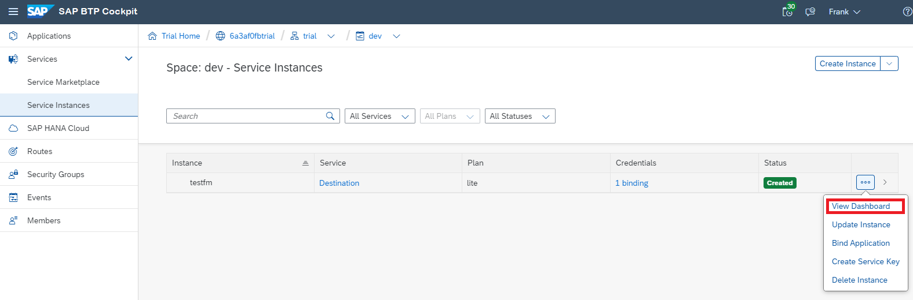
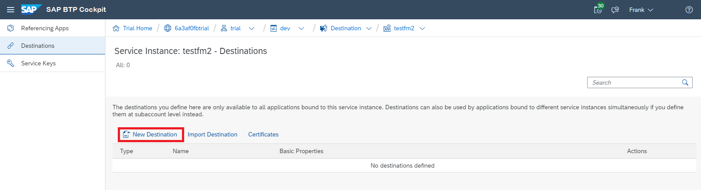

<!-- loio82ca377549c5421a8199013ea5f0facc -->

# Access the Destinations Editor

Access the Destinations Editor in the SAP BTP cockpit to create and manage destinations.

You can edit destinations at two different levels:

-   Subaccount level

-   Service instance level

On subaccount level, you can specify a destination for the entire subaccount, defining the used communication protocol and more properties, like authentication method, proxy type and URL.

On service instance level, you can reuse this destination for a specific space and adjust the URL if required. You can also create a new destination only on service instance level that is specific to the selected service instance and its assigned applications.

<a name="loio82ca377549c5421a8199013ea5f0facc__section_t2p_cf5_j2b"/>

## Prerequisites

-   You are logged into the SAP BTP cockpit.
-   You have the required authorizations.See [User Roles](what-is-sap-btp-connectivity-daca64d.md#loiodaca64dacc6148fcb5c70ed86082ef91__roles).

<a name="loio82ca377549c5421a8199013ea5f0facc__section_fwj_2f5_j2b"/>

## Procedure

**Access on Subaccount Level**

1.  In the cockpit, select your *Global Account* and your subaccount name from the *Subaccount* menu in the breadcrumbs.
2.  From the left-side panel, choose *Connectivity* \> *Destinations*.

**Access on Service Instance Level**

> ### Note:  
> To perform these steps, you must have created a Destination service instance in a *Cloud Foundry* space, see [Create and Bind a Destination Service Instance](create-and-bind-a-destination-service-instance-9fdad3c.md). On service instance level, you can set destinations only for Destination service instances.

1.  In the cockpit, choose your *Global Account* from the *Region Overview* and select a *Subaccount*.
2.  From the *Spaces* section, select a space name.
3.  From the left-side menu, choose *Services* \> *Service Instances*.
4.  Choose the *Actions* icon for a Destination service instance and select *View Dashboard*.

    

5.  On the *Destinations* screen, you can create new destinations or edit existing ones.

    

See also section *Create and Bind a Service Instance from the Cockpit* in [Create and Bind a Destination Service Instance](create-and-bind-a-destination-service-instance-9fdad3c.md).

**Related Information**  

[Create Destinations from Scratch](create-destinations-from-scratch-5eba623.md "Use the Destinations editor in the SAP BTP cockpit to configure destinations from scratch.")

[Create Destinations from a Template](create-destinations-from-a-template-ef56ea0.md "Use a template to configure destinations with scenario-specific input data in the SAP BTP cockpit.")

[Check the Availability of a Destination](check-the-availability-of-a-destination-71ea3cc.md "How to check the availability of a destination in the Destinations editor (SAP BTP cockpit).")

[Clone Destinations](clone-destinations-b80786e.md "How to clone destinations in the Destinations editor (SAP BTP cockpit).")

[Edit and Delete Destinations](edit-and-delete-destinations-372dee2.md "How to edit and delete destinations in the Destinations editor (SAP BTP cockpit).")

[Use Destination Certificates](use-destination-certificates-df1bb55.md "Maintain trust store and key store certificates in the Destinations editor (SAP BTP cockpit).")

[Import Destinations](import-destinations-91ee9db.md "How to import destinations in the Destinations editor (SAP BTP cockpit).")

[Export Destinations](export-destinations-707b49e.md "Export destinations from the Destinations editor in the SAP BTP cockpit to backup or reuse a destination configuration.")

