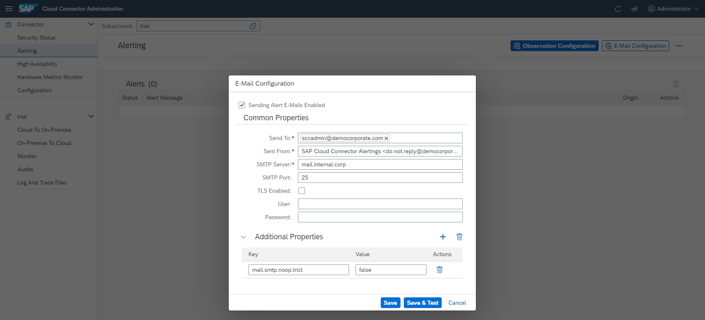
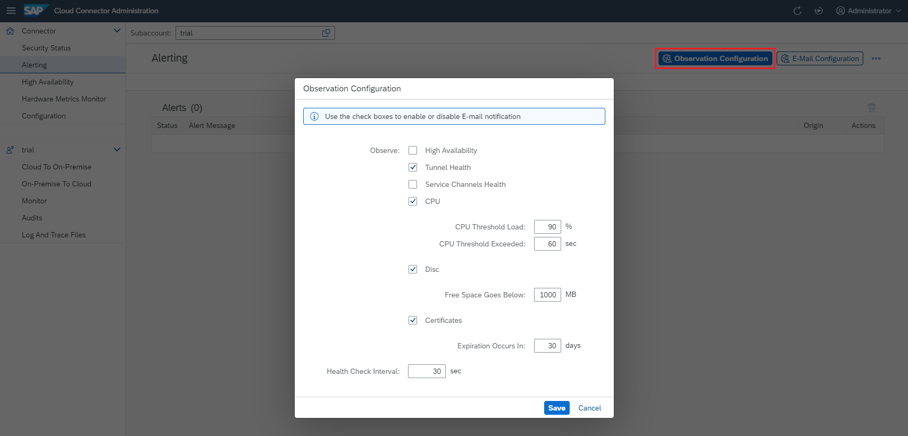

<!-- loio87bffd934192418bbb866aedd1442ad8 -->

# Alerting

Configure the Cloud Connector to send e-mail messages when situations occur that may prevent it from operating correctly.

To configure alert e-mails, choose *Alerting* from the top-left navigation menu.

You must specify the receivers of the alert e-mails \(*E-mail Configuration*\) as well as the Cloud Connector resources and components that you want to monitor \(*Observation Configuration*\). The corresponding *Alert Messages* are also shown in the Cloud Connector administration UI.


## E-mail Configuration

1.  Select *E-mail Configuration* to specify the list of em-ail addresses to which alerts should be sent \(*Send To*\).

    > ### Note:  
    > The addresses you enter here can use either of the following formats: john.doe@company.com or John Doe <j.doe@company.com\>.

2.  Enter the sender's e-mail address \(*<Sent From\>*\).
3.  In *<SMTP Server\>* provide the host of the mail server.
4.  You can specify an *<SMTP port\>*, if the server is not using the default ports. For details, contact your e-mail administrator or provider.
5.  Mark the *TLS Enabled* check box if you want to establish a potential TLS-encrypted connection using STARTTLS.
6.  If the SMTP server requires authentication, provide *<User\>* and *<Password\>*.
7.  In the *Additional Properties* section you can provide any property supported by the [Java Mail library](https://javaee.github.io/javamail/docs/api/com/sun/mail/smtp/package-summary.html). Additionally, you can set `mail.debug` to `true` in order to get SMTP protocol debug output. All specified properties will be passed to the SMTP client.
8.  Select *Save* to change the current configuration.



> ### Note:  
> Connections to an SMTP server over TLS can cause TLS errors if the SMTP server uses an "untrusted" certificate. If you cannot use a trusted certificate, you must import the public part of the issuer certificate to the JDK's trust storage.
> 
> Usually, the trust storage is done in the file *cacerts* in the Java directory \(`jre/lib/security/cacerts`\). For import, you can use the *keytool* utility:
> 
> ```
> keytool -import -storepass changeit -file <certificate used by SMTP server> -keystore cacerts -alias <for example, SMTP_xyz> 
> ```
> 
> For more information, see [https://docs.oracle.com/cd/E19830-01/819-4712/ablqw/index.html](https://docs.oracle.com/cd/E19830-01/819-4712/ablqw/index.html).


## Observation Configuration

Once you've entered the e-mail addresses to receive alerts, the next step is to identify the resources and components of the Cloud Connector: E-mail messages are sent when any of the chosen components or resources have malfunctioned or are in a critical state.

> ### Note:  
> The Cloud Connector does not dispatch the same alert repeatedly. As soon as an issue has been resolved, an informational alert is generated, sent, and listed in *Alert Messages* \(see section below\).

1.  Select *Observation Configuration* from the top-right corner of the window.
2.  Select the components or resources you want to monitor.
    -   *High Availability* alerts can occur in the context of an active high availability setup, meaning a shadow system is connected.
    -   *Tunnel Health* and *Service Channels Health* refer to the state of the respective connections. Whenever such a connection is lost, an alert is triggered.

        > ### Note:  
        > These alerts are only triggered in case of an error or exception, but not upon intentional disconnect action.

    -   An excessively high *CPU* load over an extended period of time adversely affects performance and may be an indicator of serious issues that jeopardize the operability of the Cloud Connector. The CPU load is monitored and an alert is triggered whenever the CPU load exceeds and continues to exceed a given threshold percentage \(the default is 90%\) for more than a given period of time \(the default is 60 seconds\).
    -   Although the Cloud Connector does not require nor consume large amounts of *Disk* space, running out of it is a circumstance that you should avoid. We recommend that you configure an alert to be sent if the disk space falls below a critical value \(the default is 10 megabytes\).
    -   The Cloud Connector configuration contains various *Certificates*. Whenever one of those expires, scenarios might no longer work as expected so it's important to get notified about the expiration \(the default is 30 days\).

3.  \(Optional\) Change the *Health Check Interval* \(the default is 30 seconds\).
4.  Select *Save* to change the current configuration.




## Alert Messages

The Cloud Connector shows alert messages also on screen, in *Alerting* \> *Alert Messages*.

You can remove alerts using *Delete* or *Delete All*. If you delete active \(unresolved\) alerts, they reappear in the list after the next health check interval.

