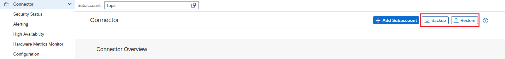

<!-- loioabd1ba7cb0dd484aa24f0f6bed29f3fa -->

# Configuration Backup

You can backup and restore your Cloud Connector configuration.

To backup or restore your Cloud Connector configuration, do the following:

1.  From the Cloud Connector main menu, choose *Connector*.

    

2.  To backup or restore your configuration, choose the respective icon in the upper right corner of the screen.
    1.  To backup your configuration, enter and repeat a password in the *Backup* dialog and choose *Backup*.

        > ### Note:  
        > An archive containing a snapshot of the current Cloud Connector configuration is created and downloaded by your browser. For security reasons, some files are encrypted, using the password provided for the backup procedure.

        > ### Tip:  
        > You can use this archive to restore the current state of the same installation or to move the current configuration to a new Cloud Connector installation, if the original instance can no longer be used.
        > 
        > You can restore the archive on a Cloud Connector instance
        > 
        > -   With the same or higher version than the original one.
        > -   Running on a different operating system.
        > 
        > However, you cannot restore it on an *older* Cloud Connector version.

    2.  To restore your configuration, enter the required *Archive Password* and the *Login Password* of the currently logged-in administrator user in the *Restore from Archive* dialog and choose *Restore*.

        > ### Caution:  
        > The restore action overwrites the current configuration of the Cloud Connector. Its current state and settings will be lost permanently unless you have created another backup before doing the restore operation. Upon successfully restoring the configuration backup, the Cloud Connector restarts automatically. All active sessions are then terminated.

        > ### Note:  
        > -   The `props.ini` file is treated in a special way. If the file from the backup archive differs from the one that is used in the current installation, it will be placed next to the original one as `props.ini.restored`. If you want to use the `props.ini.restored` file, replace the existing `props.ini` file by the restored one on OS level and restart the Cloud Connector afterwards.
        > -   All custom path settings from the configuration backup archive, which are not valid or operable anymore, will be automatically reset to their respective default values upon restore operation. For example, this will be the case if a configured directory or file path from the backup archive does not exist or is not accessible anymore.
        > -   Restored certificates from older backup archives might have expired and must be replaced with valid ones to get all configured scenarios to work again.
        > -   If restoring a configuration backup archive on a host that is different from the original one, the restored UI certificate might not be issued for the new hostname, domain or IP address, and therefore would require a replacement with a matching UI server certificate as well.
        > -   If you are using an external SNC library, neither the library itself is part of the configuration backup archive, nor any configuration that this library would load from its own external storage. As a result, the SNC configuration must be set up again after restoring a configuration backup archive on a different host.
        > -   The same applies to used own CA certificates which are stored in the JVM's managed trust store, for example, if Email alerting or LDAP has been set up this way, with own certificates for establishing a secure communication. These externally stored CA certificates would also not be part of the configuration backup archive and must be imported into the local JVM's trust store manually.

        > ### Caution:  
        > Do not run multiple Cloud Connector instances with the same configuration simultaneously. The feature to restore a configuration backup archive on another Cloud Connector installation is not supposed to be used for cloning purposes, but only for supporting the move of a Cloud Connector instance from one host to another. After restoring a configuration backup archive on a different Cloud Connector installation, you must stop the original Cloud Connector instance *immediately*. Otherwise, running two or more instances with the same configuration will cause issues. Such a cloned setup is not supported.

