<!-- loio6e5e004b6553403486a03da53bfcaf4e -->

# Configuration Tasks

Perform these steps to set up user propagation between S/4HANA Cloud and the SAP BTP Cloud Foundry environment.

<a name="loio6e5e004b6553403486a03da53bfcaf4e__steps_s4"/>

## Tasks

1.  [Configure Single Sign-On between S/4HANA Cloud and the Cloud Foundry Organization on SAP BTP](configuration-tasks-6e5e004.md#loio6e5e004b6553403486a03da53bfcaf4e__sso)
2.  [Configure OAuth Communication](configuration-tasks-6e5e004.md#loio6e5e004b6553403486a03da53bfcaf4e__oauth)
3.  [Configure Communication Settings in S/4HANA Cloud](configuration-tasks-6e5e004.md#loio6e5e004b6553403486a03da53bfcaf4e__s4)
4.  [Configure Communication Settings in SAP BTP](configuration-tasks-6e5e004.md#loio6e5e004b6553403486a03da53bfcaf4e__scp)
5.  [Consume the Destination and Execute the Scenario](configuration-tasks-6e5e004.md#loio6e5e004b6553403486a03da53bfcaf4e__consume)

<a name="loio6e5e004b6553403486a03da53bfcaf4e__sso"/>

## Configure Single Sign-On between S/4HANA Cloud and the Cloud Foundry Organization on SAP BTP

To configure SSO with S/4HANA you must configure trust between the S/4HANA IAS tenant and theCloud Foundry organization, see [Manually Establish Trust and Federation Between SAP Authorization and Trust Management Service and SAP Cloud Identity Services](https://help.sap.com/viewer/65de2977205c403bbc107264b8eccf4b/Cloud/en-US/7c6aa87459764b179aeccadccd4f91f3.html#loio7c6aa87459764b179aeccadccd4f91f3 "Use your SAP Cloud Identity Services tenant as an identity provider or a proxy to your own identity provider hosting your business users. Exchange SAML metadata to establish trust with the SAP Cloud Identity Services tenant and then register your subaccount with the tenant. To complete federation, maintain the federation attributes of the user groups.") :arrow_upper_right:.

<a name="loio6e5e004b6553403486a03da53bfcaf4e__oauth"/>

## Configure OAuth Communication

Download the certificate from your Cloud Foundry subaccount on SAP BTP.

1.  From the SAP BTP cockpit, choose *Cloud Foundry environment* \> *your global account*.
2.  Choose or create a subaccount, and from your left-side subaccount menu, go to *Connectivity* \> *Destinations*.
3.  Press the *Download Trust* button.

Back to [Tasks](configuration-tasks-6e5e004.md#loio6e5e004b6553403486a03da53bfcaf4e__steps_s4) 

<a name="loio6e5e004b6553403486a03da53bfcaf4e__s4"/>

## Configure Communication Settings in S/4HANA Cloud

1.  **Create a Communication User**
    1.  In your S/4HANA Cloud launchpad, choose the application *Maintain Communication Users*.

        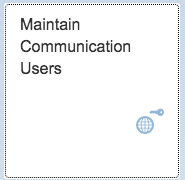

    2.  From the *User List* view, create a new user.
    3.  Set *<User Name\>*, *<Password\>* and *<Description\>*.
    4.  Copy this password, you will need it in a later step.
    5.  Press the *Save* on the bottom of the screen.

        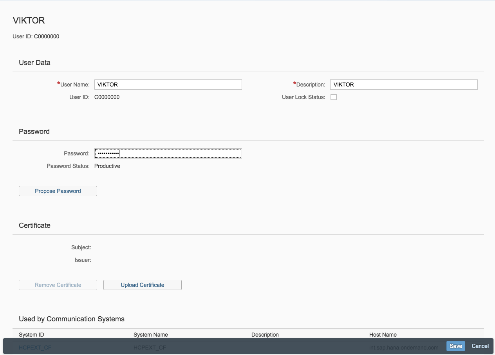

    6.  Close the *Communication Users* application.

2.  **Set up a Communication System for OAuth**
    1.  From the launchpad, choose the application *Communication Systems*.

        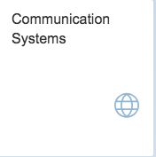

    2.  From the list view, select *New*.
    3.  A popup window appears. Enter the *<System ID\>* and the *<System Name\>*, then choose *Create*.

        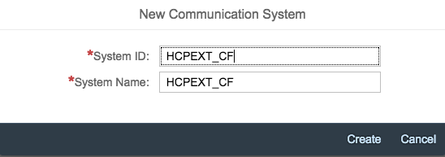

    4.  Enter the host name. This is your Cloud Foundry region, for example: `cf.eu10.hana.ondemand.com` for Europe \(Frankfurt\).

        > ### Note:  
        > For the complete list of standard regions, see [Regions](https://help.sap.com/viewer/65de2977205c403bbc107264b8eccf4b/Cloud/en-US/350356d1dc314d3199dca15bd2ab9b0e.html "You can deploy applications in different regions. Each region represents a geographical location (for example, Europe, US East) where applications, data, or services are hosted.") :arrow_upper_right:.

        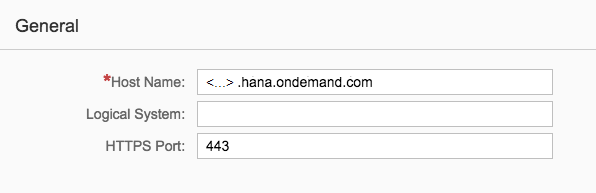

    5.  Enable the OAuth Identity Provider.

        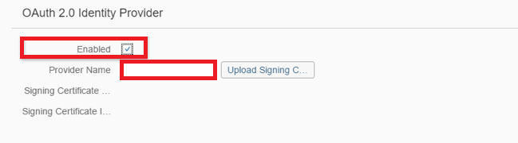

    6.  Upload the subaccount certificate that you have downloaded before from the SAP BTP cockpit.

        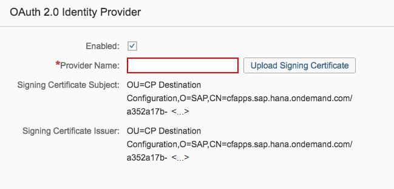

    7.  From *<Signing Certificate Subject\>*, copy the ***CN*** value \(for example: ***cfapps.sap.hana.ondemand.com/a352a17b-<...\>***\) and paste it in the field *<Provider Name\>*.
    8.  Add the *Communication User* you have created in the previous step.

        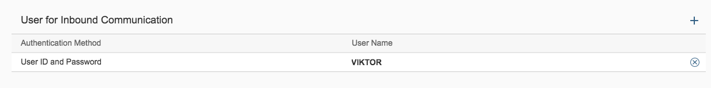

    9.  Save your settings and go back to the launchpad.

3.  **Create a Communication Arrangement**
    1.  Start the *Communication Arrangements* application.

        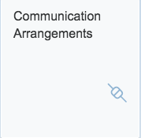

    2.  From the list view, select *New*.
    3.  In the popup, choose a scenario. For our example, we use `SAP_COM_0013`. Set the arrangement name, for example `SAP_COM_0013_MY_TEST`.
    4.  In the *Common Data* section of the configuration screen, select the *<Communication System\>* that you have created in the step before. The communication user is added automatically in the *Inbound Communication* section, and the *<Authentication Method\>* is set to ***OAuth 2.0***.

        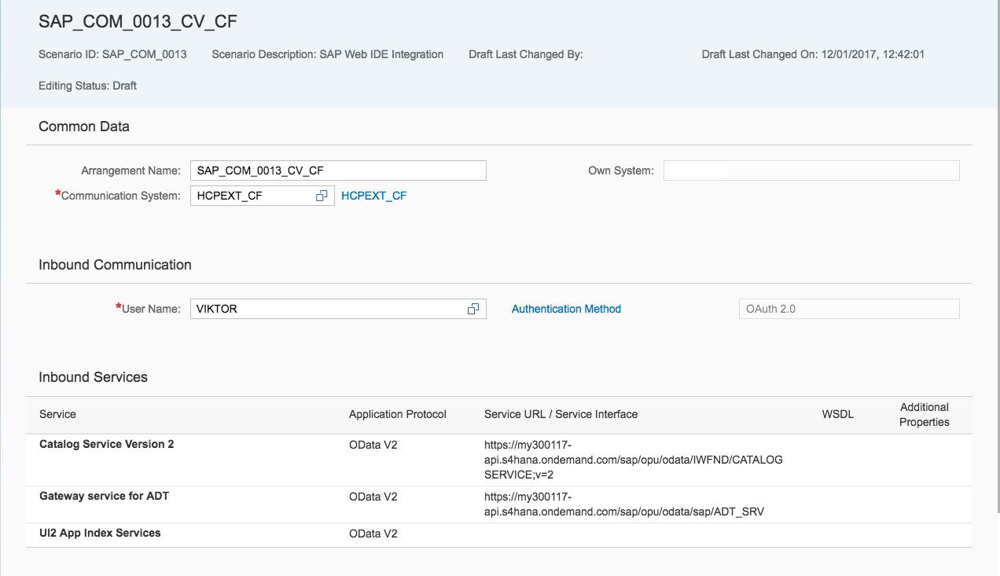

    5.  In the *Outbound Services* section, go to *Launch SAP Web IDE* and uncheck the *Active* checkbox of the field *<Service Status\>*.

        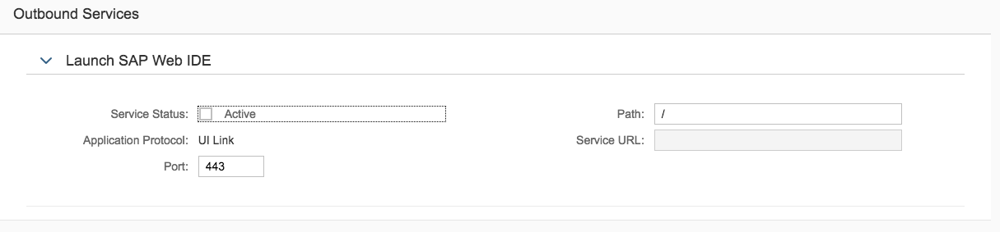

    6.  Save your settings and go back to the launchpad.

Back to [Tasks](configuration-tasks-6e5e004.md#loio6e5e004b6553403486a03da53bfcaf4e__steps_s4) 

<a name="loio6e5e004b6553403486a03da53bfcaf4e__scp"/>

## Configure Communication Settings in SAP BTP

1.  From the SAP BTP cockpit, choose *Cloud Foundry environment* \> *your global account*.
2.  Choose your subaccount, and from the left-side subaccount menu, go to *Connectivity* \> *Destinations*.
3.  Press the *New Destination* button.
4.  Enter the following parameters for your destination:

    <table>
    <tr>
    <th valign="top">

    Parameter
    
    </th>
    <th valign="top">

    Value
    
    </th>
    </tr>
    <tr>
    <td valign="top">
    
    `Name`
    
    </td>
    <td valign="top">
    
    Enter a meaningful name.
    
    </td>
    </tr>
    <tr>
    <td valign="top">
    
    `Type`
    
    </td>
    <td valign="top">
    
    `HTTP`
    
    </td>
    </tr>
    <tr>
    <td valign="top">
    
    `Description`
    
    </td>
    <td valign="top">
    
    \(Optional\) Enter a meaningful description.
    
    </td>
    </tr>
    <tr>
    <td valign="top">
    
    `URL`
    
    </td>
    <td valign="top">
    
    The OData URL, for example `https://my300117-api.s4hana.ondemand.com/sap/opu/odata/IWFND/CATALOGSERVICE;v=2?$format=json`
    
    </td>
    </tr>
    <tr>
    <td valign="top">
    
    `Proxy Type`
    
    </td>
    <td valign="top">
    
    `Internet`
    
    </td>
    </tr>
    <tr>
    <td valign="top">
    
    `Authentication`
    
    </td>
    <td valign="top">
    
    `OAuth2SAMLBearerAssertion`
    
    </td>
    </tr>
    <tr>
    <td valign="top">
    
    `Audience`
    
    </td>
    <td valign="top">
    
    The URL of your SAP S/4HANA Cloud account.

    To get it, log on to your SAP S/4HANA Cloud account. Select the profile picture. Then choose *Settings* and copy the value from the *<Server\>* field. Add `https://` to the beginning of this string, for example, `https://my300117.s4hana.ondemand.com`.

    > ### Note:  
    > This URL does not contain `my300117`*\-api*, but only `my300117`.

    
    </td>
    </tr>
    <tr>
    <td valign="top">
    
    `Client Key`
    
    </td>
    <td valign="top">
    
    The name of the communication user you have in the SAP S/4HANA ABAP tenant, e.g VIKTOR.
    
    </td>
    </tr>
    <tr>
    <td valign="top">
    
    `Token Service URL`
    
    </td>
    <td valign="top">
    
    For this field, you need the part of the URL before `/sap/...` that you copied before from *Communications Arrangements* service URL/service interface:

    `https://my300117-api.s4hana.ondemand.com/sap/bc/sec/oauth2/token`
    
    </td>
    </tr>
    <tr>
    <td valign="top">
    
    `Token Service User` 
    
    </td>
    <td valign="top">
    
    The same user as for the `Client Key` parameter.
    
    </td>
    </tr>
    <tr>
    <td valign="top">
    
    `Token Service Password`
    
    </td>
    <td valign="top">
    
    The password for the communication user.
    
    </td>
    </tr>
    <tr>
    <td valign="top">
    
    `System User`
    
    </td>
    <td valign="top">
    
    This parameter is not used, leave the field empty.
    
    </td>
    </tr>
    <tr>
    <td valign="top">
    
    `authnContextClassRef`
    
    </td>
    <td valign="top">
    
    `urn:oasis:names:tc:SAML:2.0:ac:classes:X509` 
    
    </td>
    </tr>
    </table>
    

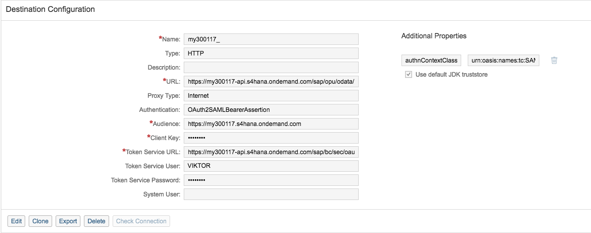

Back to [Tasks](configuration-tasks-6e5e004.md#loio6e5e004b6553403486a03da53bfcaf4e__steps_s4) 

<a name="loio6e5e004b6553403486a03da53bfcaf4e__consume"/>

## Consume the Destination and Execute the Scenario

To perform the scenario and execute the request from the source application towards the target application, proceed as follows:

1.  Decide on where the user identity will be located when calling the Destination service. For details, see [User Propagation via SAML 2.0 Bearer Assertion Flow](user-propagation-via-saml-2-0-bearer-assertion-flow-3cb7b81.md). This will determine how exactly you will perform step 2.
2.  Execute a "find destination" request from the source application to the Destination service. For details, see [Consuming the Destination Service](consuming-the-destination-service-7e30625.md) and the [REST API documentation](https://api.sap.com/api/SAP_CP_CF_Connectivity_Destination/resource).
3.  From the Destination service response, extract the access token and URL, and construct your request to the target application. See ["Find Destination" Response Structure](find-destination-response-structure-83a3f3b.md) for details on the structure of the response from the Destination service.

Back to [Tasks](configuration-tasks-6e5e004.md#loio6e5e004b6553403486a03da53bfcaf4e__steps_s4) 

