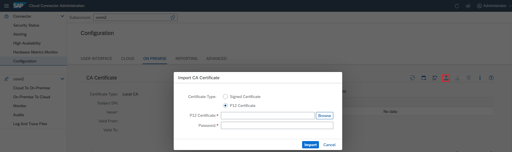
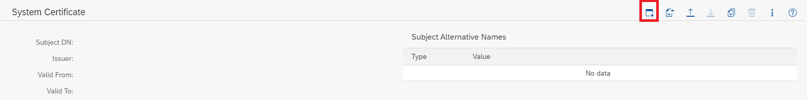
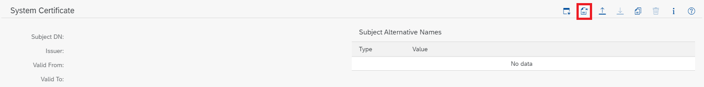
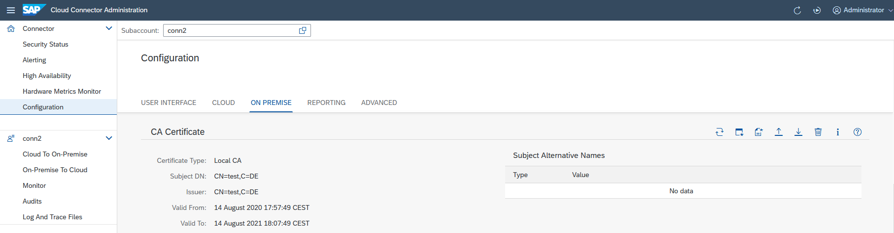
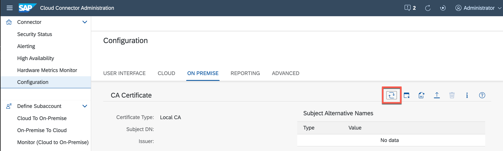
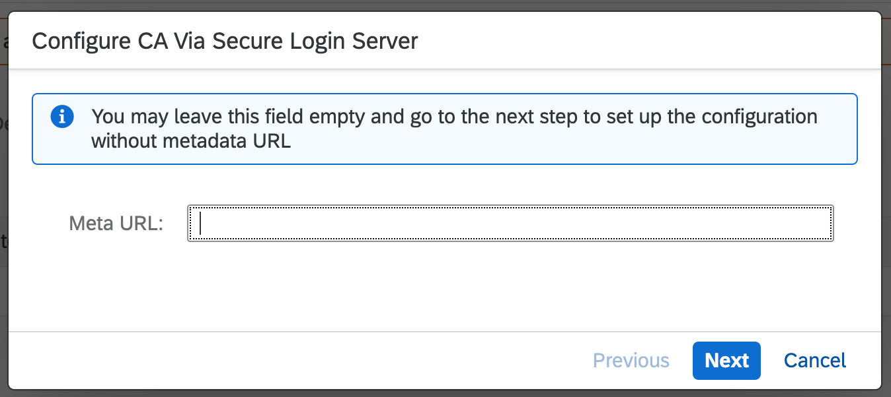
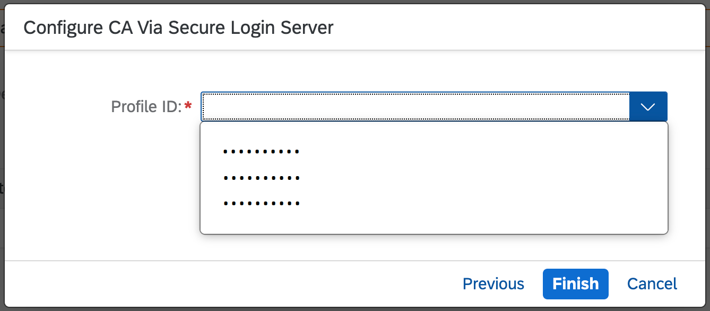
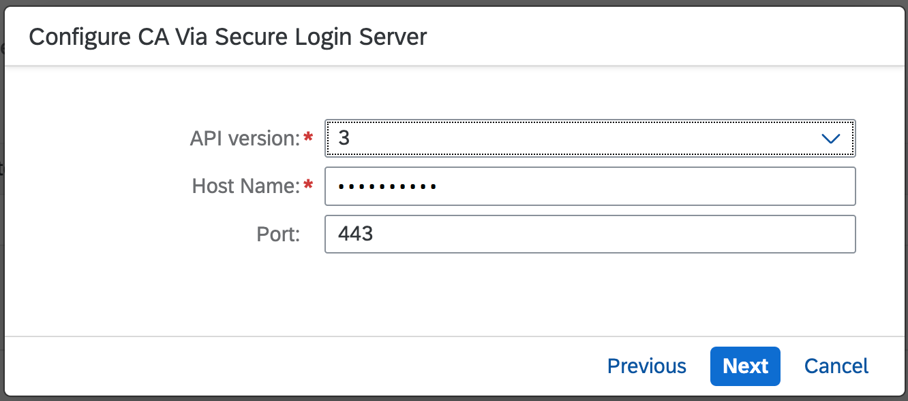
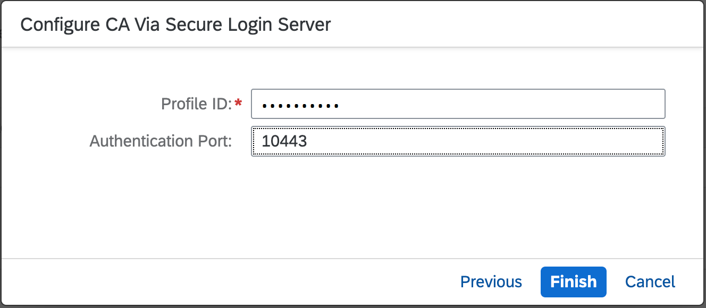

<!-- loiod0c4d5675d4f4bc78a5b7a7b8687c841 -->

# Configure a CA Certificate

Install and configure an X.509 certificate to enable support for principal propagation in the Cloud Connector.

> ### Note:  
> The information in this section applies to both principal propagation and technical user propagation.

## Supported CA Mechanisms

You can enable support for principal propagation or technical user propagation with X.509 certificates by performing either of the following procedures:

-   Using a *Local CA* in the Cloud Connector.

    > ### Note:  
    > Prior to version 2.7.0, this was the only option and the system certificate was acting both as client certificate and CA certificate in the context of principal propagation.

-   Using a *Secure Login Server* \(SLS\) and delegate the CA functionality to it.

The Cloud Connector uses the configured CA approach to issue short-lived certificates for logging on the same identity in the back end that is logged on in the cloud. For establishing trust with the back end, the respective configuration steps are independent of the approach that you choose for the CA.

<a name="loiod0c4d5675d4f4bc78a5b7a7b8687c841__section_txk_4pm_1vb"/>

## Install a local CA Certificate

To issue short-lived certificates that are used for principal propagation to a back-end system, you can import an X.509 client certificate into the Cloud Connector. This CA certificate must be provided as *PKCS\#12* file containing the \(intermediate\) certificate, the corresponding private key, and the CA root certificate that signed the intermediate certificate \(plus the certificates of any other intermediate CAs, if the certificate chain includes more than those two certificates\).

Use either of the following options to install a local CA certificate:

-   Option 1: Choose the PKCS\#12 file from the file system, using the file upload dialog. For the import process, you must also provide the file password.
-   Option 2: Start a *Certificate Signing Request* \(CSR\) procedure like for the UI certificate, see [Exchange UI Certificates in the Administration UI](exchange-ui-certificates-in-the-administration-ui-b70bf16.md).
-   Option 3: Generate a self-signed certificate, which might be useful in a demo setup or if you need a dedicated CA. In particular for this option, it is useful to export the public key of the CA via the button *Download certificate in DER format*.

> ### Caution:  
> The CA certificate should have the `KeyUsage` attribute `keyCertSign`. Many systems verify that the issuer of a certificate has this attribute and deny a client certificate, if this attribute is not present. When using the *Certificate Signing Request* procedure, the attribute will be requested for the CA certificate. Also, when generating a self-signed certificate, this attribute will be added automatically.

Choose *Import a certificate* for option 1:

Choose *Generate a certificate signing request* for option 2:

Choose *Create and import a self-signed certificate* if you want to use option 3:

In particular for this option, it is useful to export the public key of the CA by choosing the respective button.

After successful import of the CA certificate, its distinguished name, the name of the issuer, and the validity dates are shown:

If a CA certificate is no longer required, you can delete it. Use the respective *Delete* button and confirm the deletion.

## Configure a CA Hosted by a Secure Login Server

If you want to delegate the CA functionality to a *Secure Login Server* \(SLS\), choose the CA using the *Secure Login Server* option and configure the SLS as follows, after having configured the SLS as described in [Configure a Secure Login Server](configure-a-secure-login-server-de5bbf9.md).

A wizard offers in a first step a quick configuration by metadata URL pointing to the SLS you'd like to use.

Using the metadata URL lets you fetch the most relevant data from SLS instance. You only have to choose the profile configured on SLS, which should be used for the generation of short-lived certificates. Choose *Finish* to save the configuration.

> ### Note:  
> The URL won't be stored in the Cloud Connector configuration.

If you don't have the metadata URL or would change the current configuration without metadata URL, you may keep the field empty and go to the next step.

In that case, you must provide all configuration details manually.

Enter the following:

-   `API Version`: Version of the SLS configuration protocol.
-   `Host Name`: Host on which your SLS is installed.
-   `Port`: Port for communication with SLS during the configuration.
-   `Profile ID`: SLS profile ID that allows to issue certificates as needed for principal propagation with the Cloud Connector.

    > ### Note:  
    > Used if SLS API *version 3* is configured.

-   `Profile`: SLS profile that allows to issue certificates as needed for principal propagation with the Cloud Connector.

    > ### Note:  
    > Used if SLS API *version 2* is configured.

-   `Authentication Port`: Port over which the Cloud Connector is requesting the short-lived certificates from SLS.

    > ### Note:  
    > For this privileged port, a client certificate authentication is required, for which the Cloud Connector's system certificate is used.

In the next step, you can finalize the configuration. The fields in the next step depend on the chosen SLS API version.

Choose *Finish* to save the configuration.

**Related Information**  

[Configure a Secure Login Server](configure-a-secure-login-server-de5bbf9.md "Configuration steps for Java SLS support.")

[Initial Configuration \(HTTP\)](initial-configuration-http-3f974ea.md "Configure the Cloud Connector for HTTP communication.")

[Initial Configuration \(RFC\)](initial-configuration-rfc-f09eefe.md "Configure a Secure Network Connection (SNC) to set up the Cloud Connector for RFC communication to an ABAP backend system.")

