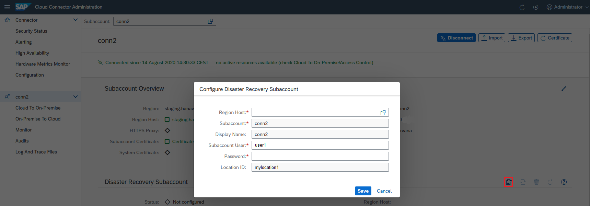

<!-- loio39447fabeab54de6ba6bf375a6ee7299 -->

# Configure a Disaster Recovery Subaccount

Configure a subaccount as backup for disaster recovery.

> ### Caution:  
> This feature is deprecated.
> 
> Due to the discontinuation of the *Enhanced Disaster Recovery Service*, the related functionality in the Cloud Connector has been dropped as of version 2.16.
> 
> For more information, see [What's New for SAP Business Technology Platform](https://help.sap.com/whats-new/cf0cb2cb149647329b5d02aa96303f56?Component=Enhanced%2520Disaster%2520Recovery%2520Service&locale=en-US&version=Cloud).

Each subaccount\(except trial accounts\) can optionally have a disaster recovery subaccount.

Prerequisite is that you are using the enhanced disaster revovery.

The disaster recovery subaccount is intended to take over if the region host of its associated original subaccount faces severe issues.

A disaster recovery account inherits the configuration from its original subaccount except for the region host. The user can, but does not have to be the same.

<a name="loio39447fabeab54de6ba6bf375a6ee7299__section_pyh_z5f_xz"/>

## Procedure

1.  From the main menu, choose your subaccount.
2.  In section *Disaster Recovery Subaccount*, choose *Configure disaster recovery subaccount*.
3.  In the configuration dialog, select an appropriate *<Region Host\>* from the drop-down list.

    > ### Note:  
    > The selected region host must be different from the region host of the original subaccount.

4.  \(Optional\) You can adjust the *<Subaccount User\>*.
5.  Enter the *<Password\>* for the subaccount user.
6.  If configured, enter a *<Location ID\>*.
7.  Choose *Save*.

> ### Note:  
> The technical subaccount name, the display name, and the location ID must remain the same. They are set automatically and cannot be changed.

> ### Note:  
> You cannot choose another original subaccountnor a trial subaccount to become a disaster recovery subaccount.

> ### Note:  
> If you want to change a disaster recovery subaccount, you must delete it first and then configure it again.

To switch from the original subaccount to the disaster recovery subaccount, choose *Employ disaster recovery subaccount*.

The disaster recovery subaccount then becomes active, and the original subaccount is deactivated.

You can switch back to the original subaccount as soon as it is available again.

> ### Note:  
> As of Cloud Connector 2.11, the cloud side informs about a disaster by issuing an event. In this case, the switch is performed automatically.

**Related Information**  

[Convert a Disaster Recovery Subaccount into a Standard Subaccount](convert-a-disaster-recovery-subaccount-into-a-standard-subaccount-3573658.md "Convert a disaster recovery sucaccount into a standard subaccount if the former primary subaccount's region cannot be recovered.")

