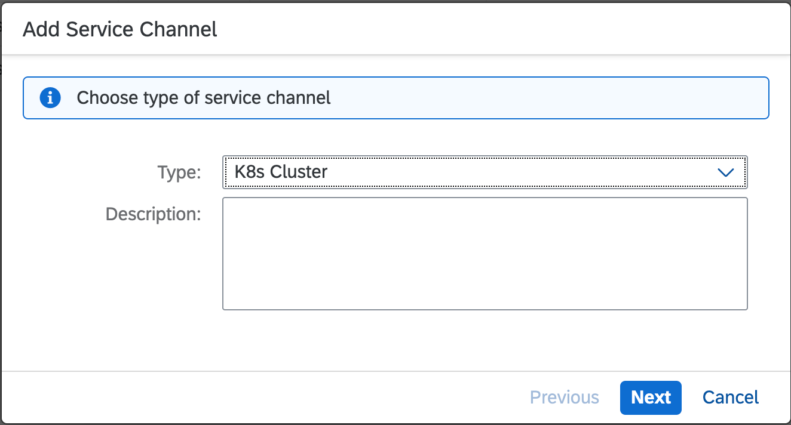
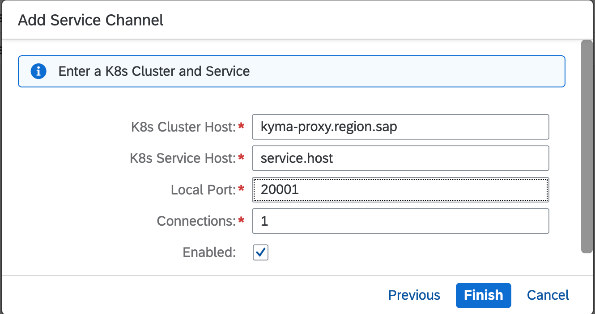

<!-- loiod6d395e759374be89e0aebab83ad5a7b -->

# Configure a Service Channel for a Kubernetes Cluster

Create a service channel to establish a connection to a service in a Kubernetes cluster in SAP BTP that is not directly exposed to external access.

Follow the steps below to establish a service channel for a Kubernetes cluster \(K8s cluster\).

<a name="loiod6d395e759374be89e0aebab83ad5a7b__section_xxh_tvn_m5b"/>

## Prerequisites

You have a service running in a Kubernetes cluster that is connected to your subaccount.

<a name="loiod6d395e759374be89e0aebab83ad5a7b__section_ztr_zsn_m5b"/>

## Procedure

1.  Choose *On-Premise to Cloud* \> *Service Channels* from your subaccount menu.
2.  Choose the *Add* button.

    

3.  In the *Add Service Channel* dialog, select `K8s Cluster` from the drop-down list of supported channel types.
4.  Optionally, provide a *Description* that explains what the Kubernetes cluster service channel is used for.
5.  Choose *Next*. The *K8s Cluster* dialog opens.
6.  Specify the host of the Kubernetes cluster and the host providing the service inside the Kubernetes cluster.
7.  Choose the *<Local Port\>* and the number of *<Connections\>*. You can enter any port that is not used yet.
8.  Leave the *Enabled* option selected to establish the channel immediately after clicking *Save*, or deselect it if the channel should not be established yet.

    

9.  When you are done, choose *Finish*.

> ### Note:  
> If you enter the complete service string `[<protocol>://]<host>[:<port>]/<service.host>` into the *K8s Cluster Host* field, it is automatically split into the fields *K8s Cluster Host* and *K8s Service Host*.

<a name="loiod6d395e759374be89e0aebab83ad5a7b__section_rsx_wsn_m5b"/>

## Next Steps

Once you have established a service channel to the Kubernetes cluster, you can connect your client application by accessing `<Cloud_connector_host>:<local_port>`.

