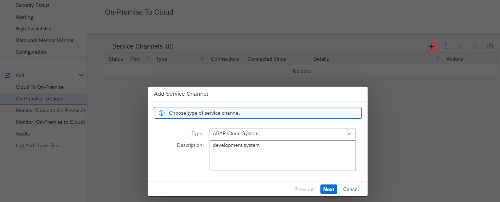
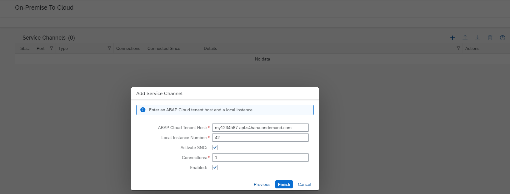

<!-- loio18602c25ae33423f847e9f2c539d7fa0 -->

# Configure a Service Channel for RFC

For scenarios that need to call from on-premise systems to SAP BTP ABAP environment using RFC, you can establish a connection to an ABAP Cloud tenant host. To do this, select *On-Premise to Cloud* \> *Service Channels* in the Cloud Connector.

<a name="loio18602c25ae33423f847e9f2c539d7fa0__section_zhm_wsk_52b"/>

## Prerequisites

-   When using the default connectivity setup with the **Cloud Foundry** subaccount in which the system has been provisioned, you can use a service channel without additional configuration, as long as the system is a single-tenant system.
-   When using connectivity via a **Neo** subaccount, you must create a communication arrangement for the scenario SAP\_COM\_0200. For more information, see [Create a Communication Arrangement for Cloud Connector Integration](https://help.sap.com/viewer/65de2977205c403bbc107264b8eccf4b/Cloud/en-US/16c9c3d29c79484c9b7cc0560e08e770.html) \(documentation for ABAP environment on SAP BTP\).

<a name="loio18602c25ae33423f847e9f2c539d7fa0__section_dqg_xgy_tz"/>

## Procedure

1.  From your subaccount menu, choose *On Premise To Cloud*.
2.  Choose the *Add* \(+\) icon.

    

3.  In the *Add Service Channel* dialog, select `ABAP Cloud System` from the drop-down list of supported channel types.
4.  Optionally, provide a *Description* that explains what the ABAP Cloud service channel is used for.
5.  Choose *Next*. The *ABAP Cloud System* dialog opens.
6.  Enter the *<ABAP Cloud Cloud Tenant Host\>* that you want to connect to.

    > ### Note:  
    > For SAP BTP ABAP environment, the tenant host is `<serviceinstanceguid>.abap.<region>.hana.ondemand.com` \(note that this is not the frontend address with the abap-web subdomain\). The region is, for example, `eu10` or `us10`.

7.  In the same dialog window, define the *<Local Instance Number\>* under which the ABAP Cloud system is reachable for the client systems. You can enter any instance number for which the port is not used yet on the Cloud Connector host. The port numbers result from the following pattern: `33<LocalInstanceNumber>`, for activated SNC \(*Secure Network Connection*\) `48<LocalInstanceNumber>`.
8.  Use the checkbox *Activate SNC* to specify if the opened service channel port should listen to and terminate incoming SNC RFC connections instead of plain RFC connections. The SNC configuration used is the same as in section [Initial Configuration \(RFC\)](initial-configuration-rfc-f09eefe.md). In case of issues, you can use the trace *Cloud Connector loggers*, and also the *SNC payload* and *CPIC* traces.

    For more information on traces, see [Troubleshooting](troubleshooting-e7df7f1.md).

    > ### Note:  
    > This SNC option is only supported for ABAP-based clients, not for any RFC connectors as JCo, NCo or NW RFC SDK. For these scenarios, please use the WebSocket RFC protocol without the Cloud Connector.

9.  In the same dialog window, leave *Enabled* selected to establish the channel immediately after choosing *Finish*. Unselect it if you don't want to establish the channel immediately.

    

10. Choose *Finish*.

> ### Note:  
> When addressing an ABAP Cloud system in a **destination configuration**, you must enter the *Cloud Connector host* as application server host. As instance number, specify the *<Local Instance Number\>* that you configured for the service channel. As user, you must provide the *business user* name but not the technical user name associated with the same.

> ### Note:  
> When using an RFC service channel in a high availability setup, you can put a TCP load balancer between the client ABAP system and the Cloud Connector master and shadow instances. In this case, you must configure the load balancer in the destination. The load balancer routes the request to the instance that is currently in the master role, either by simply trying one instance after the other or by checking regularly, which of the instances currently has the master role, and routing to this instance only.

