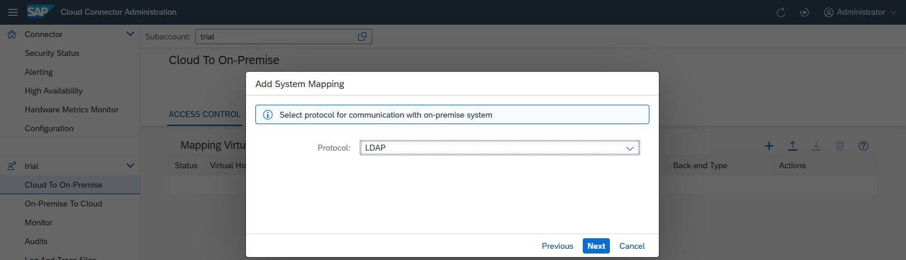
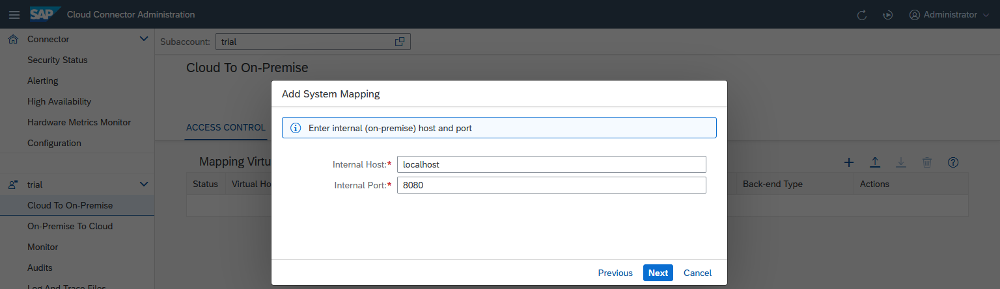
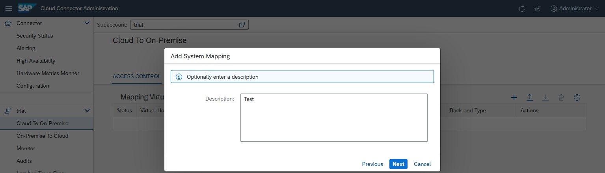
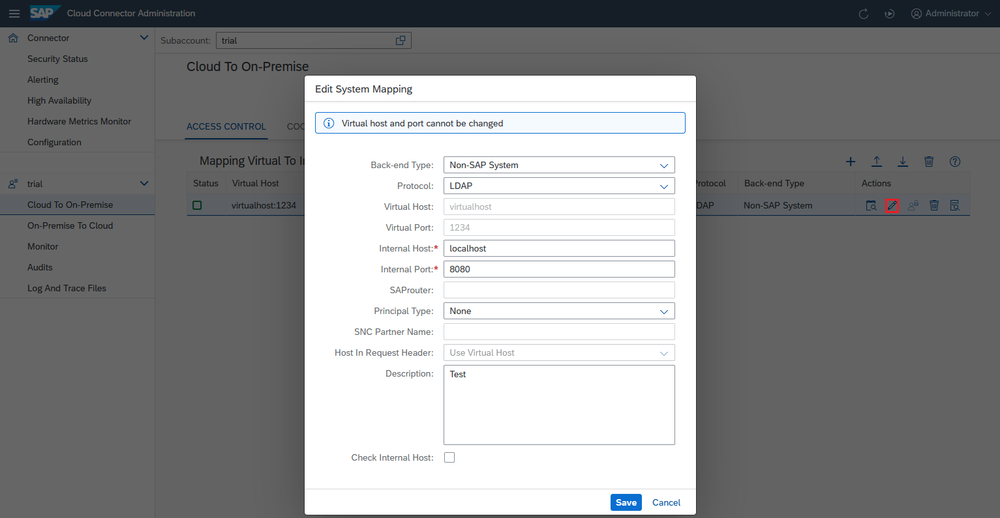

<!-- loioe4ba9b3aad764b38b9c253fdbcfde713 -->

# Configure Access Control \(LDAP\)

Add a specified system mapping to the Cloud Connector if you want to use an on-premise LDAP server or user authentication in your cloud application.

To allow your cloud applications to access an on-premise LDAP server, insert a new entry in the Cloud Connector access control management.

1.  Choose *Cloud To On-Premise* from your *Subaccount* menu.
2.  Choose *Add* \(+\). A wizard opens and asks for the required values.
3.  *Backend Type*: Select `Non-SAP System` from the drop down list. When you are done, choose *Next*.

    

4.  *Protocol*: Select `LDAP` or `LDAPS` for the connection to the backend system. When you are done, choose *Next*.

    

    > ### Note:  
    > If you specify `LDAPS`, and there is a "system certificate" imported in the Cloud Connector, the latter attempts to use this certificate for performing a client-certificate-based logon to the backend system.

5.  *Internal Host* and *Internal Port*: specify the host and port under which the target system can be reached within the intranet. It needs to be an existing network address that can be resolved on the intranet and has network visibility for the Cloud Connector. The Cloud Connector will try to forward the request to the network address specified by the internal host and port, so this address needs to be real.

    

6.  Enter a *Virtual Host* and *Virtual Port*. The virtual host can be a fake name and does not need to exist. The fields are pre-populated with the values of the *Internal Host* and *Internal Port*.

    

7.  You can enter an optional description at this stage. The respective description will be shown as a tooltip when you press the button *Show Details* in column *Actions* of the *Mapping Virtual To Internal System* overview.

    

8.  The summary shows information about the system to be stored. When saving the host mapping, you can trigger a ping from the Cloud Connector to the internal host, using the *Check Internal Host* check box. This allows you to make sure the Cloud Connector can indeed access the internal system. Also, you can catch basic things, such as spelling mistakes or firewall problems between Cloud Connector the internal host.

    If the ping to the internal host is successful, the state ***Reachable*** is shown. If it fails, a warning is displayed in column **Check Result**. You can view issue details by choosing the *Details* button, or check them in the log files.

    You can execute such a check at any time later for all selected systems in the *Mapping Virtual To Internal System* overview by pressing *Check Availability of Internal Host* in column *Actions*.

    

9.  Optional: You can later edit the system mapping \(by choosing *Edit*\) to make the Cloud Connector route the requests to a different LDAP server. This can be useful if the system is currently down and there is a back-up LDAP server that can serve these requests in the meantime. However, you cannot edit the virtual name of this system mapping. If you want to use a different fictional host name in your cloud application, you have to delete the mapping and create a new one.

    

