<!-- loioca5868997e48468395cf0ca4882f5783 -->

# Configure Access Control \(RFC\)

Specify the backend systems that can be accessed by your cloud applications using RFC.

<a name="loioca5868997e48468395cf0ca4882f5783__tasks"/>

## Tasks

[Expose Intranet Systems](configure-access-control-rfc-ca58689.md#loioca5868997e48468395cf0ca4882f5783__expose) 

[Limit the Accessible Resources for RFC](configure-access-control-rfc-ca58689.md#loioca5868997e48468395cf0ca4882f5783__limit)

<a name="loioca5868997e48468395cf0ca4882f5783__expose"/>

## Expose Intranet Systems

To allow your cloud applications to access a certain backend system on the intranet, insert a new entry in the Cloud Connector *Access Control* management.

1.  Choose *Cloud To On-Premise* from your *Subaccount* menu and go to tab *Access Control*.
2.  Choose *Add*.
3.  *Backend Type*: Select the backend system type \( `ABAP System` or `SAP Gateway` for RFC\).

    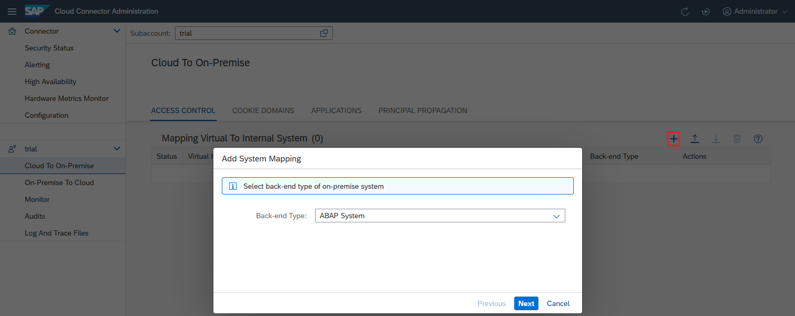

4.  Choose *Next*.
5.  *Protocol*: Choose `RFC` or `RFC SNC` for connecting to the backend system.

    > ### Note:  
    > The value `RFC SNC` is independent from your settings on the cloud side, since it only specifies the communication beween Cloud Connector and backend system. Using `RFC SNC`, you can ensure that the entire connection from the cloud application to the actual backend system \(provided by the SSL tunnel\) is secured, partly with SSL and partly with SNC. For more information, see [Initial Configuration \(RFC\)](initial-configuration-rfc-f09eefe.md).

    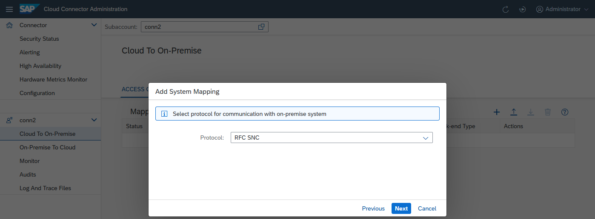

    > ### Note:  
    > -   The back end must be properly configured to support SNC connections.
    > -   SNC configuration must be provided in the Cloud Connector.

6.  Choose *Next*.
7.  Choose whether you want to configure a load balancing logon or connect to a specific application server.

    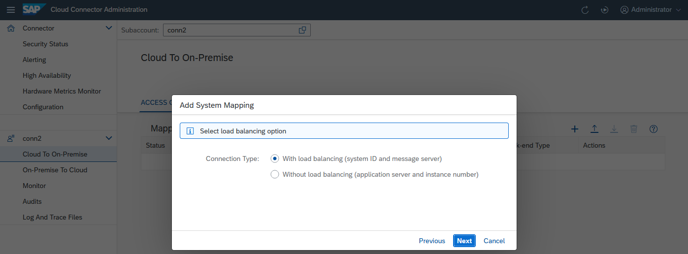

8.  Specify the parameters of the backend system. It needs to be an existing network address that can be resolved on the intranet and has network visibility for the Cloud Connector. If this is only possible using a valid [SAProuter](http://help.sap.com/saphelp_nw75/helpdata/en/48/6a169d31c34e6ee10000000a421937/frameset.htm), specify the router in the respective field. The Cloud Connector will try to establish a connection to this system, so the address has to be real.
    -   When using a load-balancing configuration, the *Message Server* specifies the message server of the ABAP system. The system ID is a three-char identifier that is also found in the SAP Logon configuration. Alternatively, it's possible to directly specify the message server port in the *System ID* field.

        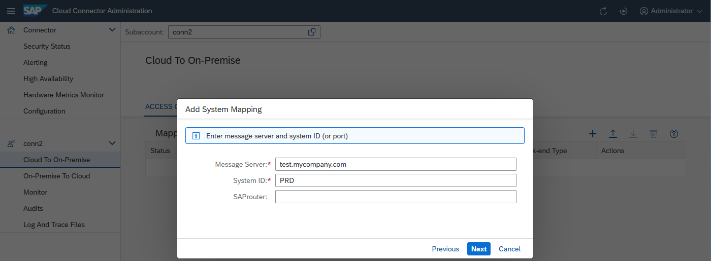

    -   When using direct logon, the *Application Server* specifies one application server of the ABAP system. The instance number is a two-digit number that is also found in the SAP Logon configuration. Alternatively, it's possible to directly specify the gateway port in the *Instance Number* field.

        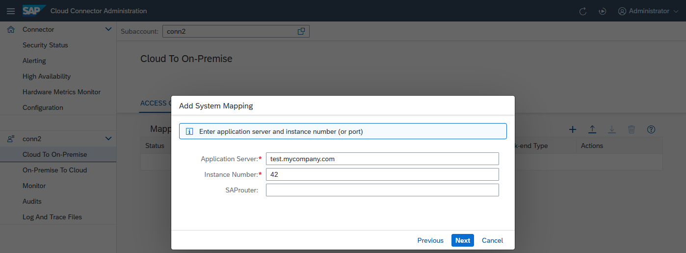

9.  Optional: You can virtualize the system information in case you like to hide your internal host names from the cloud. The virtual information can be a fake name which does not need to exist. The fields will be pre-populated with the values of the configuration provided in *Message Server* and *System ID*, or *Application Server* and *Instance Number*.

    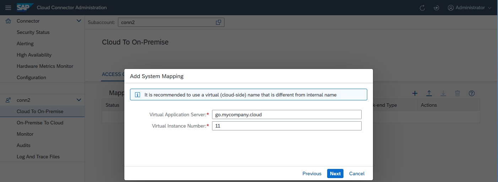

    -   *Virtual Message Server* - specifies the host name exactly as specified as the `jco.client.mshost` property in the RFC destination configuration in the cloud. The *Virtual System ID* allows you to distinguish between different entry points of your backend system that have different sets of access control settings. The value needs to be the same like for the `jco.client.r3name` property in the RFC destination configuration in the cloud.
    -   *Virtual Application Server* - it specifies the host name exactly as specified as the `jco.client.ashost` property in the RFC destination configuration in the cloud. The *Virtual Instance Number* allows you to distinguish between different entry points of your backend system that have different sets of access control settings. The value needs to be the same like for the `jco.client.sysnr` property in the RFC destination configuration in the cloud.

10. This step is only relevant if you have chosen `RFC SNC`. The *<Principal Type\>* field defines what kind of principal is used when configuring a destination on the cloud side using this system mapping with authentication type `Principal Propagation`. No matter what you choose, make sure that the general configuration for the *<Principal Type\>* has been done to make it work correctly. For destinations using different authentication types, this setting is ignored. In case you choose `None` as *<Principal Type\>*, it is not possible to apply principal propagation to this system.

    > ### Note:  
    > If you use an RFC connection, you cannot choose between different principal types. Only the `X.509` certificate is supported. You need an SNC-enabled backend connection to use it.

    For more information on principal propagation, see [Configuring Principal Propagation](configuring-principal-propagation-c84d4d0.md).

    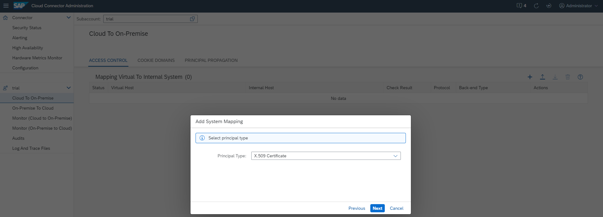

11. *SNC Partner Name*: This step will only come up if you have chosen `RFC SNC`. The SNC partner name needs to contain the correct SNC identification of the target system.

    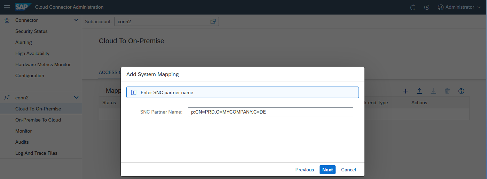

12. *Mapping Virtual to Internal System*: You can enter an optional description at this stage. The respective description will be shown as a rich tooltip when the mouse hovers over the entries of the virtual host column \(table \).

    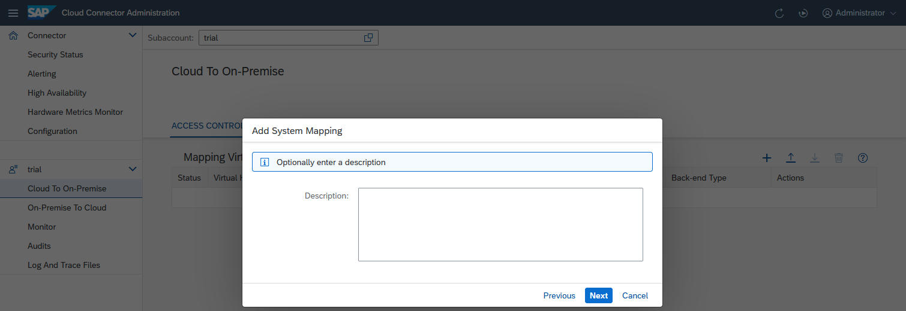

13. The summary shows information about the system to be stored. When saving the system mapping, you can trigger a ping from the Cloud Connector to the internal host, using the *Check Internal Host* checkbox. This allows you to make sure the Cloud Connector can indeed access the internal system, and allows you to catch basic things, such as spelling mistakes or firewall problems between the Cloud Connector and the internal host.

    If the ping to the internal host is successful \(that is, the host is reachable via TLS\), the state ***Reachable*** is shown. If it fails, a warning pops up. You can view issue details by choosing the *Details* button, or check them in the log files.

    You can execute such a check at any time later for all selected systems in the *Access Control* overview.

    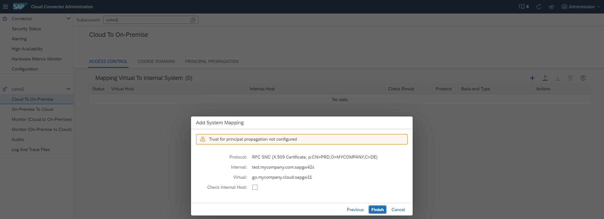

14. Optional: You can later edit a system mapping \(choose *Edit*\) to make the Cloud Connector route the requests for `sales-system.cloud:sapgw42` to a different backend system. This can be useful if the system is currently down and there is a back-up system that can serve these requests in the meantime. However, you cannot edit the virtual name of this system mapping. If you want to use a different fictional host name in your cloud application, you must delete the mapping and create a new one. Here, you can also change the *Principal Type* to `None` in case you don't want to allow principal propagation to a certain system.

    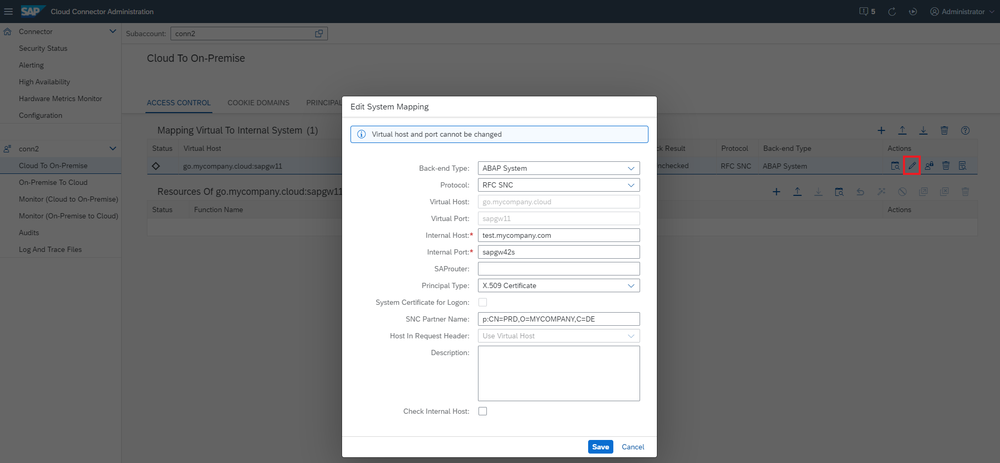

15. *Optional*. You can later edit a system mapping to add more protection to your system when using RFC via theCloud Connector, by restricting the mapping to specified clients and users: in column *Actions*, choose the button *Maintain Authority Lists \(only RFC\)* to open an allowlist/blocklist dialog. In section *Authority Client Allowlist*, enter all clients of the corresponding system in the field *<Client ID\>* that you want to allow to use the Cloud Connector connection. In section *Authority User Blocklist*, press the button *Add a user authority* \(+\) to enter all users you want to exclude from this connection. Each user must be assigned to a specified client. When you are done, press *Save*.

    > ### Note:  
    > This function applies for RFC/RFC SNC only.

    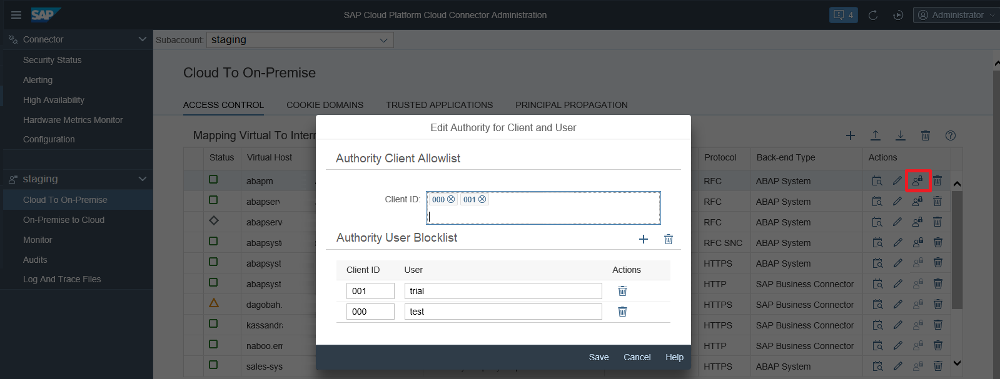

    Back to [Tasks](configure-access-control-rfc-ca58689.md#loioca5868997e48468395cf0ca4882f5783__tasks)

<a name="loioca5868997e48468395cf0ca4882f5783__limit"/>

## Limit the Accessible Resources for RFC

In addition to allowing access to a particular host and port, you also must specify which function modules \(*Resources*\) are allowed to be invoked on that host. You can enter an optional description at this stage. The Cloud Connector uses very strict allowlists for its access control. Besides internally used infrastructure function modules, only function modules for which you explicitly granted access are allowed.

1.  To define the permitted function modules for a particular backend system, choose the row corresponding to that backend system and press *Add* in section *Resources Accessible On...* below. A dialog appears, prompting you to enter the specific function module name whose invoking you want to allow.

    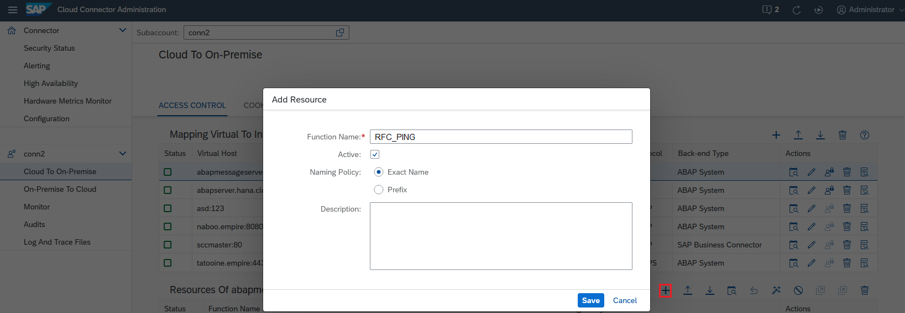

2.  The Cloud Connector checks that the function module name of an incoming request is exactly as specified in the configuration. If it is not, the request is denied.
3.  If you select the *Prefix* option, the Cloud Connector allows all incoming requests, for which the function module name begins with the specified string.
4.  The *Active* checkbox allows you to specify whether that resource should be initially enabled or disabled.

Back to [Tasks](configure-access-control-rfc-ca58689.md#loioca5868997e48468395cf0ca4882f5783__tasks)

