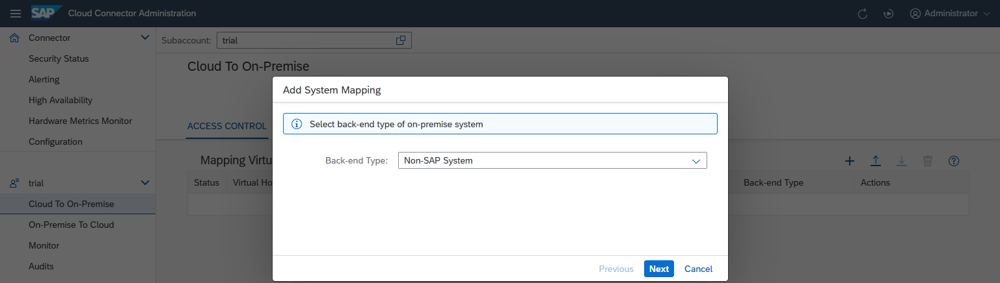
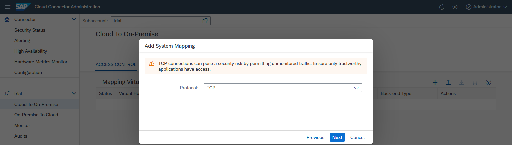
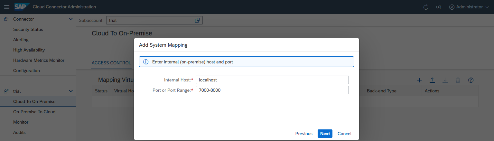
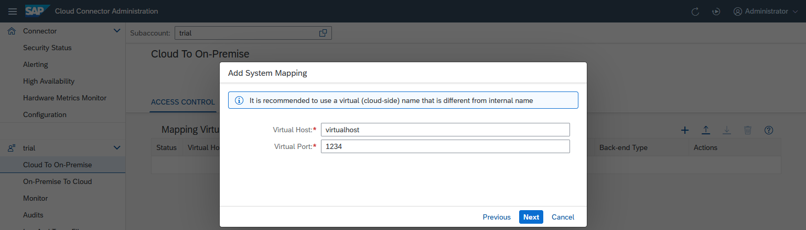
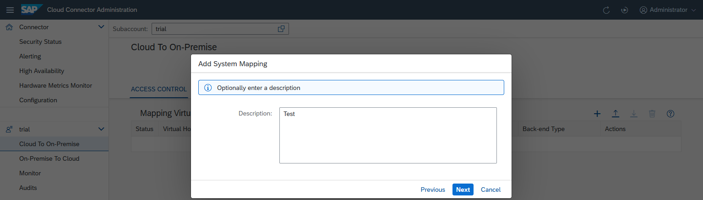
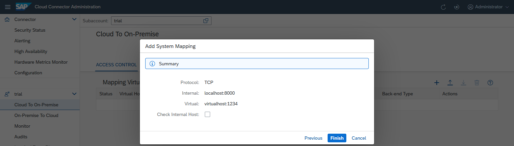
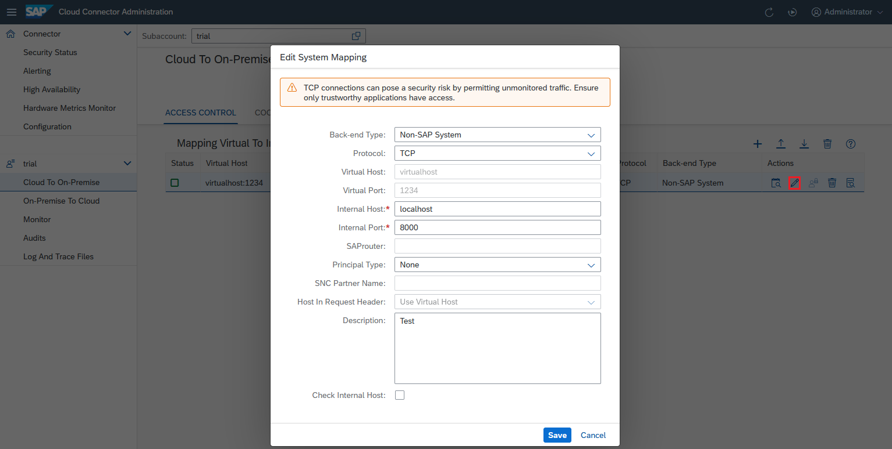

<!-- loiobefd4374d33a4833be117d7149b6a103 -->

# Configure Access Control \(TCP\)

Add a specified system mapping to the Cloud Connector if you want to use the TCP protocol for communication with a backend system.

To allow your cloud applications to access a certain backend system on the intranet via TCP, insert a new entry in the Cloud Connector access control management.

1.  Choose *Cloud To On-Premise* from your *Subaccount* menu.
2.  Choose *Add* \(+\). A wizard opens and asks for the required values.
3.  *Backend Type*: Select an appropriate system type, for example, `Non-SAP System`, from the drop-down list. When you are done, choose *Next*.

    

4.  *Protocol*: Select `TCP` or `TCP SSL` for the connection to the backend system. When choosing TCP, you can perform an end-to-end TLS handshake from the cloud client to the backend. If the cloud-side client is using plain communication, but you still need to encrypt the hop between Cloud Connector and the backend, choose `TCP SSL`. When you are done, choose *Next*.

    > ### Note:  
    > When selecting TCP as protocol, the following warning message is displayed: ***TCP connections can pose a security risk by permitting unmonitored traffic. Ensure only trustworthy applications have access***. The reason is that using plain TCP, the Cloud Connector cannot see or log any detail information about the calls. Therefore, in contrast to HTTP or RFC \(both running on top of TCP\), the Cloud Connector cannot check the validity of a request. To minimize this risk, make sure you
    > 
    > -   deploy only trusted applications on SAP BTP.
    > -   configure an application allowlist in the Cloud Connector, see [Set Up Trust](set-up-trust-a4ee70f.md).
    > -   take the recommended security measures for your SAP BTP \(sub\)account. See section [Security](https://help.sap.com/viewer/65de2977205c403bbc107264b8eccf4b/Cloud/en-US/e129aa20c78c4a9fb379b9803b02e5f6.html "Use the security features and functions of SAP BTP to support the security policies of your organization.") :arrow_upper_right: in the SAP BTP documentation.

    > ### Note:  
    > If you specify `TCP SSL`, and there is a "system certificate" imported in the Cloud Connector, the latter attempts to use this certificate for performing a client-certificate-based logon to the backend system.

    

5.  *Internal Host* and *Port or Port Range*: specify the host and port under which the target system can be reached within the intranet. It needs to be an existing network address that can be resolved on the intranet and has network visibility for the Cloud Connector. The Cloud Connector will try to forward the request to the network address specified by the internal host and port. That is why this address needs to be real.

    

    For TCP and TCP SSL, you can also specify a port range through its lower and upper limit, separated by a hyphen.

    

6.  Enter a *Virtual Host* and *Virtual Port*. The virtual host can be a fake name and does not need to exist. The fields are prepopulated with the values of the *Internal Host* and *Port or Port Range*.

    

7.  You can enter an optional description at this stage. The respective description will be shown as a tooltip when you press the button *Show Details* in column *Actions* of the *Mapping Virtual To Internal System* overview.

    

8.  The summary shows information about the system to be stored. When saving the host mapping, you can trigger a ping from the Cloud Connector to the internal host, using the *Check Internal Host* checkbox. This allows you to make sure the Cloud Connector can access the internal system. Also, you can catch basic things, such as spelling mistakes or firewall problems between the Cloud Connector and the internal host.

    If the ping to the internal host is successful \(that is, the host is reachable via TLS\), the state ***Reachable*** is shown. If it fails, a warning is displayed in column **Check Result**. You can view issue details by choosing the *Details* button, or check them in the log files.

    This check also tries to perform client authentication, if possible for TCPS, regardless of the host's availability. Find additional information and hints by choosing the *Details* button. You can check, for example, if the system certificate acting as a client certificate is configured correctly, and if the backend trusts it.

    You can execute such a check at any time later for all selected systems in the *Mapping Virtual To Internal System* overview by pressing *Check Availability of Internal Host* in column *Actions*.

    

9.  Optional: You can later edit the system mapping \(by choosing *Edit*\) to make the Cloud Connector route the requests to a different backend system. This can be useful if the system is currently down and there is a backup system that can serve these requests in the meantime. However, you cannot edit the virtual name nor port of this system mapping. If you want to use a different fictional host name in your cloud application, you must delete the mapping and create a new one. The same goes for port ranges. If a port range needs to be changed, you must delete the mapping and create it again with the desired port range.

    

