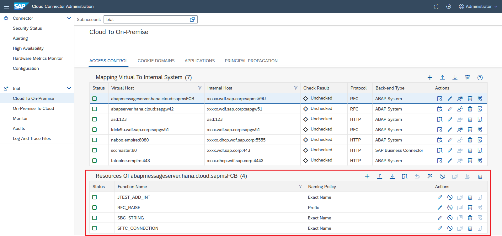
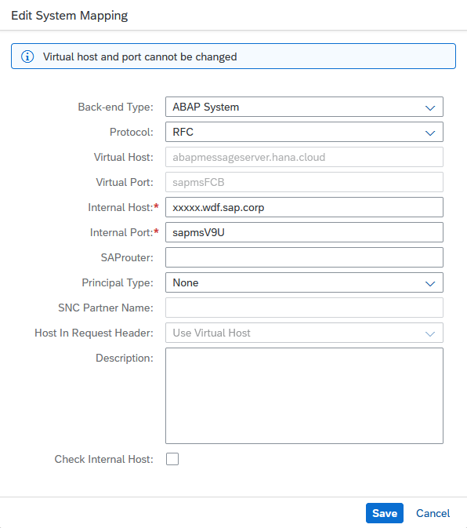
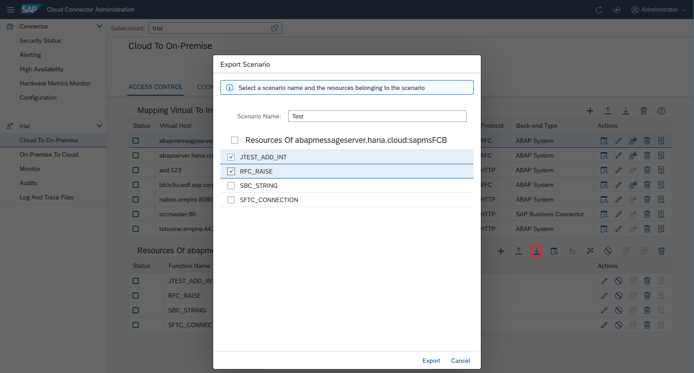
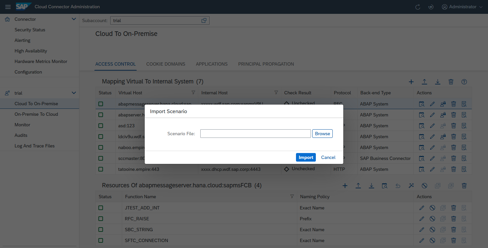
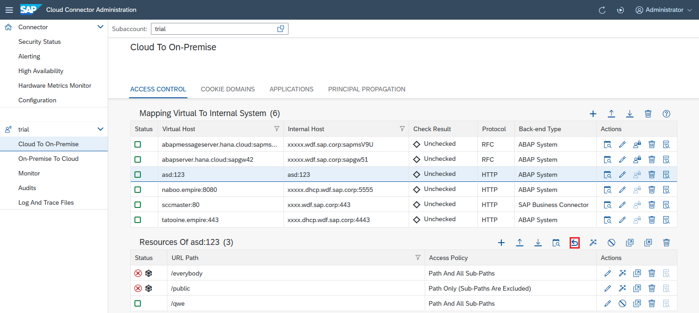

<!-- loio3b12086100b344d39a2ff0c9410e66c6 -->

# Configure Accessible Resources

Configure backend systems and resources in the Cloud Connector, to make them available for a cloud application.

<a name="loio3b12086100b344d39a2ff0c9410e66c6__tasks"/>

## Tasks

[Map Systems and Limit Access](configure-accessible-resources-3b12086.md#loio3b12086100b344d39a2ff0c9410e66c6__map)

[Use Scenarios for Resources](configure-accessible-resources-3b12086.md#loio3b12086100b344d39a2ff0c9410e66c6__scenarios)

<a name="loio3b12086100b344d39a2ff0c9410e66c6__map"/>

## Map Systems and Limit Access

Initially, after installing a new Cloud Connector, no network systems or resources are exposed to the cloud. You must configure each system and resource used by applications of the connected cloud subaccount. To do this, choose *Cloud To On Premise* from your subaccount menu and go to tab *Access Control*:

The Cloud Connector supports any type of system \(SAP or non-SAP system\) that can be called via one of the supported protocols. For example, a convenient way to access an ABAP system from a cloud application is via [SAP NetWeaver Gateway](http://help.sap.com/nwgateway), as it allows the consumption of ABAP content via HTTP and open standards.

-   For systems using HTTP communication, see: [Configure Access Control \(HTTP\)](configure-access-control-http-e7d4927.md).
-   For information on configuring RFC resources, see: [Configure Access Control \(RFC\)](configure-access-control-rfc-ca58689.md).

We recommend that you limit the access to backend services and resources. Instead of configuring a system and granting access to all its resources, grant access only to the resources needed by the cloud application. For example, define access to an HTTP service by specifying the service URL root path and allowing access to all its subpaths.

When configuring an on-premise system, you can define a virtual host and port for the specified system. The virtual host name and port represent the fully qualified domain name of the related system in the cloud. We recommend that you use the virtual host name/port mapping to prevent leaking information about a system's physical machine name and port to the cloud.

Back to [Tasks](configure-accessible-resources-3b12086.md#loio3b12086100b344d39a2ff0c9410e66c6__tasks)

<a name="loio3b12086100b344d39a2ff0c9410e66c6__scenarios"/>

## Use Scenarios for Resources

As of version 2.12, the Cloud Connector lets you define a set of resources as a scenario that you can export, and import into another Cloud Connector.

Scenarios are useful if you provide an application to many consumers, which invokes a large number of resources in an on-premise system. In this case, you must expose a system on your Cloud Connector that covers all required resources, which increases the risk of incorrect configuration.

[Define and Export a Scenario](configure-accessible-resources-3b12086.md#loio3b12086100b344d39a2ff0c9410e66c6__export)

[Import a Scenario](configure-accessible-resources-3b12086.md#loio3b12086100b344d39a2ff0c9410e66c6__import)

[Remove a Scenario](configure-accessible-resources-3b12086.md#loio3b12086100b344d39a2ff0c9410e66c6__remove)

**Define and Export a Scenario**

If you, as application owner, have implemented and tested a scenario, and configured a Cloud Connector accordingly, you can define the scenario as follows:

1.  Choose the *Export Scenario* button.
2.  In the dialog, select the resources that belong to the scenario.
3.  In the field *<Scenario Name\>*, choose a descriptive name, under which the set of resources can be identified in the consuming Cloud Connector.
4.  Choose *Export* to store the scenario.

> ### Note:  
> For applications provided by SAP, default scenario definitions may be available. To verify this, check the corresponding application documentation.

Back to [Use Scenarios for Resources](configure-accessible-resources-3b12086.md#loio3b12086100b344d39a2ff0c9410e66c6__scenarios)

Back to [Tasks](configure-accessible-resources-3b12086.md#loio3b12086100b344d39a2ff0c9410e66c6__tasks)

**Import a Scenario**

As an administrator taking care for a scenario configuration in some other Cloud Connector, perform the following steps:

1.  Choose the *Import Scenario* button to add all required resources to the desired access control entry.
2.  In the dialog, navigate to the folder of the archive that contains the scenario definition.
3.  Choose *Import*. The resources of the scenario are merged with the existing set of resources which are already available in the access control entry.

All resources belonging to a scenario get an additional scenario icon in their status. When hovering over it, the assigned scenario\(s\) of this resource are listed.

Back to [Use Scenarios for Resources](configure-accessible-resources-3b12086.md#loio3b12086100b344d39a2ff0c9410e66c6__scenarios)

Back to [Tasks](configure-accessible-resources-3b12086.md#loio3b12086100b344d39a2ff0c9410e66c6__tasks)

**Remove a Scenario**

To remove a scenario:

1.  Choose the *Remove Scenario* button.
2.  In the dialog, choose the scenario\(s\) you want to remove.
3.  Choose *Remove* to remove all resources associated with the chosen entry from the access control entry. Resources that existed before, or are assigned to another scenario as well, are not removed.

Back to [Use Scenarios for Resources](configure-accessible-resources-3b12086.md#loio3b12086100b344d39a2ff0c9410e66c6__scenarios)

Back to [Tasks](configure-accessible-resources-3b12086.md#loio3b12086100b344d39a2ff0c9410e66c6__tasks)

