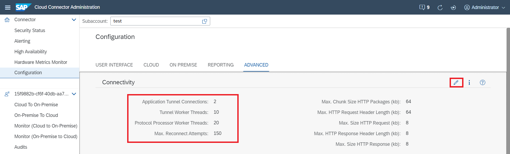
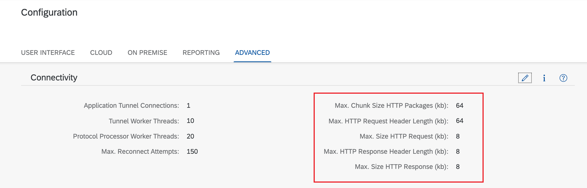

<!-- loio3975253c1a884638bf6f408f55ea349e -->

# Configure Advanced Connectivity

Adapt connectivity settings that control the throughput and HTTP connectivity to on-premise systems.

<a name="loio3975253c1a884638bf6f408f55ea349e__section_vxf_1fc_ztb"/>

## Tunnel Connections

If required, you can adjust the following parameters for the communication tunnel by changing their default values:

-   Application Tunnel Connections \(default: 1\)

    > ### Note:  
    > This parameter specifies the default value for the maximal number of tunnel connections *per application*. The value must be higher than 0.

-   Tunnel Worker Threads \(default: 10\)

-   Protocol Processor Worker Threads \(default: 20\)

For detailed information on connection configuration requirements, see [Configuration Setup](configuration-setup-7437cd6.md).

To change the parameter values, do the following:

1.  From the Cloud Connector main menu, choose *Configuration* \> *Advanced*. In section *Connectivity*, select *Edit*.

    

2.  In the *Edit Connectivity Settings* dialog, change the parameter values as required.
3.  Choose *Save*.

Additionally, you can specify the number of allowed tunnel connections for each application that you have specified as a [trusted application](set-up-trust-a4ee70f.md#loioa4ee70f0274248f8bbc7594179ef948d__trust_cloud_apps).

> ### Note:  
> If you don't change the value for a trusted application, it keeps the default setting specified above. If you change the value, it may be higher or lower than the default and must be higher than 0.

<a name="loio3975253c1a884638bf6f408f55ea349e__section_fjz_y2c_ztb"/>

## HTTP Connectivity

The Cloud Connector also allows to set some sensible parameters controlling the HTTP connectivity to on-premise systems.

> ### Caution:  
> Do not change these parameters unless you are absolutely sure that changes are indispensable.

Find a brief description of these critical configuration parameters below:

<table>
<tr>
<th valign="top">

Parameter

</th>
<th valign="top">

Description

</th>
<th valign="top">

Default Value

</th>
</tr>
<tr>
<td valign="top">

Max. Chunk Size HTTP Packages \(kb\)

</td>
<td valign="top">

Max. size of chunks transmitted in HTTP streaming. The chunk size affects the throughput of HTTP communication.

</td>
<td valign="top">

64kb

</td>
</tr>
<tr>
<td valign="top">

Max. HTTP Request Header Length \(kb\)

</td>
<td valign="top">

Max. allowed size of HTTP request headers. Headers containing

authentication information like SAML or JWT could require this size.

</td>
<td valign="top">

64kb

</td>
</tr>
<tr>
<td valign="top">

Max. Size HTTP Request \(kb\)

</td>
<td valign="top">

Size for the request line of HTTP request. HTTP Body is not included.

</td>
<td valign="top">

8kb

</td>
</tr>
<tr>
<td valign="top">

Max. HTTP Response Header Length \(kb\)

</td>
<td valign="top">

Max. allowed size of HTTP response headers.

</td>
<td valign="top">

8kb

</td>
</tr>
<tr>
<td valign="top">

Max. Size HTTP Response \(kb\)

</td>
<td valign="top">

Size for the response line of the HTTP response. HTTP Body is not included.

</td>
<td valign="top">

8kb

</td>
</tr>
</table>

