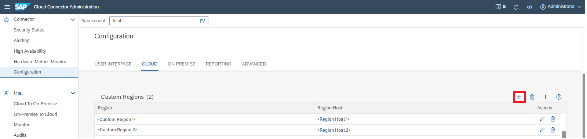

<!-- loioa994a759237948cc94cb55c167a08725 -->

# Configure Custom Regions

Configure regions that are not available in the standard selection.

> ### Tip:  
> This procedure is useful in particular for regions introduced after the release of your current Cloud Connector version. Those regions are not included in the list of predefined regions.

If you want to use a custom region for your subaccount, you can configure regions in the Cloud Connector, which are not listed in the selection of standard regions.

To add a custom region, do the following:

1.  From the Cloud Connector main menu, choose *Configuration* \> *Cloud* and go to the *Custom Regions* section.
2.  To add a region to the list, choose the *Add* icon.

    

3.  In the *Add Region* dialog, enter the *<Region\>* and *<Region Host\>* you want to use.
4.  Choose *Save*.
5.  To edit a region from the list, select the corresponding line and choose the *Edit* icon.

