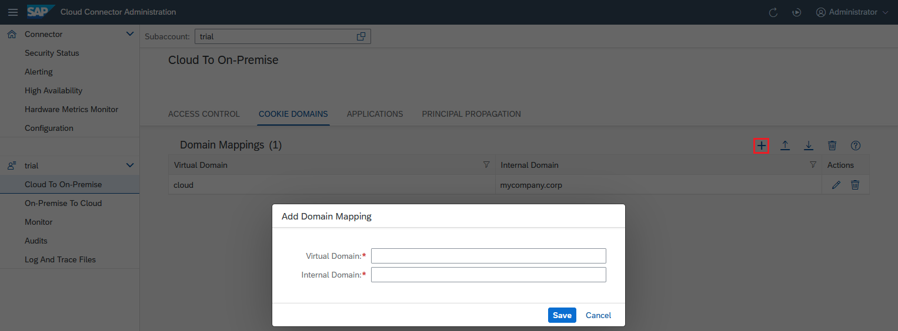

<!-- loiob7d257b070b042e19a60df01e02d191f -->

# Configure Domain Mappings for Cookies


## Context

Some HTTP servers return cookies that contain a `domain` attribute. For subsequent requests, HTTP clients should send these cookies to machines that have host names in the specified domain.

For example, if the client receives a cookie like the following:

```
Set-Cookie: cookie-field=some-value; domain=mycompany.corp; path=...; ...
```

It returns the cookie in follow-up requests to all hosts like `ecc60.mycompany.corp`, `crm40.mycompany.corp`, and so on, if the other attributes like `path` and `attribute` require it.

However, in a Cloud Connector setup between a client and a Web server, this may lead to problems. For example, assume that you have defined a virtual host *sales-system.cloud* and mapped it to the internal host name `ecc60.mycompany.corp`. The client "thinks" it is sending an HTTP request to the host name *sales-system.cloud*, while the Web server, unaware of the above host name mapping, sets a cookie for the domain `mycompany.corp`. The client does not know this domain name and thus, for the next request to that Web server, doesn't attach the cookie, which it should do. The procedure below prevents this problem.


## Procedure

1.  From your subaccount menu, choose *Cloud To On-Premise*, and go to the *Cookie Domains* tab.

2.  Choose *Add*.

3.  Enter `cloud` as the virtual domain, and your company name as the internal domain.

4.  Choose *Save*.

    

    The Cloud Connector checks the Web server's response for `Set-Cookie` headers. If it finds one with an attribute `domain=intranet.corp`, it replaces it with `domain=sales.cloud` before returning the HTTP response to the client. Then, the client recognizes the domain name, and for the next request against *www1.sales.cloud* it attaches the cookie, which then successfully arrives at the server on `machine1.intranet.corp`.

    > ### Note:  
    > Some Web servers use a syntax such as `domain=.intranet.corp` \(RFC 2109\), even though the newer RFC 6265 recommends using the notation without a dot.

    > ### Note:  
    > The value of the domain attribute may be a simple host name, in which case no extra domain mapping is necessary on the Cloud Connector. If the server sets a cookie with `domain=machine1.intranet.corp`, the Cloud Connector automatically reverses the `mapping machine1.intranet.corp` to *www1.sales.cloud* and replaces the cookie domain accordingly.


**Related Information**  


[Configure Access Control](configure-access-control-f42fe44.md "Specify the backend systems that can be accessed by your cloud applications.")

