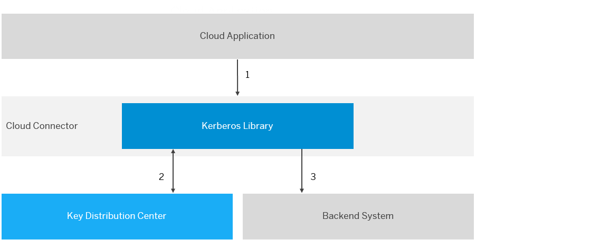
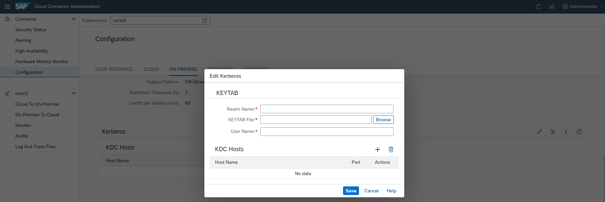

<!-- loiof2339d896587464ab703564fd687dfde -->

# Configure Kerberos

## Context

The Cloud Connector allows you to propagate users authenticated in SAP BTP via Kerberos against backend systems. It uses the **Service For User and Constrained Delegation** protocol extension of Kerberos.

> ### Note:  
> This feature is not supported for ABAP backend systems. In this case, you can use the certificate-based principal propagation, see [Configure a CA Certificate](configure-a-ca-certificate-d0c4d56.md).

The Key Distribution Center \(KDC\) is used for exchanging messages in order to retrieve Kerberos tokens for a certain user and backend system.

For more information, see [Kerberos Protocol Extensions: Service for User and Constrained Delegation Protocol](http://msdn.microsoft.com/en-us/library/cc246071.aspx).

1.  An SAP BTP application calls a backend system via the Cloud Connector.
2.  The Cloud Connector calls the KDC to obtain a Kerberos token for the user propagated from the Cloud Connector.
3.  The obtained Kerberos token is sent as a credential to the backend system.

## Procedure

1.  Choose *Configuration* from the main menu.

2.  From the *Kerberos* section of the *On Premise* tab, choose *Edit*.

    

3.  Enter the name of your Kerberos realm.

4.  Upload a KEYTAB file that contains the secret keys of your service user. The KEYTAB file should contain the `rc4-hmac` key for your user.

5.  Enter the name of the service user to be used for communication with the KDC. This user should be allowed to request Kerberos tokens for other users for the backend systems that you are going to access.

6.  In the *<KDC Hosts\>* field \(press *Add* to display the field\), enter the host name of your KDC using the format `<host>:<port>`. The port is optional; if you leave it empty, the default, 88, is used.

7.  Choose *Save*.

## Example

You have a backend system protected with SPNego authentication in your corporate network. You want to call it from a cloud application while preserving the identity of a cloud-authenticated user.

Define the following:

-   A connectivity destination in SAP BTP, with `ProxyType` = `OnPremise`.
-   A system mapping made in the Cloud Connector. \(Choose *Cloud to On Premise* from your subaccount menu, Go to tab *Access Control* \> *Add*, and for *Principal Type*, select `Kerberos`.\)
-   Kerberos configuration in the Cloud Connector, where the service user is allowed to delegate calls for your backend host service.

**Result:**

When you now call a backend system, the Cloud Connector obtains an SPNego token from your KDC for the cloud-authenticated user. This token is sent along with the request to the back end, so that it can authenticate the user and the identity to be preserved.

**Related Information**  

[Set Up Trust](set-up-trust-a4ee70f.md "Establish trust to an identiy provider to support principal propagation and technical user propagation.")

