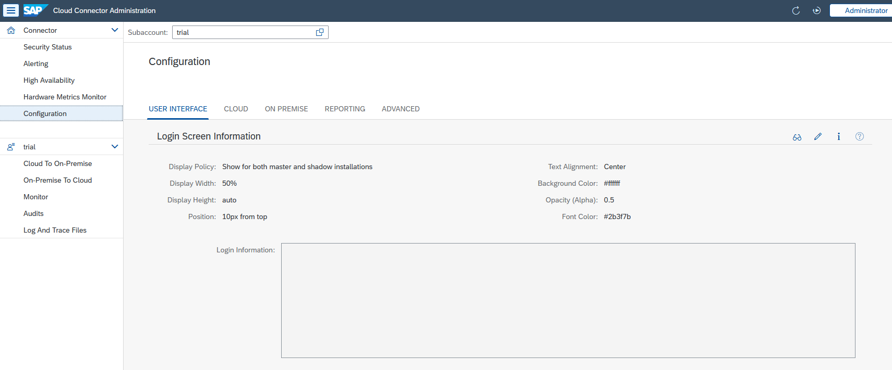
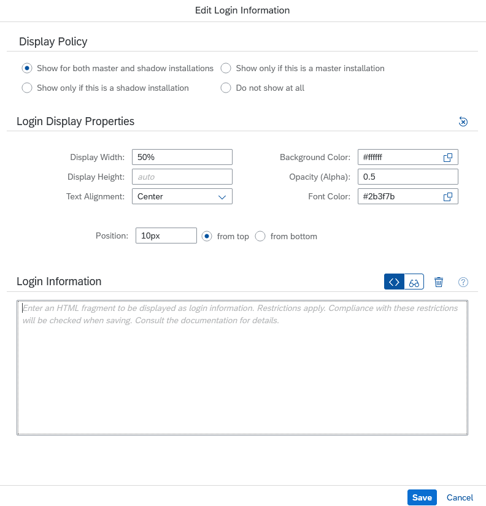

<!-- loio916df5b825494bc087a5a619e741eeef -->

# Configure Login Screen Information

Add additional information to the login screen and configure its appearance.

To configure the login screen information, proceed as follows:

1.  Go to *Configuration* \> *User Interface* \(Shadow instance: *Shadow Configuration* \> *User Interface*\) and press the *Edit* button in section *Login Screen Information* \(at the bottom of the screen\).

    

    As a result, the following dialog is opened:

    

2.  In section *Display Policy*, select a display policy for the login screen information. The display policy decides whether the information is shown if the instance is assuming the role mentioned in the policy.
3.  In section *Display Properties*, specify your preferred display properties \(appearance and position\):
    -   The login information is displayed in a box with rounded corners. You can specify its width and height in pixels \(unit `px`\) or as a percentage \(unit `%`\).

        > ### Note:  
        > Omitting any value triggers the default or auto behavior.
        > 
        > -   For the width, the default behavior is equivalent to 100%.
        > -   For the height, the default behavior sets the height to a value that accommodates the login information \(that is, the given HTML fragment\). For extensive information we therefore recommend that you limit the height to a suitable pixel or percentage value to induce scrolling, and to prevent the box from growing beyond a reasonable height.

    -   When customizing the **background color** of the box, the **opacity** \(of the background color\), **font color**, or **text alignment**, then the section *Login Information* automatically switches to preview mode. That way you can follow live the changes made to the appearance of the box and of the information displayed inside it.

        > ### Note:  
        > You can hide the box and to show only the text of the login information by choosing an opacity value of `0` \(opacity is the opposite of transparency. *No* opacity means *complete* transparency\).

    -   You can **position the box** containing the login information at the top or bottom of the login page. To do this, set the field *<Position\>* to the corresponding pixel or percentage value.

4.  Enter the information to be displayed in section *Login Information*. The information must be supplied as an HTML fragment. There is a limited number of tags that can be used. Attributes available for these tags are subject to restrictions.

    <table>
    <tr>
    <th valign="top">

    Available Tag
    
    </th>
    <th valign="top">

    Attribute Restriction
    
    </th>
    </tr>
    <tr>
    <td valign="top">
    
    p
    
    </td>
    <td valign="top">
    
    Only attribute style is permitted, with property `text-align` set to a valid value \(`left`, `right`, `center`, or `justified`\)
    
    </td>
    </tr>
    <tr>
    <td valign="top">
    
    ul
    
    </td>
    <td valign="top">
    
    No attributes allowed
    
    </td>
    </tr>
    <tr>
    <td valign="top">
    
    ol
    
    </td>
    <td valign="top">
    
    No attributes allowed
    
    </td>
    </tr>
    <tr>
    <td valign="top">
    
    li
    
    </td>
    <td valign="top">
    
    No attributes allowed
    
    </td>
    </tr>
    <tr>
    <td valign="top">
    
    br
    
    </td>
    <td valign="top">
    
    No attributes allowed
    
    </td>
    </tr>
    <tr>
    <td valign="top">
    
    h1
    
    </td>
    <td valign="top">
    
    No attributes allowed
    
    </td>
    </tr>
    <tr>
    <td valign="top">
    
    h2
    
    </td>
    <td valign="top">
    
    No attributes allowed
    
    </td>
    </tr>
    <tr>
    <td valign="top">
    
    h3
    
    </td>
    <td valign="top">
    
    No attributes allowed
    
    </td>
    </tr>
    <tr>
    <td valign="top">
    
    i
    
    </td>
    <td valign="top">
    
    No attributes allowed
    
    </td>
    </tr>
    <tr>
    <td valign="top">
    
    b
    
    </td>
    <td valign="top">
    
    No attributes allowed
    
    </td>
    </tr>
    <tr>
    <td valign="top">
    
    a
    
    </td>
    <td valign="top">
    
    Must have exactly two attributes:

    -   `href` \(its value must be a `<URL>` with protocol `http` or `https`\)
    -   `target` \(its value must be "`_blank`"\)

    
    </td>
    </tr>
    </table>
    
    HTML syntax checking is strict. Attribute values must be enclosed by double quotes. Missing or unmatched opening or closing tags are not permitted.

    > ### Note:  
    > Tag `br` does not require a closing tag as there cannot be any inner HTML.

