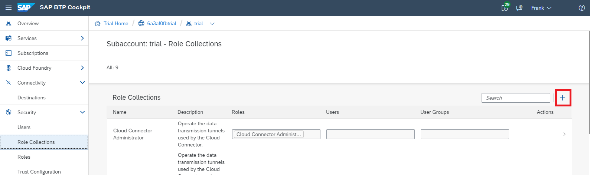
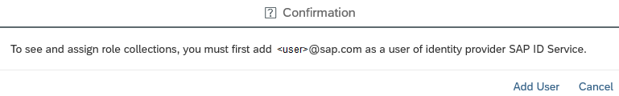

<!-- loioe862ab70c8304b0589491c018b3abc1e -->

# Configure Roles and Trust

Configure a role that enables your user to access your Web application.

To add and assign roles, navigate to the subaccount view of the cloud cockpit and choose *Security* \> *Role Collections*.

1.  Create a new role collection with the name `all`.
2.  From the subaccount menu, choose *Trust Configuration*.
3.  If you don't have a trust configuration, follow the steps in [Manually Establish Trust and Federation Between SAP Authorization and Trust Management Service and SAP Cloud Identity Services](https://help.sap.com/viewer/65de2977205c403bbc107264b8eccf4b/Cloud/en-US/7c6aa87459764b179aeccadccd4f91f3.html#loio7c6aa87459764b179aeccadccd4f91f3 "Use your SAP Cloud Identity Services tenant as an identity provider or a proxy to your own identity provider hosting your business users. Exchange SAML metadata to establish trust with the SAP Cloud Identity Services tenant and then register your subaccount with the tenant. To complete federation, maintain the federation attributes of the user groups.") :arrow_upper_right:.
4.  Click on the IdP name of your choice.
5.  Type in your e-mail address and choose *Show Assignments*.
6.  If your user has not yet been added to the SAP ID service, you see following popup. In this case, add your user now.

    

7.  You should now be able to click *Assign Role Collection*. Choose role collection `all` and assign it.

<a name="loioe862ab70c8304b0589491c018b3abc1e__section_xsy_nkc_cgb"/>

## Next Steps

-   [Set Up an Application Router](set-up-an-application-router-b14eeb9.md)
-   [Configure the RFC Destination](configure-the-rfc-destination-296f457.md)
-   [Configure the Cloud Connector](configure-the-cloud-connector-783a96e.md)
-   [Monitoring Your Web Application](monitoring-your-web-application-e2ce724.md) \(Optional\)

**Related Information**  

[Working with Role Collections](https://help.sap.com/viewer/65de2977205c403bbc107264b8eccf4b/Cloud/en-US/393ea0b222754311884123ce564779bd.html "As an administrator, you group application roles in role collections. You then assign role collections to application users.") :arrow_upper_right:

