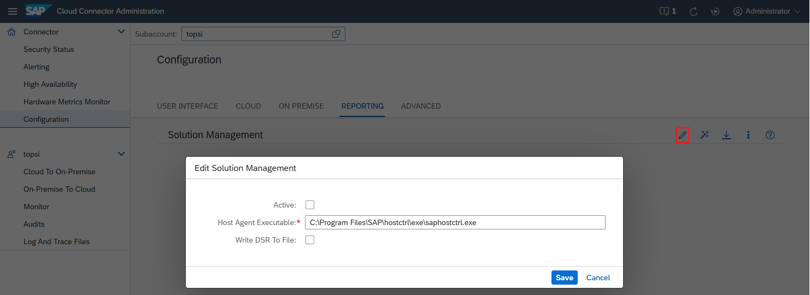

<!-- loio3a058a25a0f0487eb5b8d2d0df8e9426 -->

# Configure Solution Management Integration

Activate Solution Management reporting in the Cloud Connector.

If you want to monitor the Cloud Connector with the SAP Solution Manager, you can install a host agent on the machine of the Cloud Connector and register the Cloud Connector on your system.

<a name="loio3a058a25a0f0487eb5b8d2d0df8e9426__section_mgq_br3_vcb"/>

## Prerequisites

-   You have installed the SAP Diagnostics Agent and SAP Host Agent on the Cloud Connector host and connected them to the SAP Solution Manager. The RPM on Linux ensures that the host agent configuration is adjusted and that user groups are setup correctly.

    For more details about the host agent and diagnostics agent, see [SAP Host Agent](https://help.sap.com/viewer/3ce0859db2164fe19541dda577d29020/7.52.0/en-US) and the SCN Wiki [SAP Solution Manager Setup/Managed System Checklist](https://wiki.scn.sap.com/wiki/display/SMSETUP/Managed+System+Checklist).

    See also SAP notes [2607632](https://me.sap.com/notes/2607632) \(*SAP Solution Manager 7.2 - Managed System Configuration for SAP Cloud Connector*\) and [1018839](https://me.sap.com/notes/1018839) \(*Registering in the System Landscape Directory using sldreg*\). For consulting, contact your local SAP partner.

    > ### Note:  
    > Linux OS: if you installed the host agent after installing the Cloud Connector, you can execute `enableSolMan.sh` in the installation directory to adjust the host agent configuration and user group setup. This action requires root permission.

-   The SAP Solution Manager must be of release 7.2 SP06 or higher.

<a name="loio3a058a25a0f0487eb5b8d2d0df8e9426__section_tp1_cr3_vcb"/>

## Procedure

To enable the integration, do the following:

1.  From the Cloud Connector main menu, choose *Configuration* \> *Reporting*. In section *Solution Management* of the *Reporting* tab, select *Edit*.

    

2.  Select the *Active* checkbox.
3.  In the field *<Host Agent\>*, specify the location of the host agent as filepath.
4.  If you want to store the reporting results \(*Dynamic Statistical Records*\), select *Write DSR To File*.
5.  Choose *Save*.

> ### Note:  
> To download the registration file *lmdbModel.xml*, choose the icon *Download registration file* from the *Reporting* tab.

**Related Information**  

[Monitoring](monitoring-6d9c937.md "Learn how to monitor the Cloud Connector from the SAP BTP cockpit and from the Cloud Connector administration UI.")

