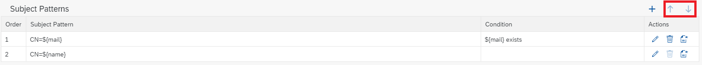
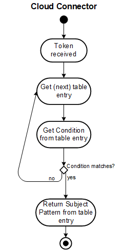
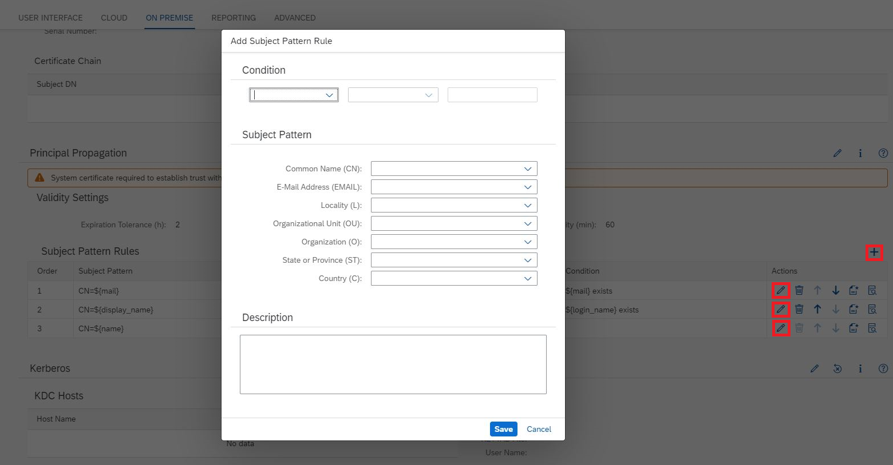
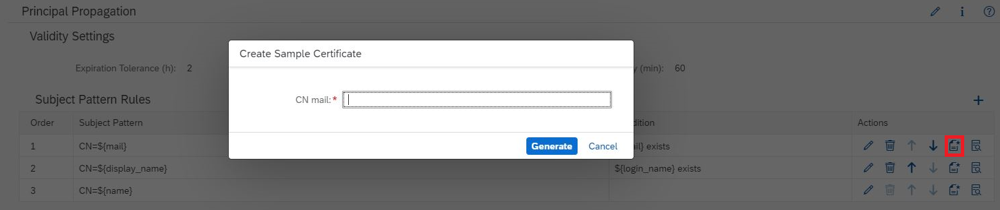

<!-- loio58803a25e5894d759e0df1c5513b41ed -->

# Configure Subject Patterns for Principal Propagation

Define patterns identifying the user for the subject of a generated short-lived X.509 certificate.

> ### Note:  
> The information in this section applies to both principal propagation and technical user propagation.

Using this configuration option, you can define different patterns identifying the user for the subject of the generated short-lived X.509 certificate, based on a specified condition. You can also specify the validity period and expiration tolerance.

## Configure Subject Patterns

To configure a subject pattern, choose *Configuration* \> *On Premise* \> *Principal Propagation*. In the table shown, you can add or modify patterns.

This table represents an ordered list containing entries that have a specified condition, and the respective subject pattern. You can change the order for an entry by choosing the arrow buttons. The workflow in the Cloud Connector looks like this:

The last entry in the table is the default one having no condition \(that is, it always matches as fallback\). This entry can not be moved or deleted.

To modify or add table entries, choose the *Edit* or *Add* icon:

<a name="loio58803a25e5894d759e0df1c5513b41ed__section_xw1_mqn_zbb"/>

## Specify a Condition

Use either of the following procedures to specify a condition based on the attributes of incoming tokens from cloud side:

-   Enter the values in the subject pattern fields manually.
-   Use the selection menu of the corresponding field to enter a predefined variable.

Using the selection menu, you can assign values for the following parameters:

-   `${user_type}`
-   `${name}`
-   `${mail}`
-   `${email}`
-   `${display_name}`
-   `${login_name}` 

<a name="loio58803a25e5894d759e0df1c5513b41ed__section_fgn_43m_1vb"/>

## Operators

In a next step, choose an operator:

-   *exists*: This attribute must be present in the incoming token.
-   *does not exist*: This attribute must not be present in the incoming token.
-   *is*: This attribute must be present and equals to the value that has been entered in the third field afterwards.
-   *is not*: This attribute must be present and is not equal to the value that has been entered in the third field afterwards.

> ### Note:  
> For the condition `${user_type}`, you can only switch between `Technical` or `Business`. The latter refers to the "classical" propagation of business user information, whereas `Technical` is the propagation of a technical user.

<a name="loio58803a25e5894d759e0df1c5513b41ed__section_zds_23m_1vb"/>

## Subject Pattern Details

Use either of the following procedures to define the subject's distinguished name \(DN\), for which the certificate will be issued:

-   Enter the values in the subject pattern fields manually.
-   Use the selection menu of the corresponding field to enter a predefined variable.

Using the selection menu, you can assign values for the following parameters:

-   `${name}`
-   `${mail}`
-   `${display_name}`
-   `${login_name}` 

> ### Note:  
> If the token provided by the Identity Provider contains additional values that are stored in attributes with different names, but you still want to use it for the subject pattern, you can edit the variable name to place the corresponding attribute value in the subject accordingly. For example, provide `${email}`, if a SAML assertion uses `email` instead of providing `mail`, or `${user_uuid}` if the attribute `user_uuid` representing the global user ID is contained in the assertion.
> 
> When using a subaccount in the **Cloud Foundry** environment: The Cloud Connector also offers direct access to custom variables injected in the JWT \(JSON Web token\) by SAP BTP *Authorization & Trust Management* that were taken over from a SAML assertion.

The values for these variables are provided by the trusted identiy provider in the token which is passed to the Cloud Connector and specifies the user that has logged on to the cloud application.

By default, the following attributes are provided:

-   *<CN\>*: \(common name\) – the name of the certificate owner
-   *<EMAIL\>*: \(e-mail address\) - the e-mail address of the certificate owner
-   *<L\>*: \(locality\) – the certificate owner's location
-   *<O\>*: \(organization\) – the certificate owner's organization or company
-   *<OU\>*: \(name of organizational unit\) – the organizational unit to which the certificate owner belongs
-   *<ST\>*: \(state of residence\) – the state in which the certificate issuer resides
-   *<C\>*: \(country of residence\) – the country in which the certificate owner resides
-   *<Expiration Tolerance \(h\)\>*: The length of time in hours, that an application can use a principal issued for a user after the token from cloud side has expired.
-   *<Certificate Validity \(min\)\>*: The length of time in minutes, that a certificate generated for principal propagation can authenticate against the back end. You can reuse a previously generated certificate to improve performance.

<a name="loio58803a25e5894d759e0df1c5513b41ed__section_iz1_mqn_zbb"/>

## Sample Certificate

By choosing *Generate Sample Certificate* you can create a sample certificate that looks like one of the short-lived certificates created at runtime. You can use this certificate to, for example, generate user mapping rules in the target system, via transaction CERTRULE in an ABAP system. If your subject pattern contains variable fields, a wizard lets you provide meaningful values for each of them and eventually you can save the sample certificate in `DER` format.

<a name="loio58803a25e5894d759e0df1c5513b41ed__section_tqr_wjm_1vb"/>

## Validity Settings

You can change the validity settings by choosing the *Edit* button.

**Related Information**  

[Server Certificate Authentication](server-certificate-authentication-e75d7f1.md "Create and configure a Server Certificate destination for an application in the Cloud Foundry environment.")

