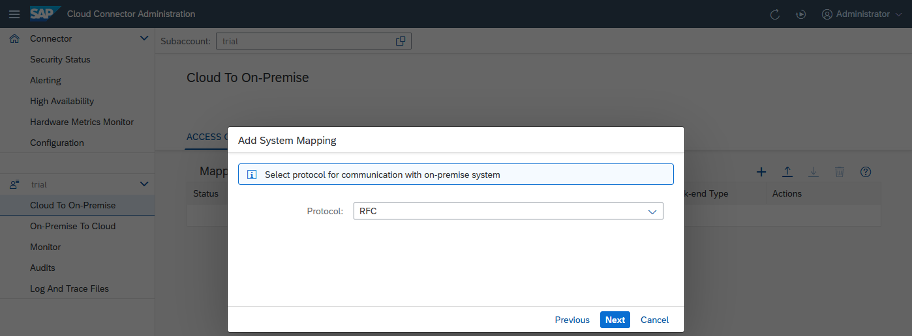
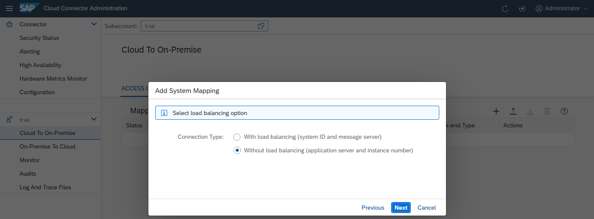
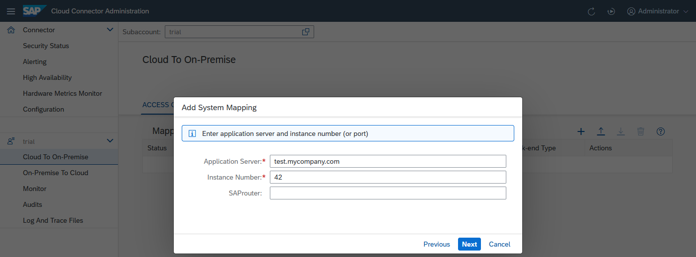
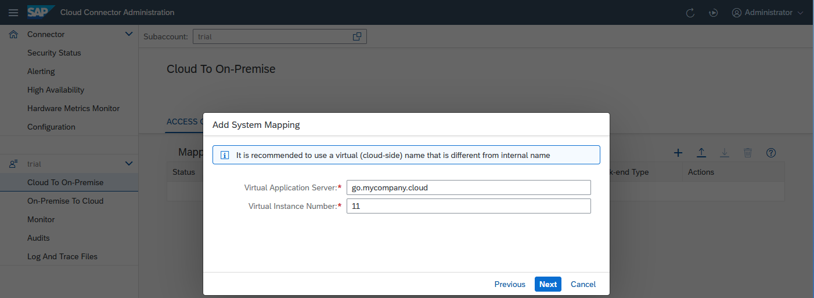
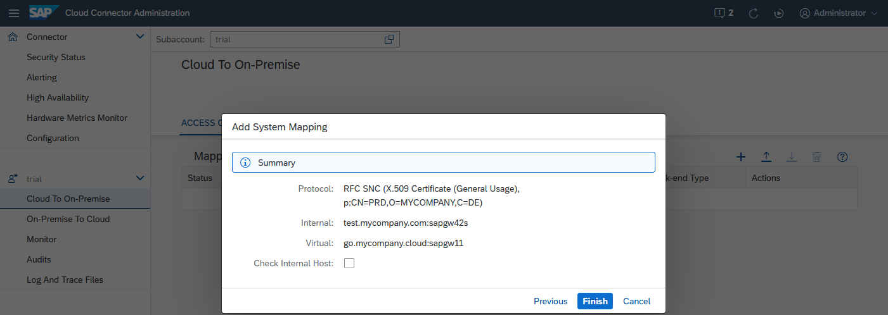
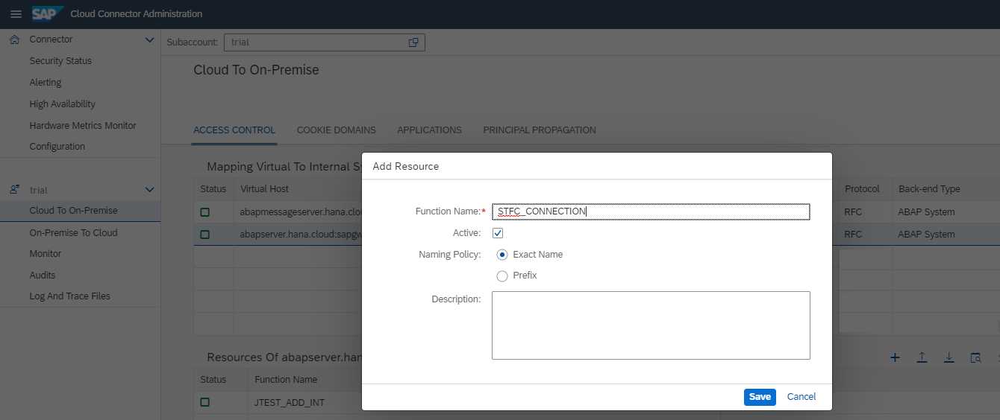

<!-- loio783a96e7e92342bdb7cb7c2a1be4ab54 -->

# Configure the Cloud Connector

Configure the system mapping and the function module in the Cloud Connector.


<a name="loio783a96e7e92342bdb7cb7c2a1be4ab54__Steps_Configure_CC"/>

## Steps

1.  [Configure Host Mapping](configure-the-cloud-connector-783a96e.md#loio783a96e7e92342bdb7cb7c2a1be4ab54__Map)
2.  [Configure the Function Module](configure-the-cloud-connector-783a96e.md#loio783a96e7e92342bdb7cb7c2a1be4ab54__Config)


<a name="loio783a96e7e92342bdb7cb7c2a1be4ab54__Map"/>

## Configure Host Mapping

The Cloud Connector only allows access to trusted backend systems. To configure this, follow the steps below:

1.  Optional: In the Cloud Connector administration UI, you can check under *Audits* whether access has been denied:

    ***Denying access for user DEMOUSER to system abapserver.hana.cloud:sapgw42 \[connectionId=-1547299395\]***

2.  In the Cloud Connector administration UI, choose *Cloud To On-Premise* from your *Subaccount* menu, tab *Access Control*.
3.  In section *Mapping Virtual To Internal System* choose *Add* to define a new system.
    1.  For *Backend Type*, select `ABAP System` and choose *Next*.

        

    2.  For *Protocol*, select `RFC` and choose *Next*.

        

    3.  Choose option *Without load balancing*.

        

    4.  Enter application server and instance number. The *Application Server* entry must be the physical host name of the machine on which the ABAP application server is running. Choose *Next*.

        **Example:**

        

    5.  Enter server and instance number for virtual mapping.

        > ### Note:  
        > The values must match with the ones of the destination configuration in the cloud cockpit.

        **Example:**

        

    6.  Summary \(example\):

        


4.  Call again the URL that references the cloud application in the Web browser. The application should now throw a different exception:

    ```
    
    
    om.sap.conn.jco.JCoException: (102) JCO_ERROR_COMMUNICATION:  Partner signaled an error: Access denied for STFC_CONNECTION on abapserver.hana.cloud:sapgw42. Expose the function module in your Cloud Connector in case it was a valid request.
    
        at com.sap.conn.jco.rt.MiddlewareJavaRfc.generateJCoException(MiddlewareJavaRfc.java:632)
        at com.sap.conn.jco.rt.MiddlewareJavaRfc$JavaRfcClient.execute(MiddlewareJavaRfc.java:1764)
        at com.sap.conn.jco.rt.ClientConnection.execute(ClientConnection.java:1110)
        at com.sap.conn.jco.rt.ClientConnection.execute(ClientConnection.java:943)
        at com.sap.conn.jco.rt.RfcDestination.execute(RfcDestination.java:1307)
        at com.sap.conn.jco.rt.RfcDestination.execute(RfcDestination.java:1278)
        at com.sap.conn.jco.rt.AbapFunction.execute(AbapFunction.java:295)
        at com.sap.demo.jco.ConnectivityRFCExample.doGet(ConnectivityRFCExample.java:55)
    
            ..... (cut rest of the call stack)
    
    ```

5.  This means that the Cloud Connector denied invoking STFC\_CONNECTION in this system. As a final step, you must provide access to this function module.

Back to [Steps](configure-the-cloud-connector-783a96e.md#loio783a96e7e92342bdb7cb7c2a1be4ab54__Steps_Configure_CC)


<a name="loio783a96e7e92342bdb7cb7c2a1be4ab54__Config"/>

## Configure the Function Module

The Cloud Connector only allows access to explicitly allowed resources \(which, in an RFC scenario, are defined on the basis of function module names\). To configure the function module, follow the steps below:

1.  Optional: In the Cloud Connector administration UI, you can check under *Monitor* \> *Audit* whether access has been denied:

    ***Denying access for user DEMOUSER to resource STFC\_CONNECTION on system abapserver.hana.cloud:sapgw42 \[connectionId=609399452\]***

2.  In the Cloud Connector administration UI, choose again *Cloud To On-Premise* from your *Subaccount* menu, and go to tab *Access Control*.
3.  For the specified internal system referring to *abapserver.hana.cloud*, add a new resource. To do this, select the system in the table.
4.  Add a new function name under the list of exposed resources. In section *Resources Accessible On abapserver.hana.cloud:sapgw42*, choose the *Add* button and specify STFC\_CONNECTION as accessible resource, as shown in the screenshot below. Make sure that you have selected the *Exact Name* option to only expose this specific function module.

    

5.  Call again the URL that references the cloud application in the Web browser. The application should now return a message showing the export parameters of the function module.

See also [Configure Access Control \(RFC\)](configure-access-control-rfc-ca58689.md).

Back to [Steps](configure-the-cloud-connector-783a96e.md#loio783a96e7e92342bdb7cb7c2a1be4ab54__Steps_Configure_CC)


<a name="loio783a96e7e92342bdb7cb7c2a1be4ab54__monitoring"/>

## Next Step \(Optional\)

-   [Monitoring Your Web Application](monitoring-your-web-application-e2ce724.md)

