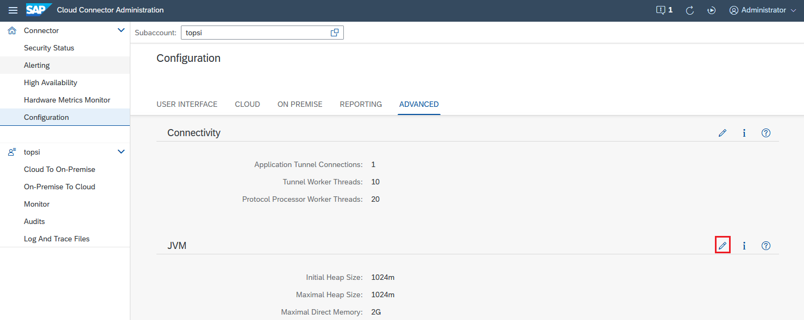

<!-- loio09e62bcd6eee41a5828dfbb23c7c2970 -->

# Configure the Java VM

Adapt the JVM settings that control memory management.

If required, you can adjust the following parameters for the Java VM by changing their default values:

-   Initial Heap Size \(default: 1024 MB\)

-   Maximal Heap Size \(default: 1024 MB\)

-   Maximal Direct Memory \(default: 2 GB\)

> ### Note:  
> A restart is required when changing JVM settings.

We recommended that you set the initial heap size equal to the maximal heap size, to avoid memory fragmentation.

To change the parameter values, do the following:

1.  From the Cloud Connector main menu, choose *Configuration* \> *Advanced*. In section *JVM*, select *Edit*.

    

2.  In the *Edit JVM Settings* dialog, change the parameter values as required.
3.  Choose *Save*.

