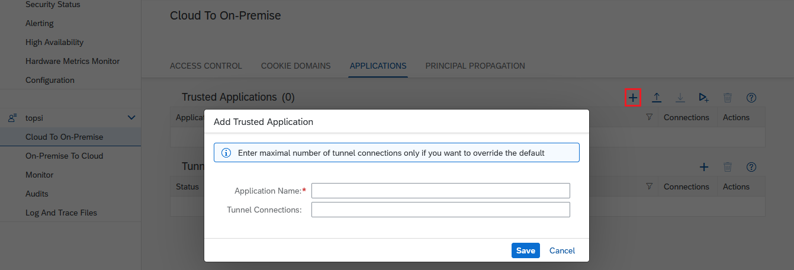
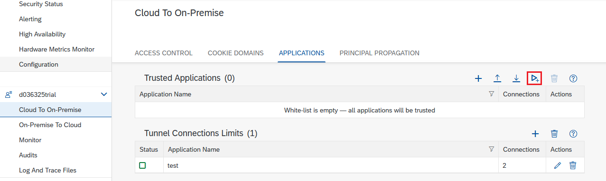

<!-- loio13bfb28fd5bc4c71a82af698ee8d876f -->

# Configure Trust

Set up an allowlist for cloud applications and a trust store for on-premise systems in the Cloud Connector.

<a name="loio13bfb28fd5bc4c71a82af698ee8d876f__tasks"/>

## Tasks

[Trust Cloud Applications in the Cloud Connector](configure-trust-13bfb28.md#loio13bfb28fd5bc4c71a82af698ee8d876f__trust_cloud_apps)

[Configure the Trust Store](configure-trust-13bfb28.md#loio13bfb28fd5bc4c71a82af698ee8d876f__section_TrustStore)

<a name="loio13bfb28fd5bc4c71a82af698ee8d876f__trust_cloud_apps"/>

## Trust Cloud Applications in the Cloud Connector

> ### Restriction:  
> Currently, the complete implementation of this feature is available only for interaction with the Neo environment.

By default, all applications within a subaccount are allowed to use the Cloud Connector associated with the subaccount they run in. However, this behavior might not be desired in specific scenarios. For example, this may be acceptable for some applications, as they must interact with on-premise resources, while other applications, for which it is not transparent whether they try to receive on-premise data, might turn out to be malicious. For such cases, you can use an application allowlist.

As long as there is no entry in this list, all applications are allowed to use the Cloud Connector. If one or more entries appear in the allowlist, then only these applications are allowed to connect to the exposed systems in the Cloud Connector.

You can add, edit, or delete entries as follows:

1.  From your subaccount menu, choose *Cloud to On-Premise* and go to the *Applications* tab.
2.  To add an application, choose the *Add* icon in section *Trusted Applications*.
3.  Enter the *<Application Name\>* in the *Add Trusted Application* dialog.

    > ### Note:  
    > To add all applications that are listed in section *Tunnel Connection Limits* on the same screen, you can also use the *Upload* button next to the *Add* button. The list *Tunnel Connection Limits* shows all applications for which a specific maximal number of tunnel connections was specified. See also: [Configure Advanced Connectivity](configure-advanced-connectivity-3975253.md).

4.  \(Optional\) Enter the maximal number of *<Tunnel Connections\>* only if you want to override the default value.
5.  Choose *Save*.

    > ### Note:  
    > The application name is visible in the SAP BTP cockpit under *Applications* \> *Java Applications*. To allow a subscribed application, you must add it to the allowlist in the format `<providerSubaccount>:<applicationName>`. In particular, when using HTML5 applications, an implicit subscription to *services:dispatcher* is required.

To edit an existing entry:

1.  Choose the *Edit* button.
2.  When you are done, select *Save*.

To remove an application from the list:

1.  Select the entry.
2.  Choose *Delete*.

To delete all entries, choose *Delete All*.

To add all applications from section *Tunnel Connection Limits* to the allowlist, choose the button *Add all applications...* from section **Trusted Applications**.

Back to [Tasks](configure-trust-13bfb28.md#loio13bfb28fd5bc4c71a82af698ee8d876f__tasks)

<a name="loio13bfb28fd5bc4c71a82af698ee8d876f__section_TrustStore"/>

## Configure the Trust Store \(as of Version 2.15\)

To configure the trust store, choose *Configuration* from the main menu, and go to tab *On Premise*, section *Trust Store*.

By default, the Cloud Connector **does not trust any** on-premise system when connecting to it via TLS:

To enable secured backend communication, you must add trusted certificate authorities \(CAs\) to the allowlist. Any TLS server certificate that has been issued by one of those CAs, will be considered trusted. If the CA that has issued a concrete server certificate is not contained in the trust store, the server will be considered untrusted and the connection will fail.

> ### Note:  
> You must provide the CA's X.509 certificates in `DER` or `PEM` format.

> ### Caution:  
> If you don't want to specify explicit CAs you are going to trust, but rather **trust all backends**, you can switch off the handle. In this case, the allowlist is ignored. This option considered less secure, since all backends are trusted now.
> 
> 

Back to [Tasks](configure-trust-13bfb28.md#loio13bfb28fd5bc4c71a82af698ee8d876f__tasks)

