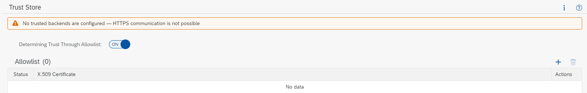
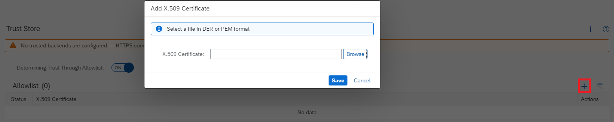
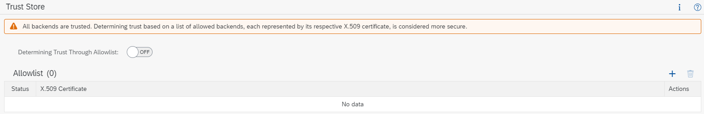

<!-- loio13bfb28fd5bc4c71a82af698ee8d876f -->

# Configure Trust

Set up a trust store for on-premise systems in the Cloud Connector.

<a name="loio13bfb28fd5bc4c71a82af698ee8d876f__section_TrustStore"/>

## Configure the Trust Store \(as of Version 2.15\)

To configure the trust store, choose *Configuration* from the main menu, and go to tab *On Premise*, section *Trust Store*.

By default, the Cloud Connector **does not trust any** on-premise system when connecting to it via TLS:

To enable secured backend communication, you must add trusted certificate authorities \(CAs\) to the allowlist. Any TLS server certificate that has been issued by one of those CAs, will be considered trusted. If the CA that has issued a concrete server certificate is not contained in the trust store, the server will be considered untrusted and the connection will fail.

> ### Note:  
> You must provide the CA's X.509 certificates in `DER` or `PEM` format.

> ### Caution:  
> If you don't want to specify explicit CAs for trust, but rather **trust all certificates used by your backends**, you can switch off the trust store. In this case, the allowlist is ignored. However, this is considered less secure, since all server certificates are trusted and the issuing CA is not checked.
> 
> As a result, certain attacks on the hop between Cloud Connector and internal systems can be performed more easily. Therefore, **we strongly recommend that you *don't do this in productive installations***.
> 
> 

Back to [Tasks](configure-trust-13bfb28.md#loio13bfb28fd5bc4c71a82af698ee8d876f__tasks)

