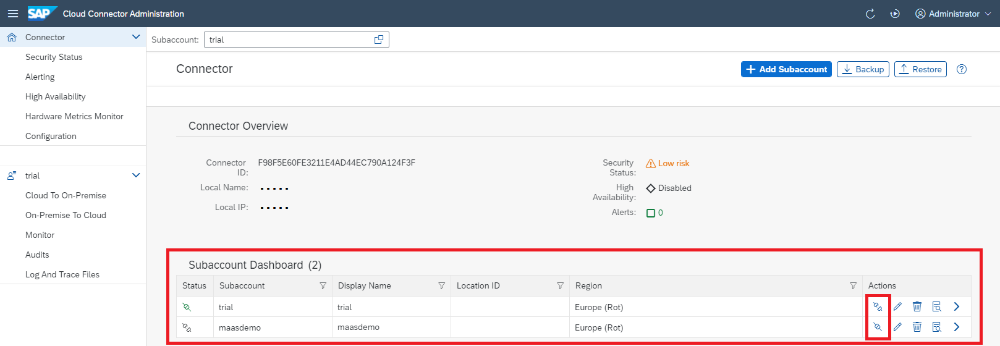

<!-- loioe8f055e712434c90a4747c8f4d7ba2a4 -->

# Connect and Disconnect a Cloud Subaccount

The major principle for the connectivity established by the Cloud Connector is that the Cloud Connector administrator should have full control over the connection to the cloud, that is, deciding if and when the Cloud Connector should be connected to the cloud, the accounts to which it should be connected, and which on-premise systems and resources should be accessible to applications of the connected subaccount.

Using the administration UI, the Cloud Connector administrator can connect and disconnect the Cloud Connector to and from the configured cloud subaccount. Once disconnected, no communication is possible, either between the cloud subaccount and the Cloud Connector, or to the internal systems. The connection state can be verified and changed by the Cloud Connector administrator on the Subaccount Dashboard tab of the UI.

> ### Note:  
> Once the Cloud Connector is freshly installed and connected to a cloud subaccount, none of the systems in the customer network are yet accessible to the applications of the related cloud subaccount. Accessible systems and resouurces must be configured explicitly in the Cloud Connector one by one, see [Configure Access Control](configure-access-control-f42fe44.md).

A Cloud Connector instance can be connected to multiple subaccounts in the cloud. This is useful especially if you need multiple subaccounts to structure your development or to stage your cloud landscape into development, test, and production. In this case, you can use a single Cloud Connector instance for multiple subaccounts. However, we recommend that you do not use subaccounts running in productive scenarios and subaccounts used for development or test purposes within the same Cloud Connector. You can add or a delete a cloud account to or from a Cloud Connector using the *Add* and *Delete* buttons on the *Subaccount Dashboard* \(see screenshot above\).

**Related Information**  

[Managing Subaccounts](managing-subaccounts-f16df12.md "Add and connect your SAP BTP subaccounts to the Cloud Connector.")

