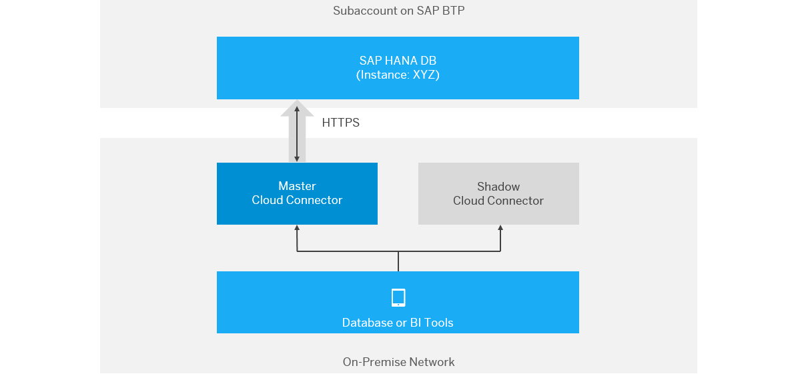

<!-- loio64d6a510e98941d28dbff2fc8179f175 -->

# Connect DB Tools to SAP HANA via Service Channels


## Context

You can connect database, BI, or replication tools running in on-premise network to an SAP HANA database on SAP BTP using service channels of the Cloud Connector. You can also use the high availability support of the Cloud Connector on a database connection. The picture below shows the landscape in such a scenario.



Follow the steps below to set up failover support, configure a service channel, and connect on-premise DB tools via JDBC or ODBC to the SAP HANA database.

-   For more information on using SAP HANA instances, see [Using an SAP HANA XS Database System](https://help.sap.com/viewer/ea72206b834e4ace9cd834feed6c0e09/Cloud/en-US/c6f5764433354640a1e44b893399eaee.html "Use SAP HANA single-container database systems designed for developing with SAP HANA in a productive environment.") :arrow_upper_right:
-   For the connection string via ODBC you need a corresponding database user and password \(see step 4 below\). See also: [Creating Database Users](https://help.sap.com/viewer/ea72206b834e4ace9cd834feed6c0e09/Cloud/en-US/a55b836f126b461a9999b56f3cd867d5.html "Use the database user feature in the SAP BTP cockpit to create a database administration user for SAP HANA XS databases, and set up database users in SAP HANA for the members of your development team.") :arrow_upper_right:.
-   Find detailed information on failover support in the *SAP HANA Administration Guide*: [Configuring Clients for Failover](http://help.sap.com/saphelp_hanaplatform/helpdata/en/27/eddf5616ae449a8db32653a98f24e4/frameset.htm).

    > ### Note:  
    > This link points to the latest release of *SAP HANA Administration Guide*. Refer to the [SAP BTP Release Notes](http://scn.sap.com/docs/DOC-28833) to find out which SAP HANA SPS is supported by SAP BTP. Find the list of guides for earlier releases in the *Related Links* section below.


## Procedure

1.  To establish a highly available connection to one or multiple SAP HANA instances in the cloud, we recommend that you make use of the failover support of the Cloud Connector. Set up a master and a shadow instance. See [Install a Failover Instance for High Availability](install-a-failover-instance-for-high-availability-c697705.md).

2.  In the master instance, configure a service channel to the SAP HANA database of the SAP BTP subaccount to which you want to connect. If, for example, the chosen HANA instance is 01, the port of the service channel is 30115. See also [Configure a Service Channel for an SAP HANA Database](https://help.sap.com/viewer/b865ed651e414196b39f8922db2122c7/Cloud/en-US/3dc28b456bb64fad89084d2d10af602c.html "Using Cloud Connector service channels, you can establish a connection to an SAP HANA database in SAP BTP that is not directly exposed to external access.") :arrow_upper_right:.

3.  Connect on-premise DB tools via JDBC to the SAP HANA database by using the following connection string:

    **Example:**

    ```
    jdbc:sap://<cloud-connector-master-host>:30115;<cloud-connector-shadow-host>:30115[/?<options>]
    ```

    The SAP HANA JDBC driver supports failover out of the box. All you need is to configure the shadow instance of the Cloud Connector as a failover server in the JDBC connection string. The different options supported in the JDBC connection string are described in: [Connect to SAP HANA via JDBC](http://help.sap.com/saphelp_hanaplatform/helpdata/en/ff/15928cf5594d78b841fbbe649f04b4/content.htm)

4.  You can also connect on-premise DB tools via ODBC to the SAP HANA database. Use the following connection string:

    ```
    "DRIVER=HDBODBC32;UID=<user>;PWD=<password>;SERVERNODE=<cloud-connector-master-host>:30115,<cloud-connector-shadow-host>:30115;"
    ```


**Related Information**  


[Guides for earlier releases of SAP HANA](http://help.sap.com/hana_platform_earlier_releases)

