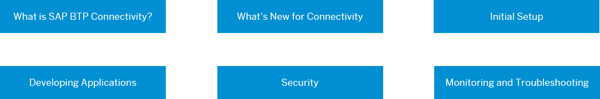

<!-- loio34010ace6ac84574a4ad02f5055d3597 -->

# Connectivity in the Cloud Foundry Environment

Consuming SAP BTP Connectivity for your application in the Cloud Foundry environment: Overview.

> ### Note:  
> This documentation refers to SAP BTP, Cloud Foundry environment. If you are looking for information about the Neo environment, see [Connectivity for the Neo Environment](https://help.sap.com/viewer/b865ed651e414196b39f8922db2122c7/Cloud/en-US/5ceb84290d5644638f73d40fde3af5d0.html).

Hover over the elements for a description. Click an element for more information.

**Related Information**  

[Resilience Recommendations](resilience-recommendations-6c88a09.md "Improve resilience of your SAP BTP applications.")

