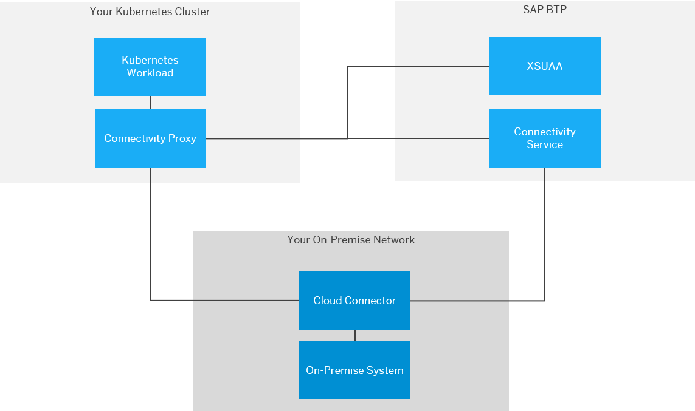

<!-- loioe661713ef7d14373b57e3e26b0b03b86 -->

# Connectivity Proxy for Kubernetes

Use the connectivity proxy for Kubernetes to connect workloads on a Kubernetes cluster to on-premise systems.

The connectivity proxy is a Kubernetes component that connects workloads running on a Kubernetes cluster to on-premise systems, which are exposed via the [Cloud Connector](cloud-connector-e6c7616.md). The connectivity proxy must be paired to an SAP BTP region to grant access to the Cloud Connectors connected to that region. The SAP BTP domain model \(subaccounts\) is used to target a particular Cloud Connector.

The connectivity proxy is delivered as a Docker image and a Helm chart. You need to run the image on your Kubernetes cluster with appropriate configurations. The Helm chart simplifies the installation process. See [Lifecycle Management](lifecycle-management-60c0a45.md) for more details.

You can find information about new versions of the connectivity proxy via SAP BTP [release notes](https://help.sap.com/doc/43b304f99a8145809c78f292bfc0bc58/Cloud/en-US/98bf747111574187a7c76f8ced51cfeb.html?sel1=Connectivity). To request a new feature, you can use [Influence SAP](https://influence.sap.com/sap/ino/#/campaign/2282).

**Related Information**  

[Concepts](concepts-6257430.md "Find an overview of important concepts for working with the connectivity proxy for Kubernetes.")

[Lifecycle Management](lifecycle-management-60c0a45.md "Use the connectivity proxy image and the connectivity proxy Helm chart to manage the life cycle of the connectivity proxy for Kubernetes.")

[Verification and Testing](verification-and-testing-c0d9575.md "Check if the connectivity proxy for Kubernetes is operational.")

[Monitoring](monitoring-0097891.md "Check operability, scenarios and metrics of the connectivity proxy for Kubernetes.")

[Using the Connectivity Proxy](using-the-connectivity-proxy-f3c1ef4.md "Use the connectivity proxy for Kubernetes with different communication protocols and principal propagation (SSO).")

[Troubleshooting](troubleshooting-e7a04d9.md "Find procedures to troubleshoot issues with the connectivity proxy for Kubernetes.")

[Frequently Asked Questions](frequently-asked-questions-a5c54ef.md "Answers to the most common questions about the connectivity proxy for Kubernetes.")

