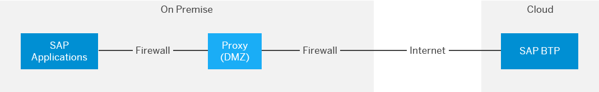

<!-- loiodde01af51ddc49758dbbb03afcb075e5 -->

# Connectivity via Reverse Proxy

An alternative approach compared to the SSL VPN solution that is provided by the Cloud Connector is to expose on-premise services and applications via a reverse proxy to the Internet. This method typically uses a reverse proxy setup in a customer's "demilitarized zone" \(DMZ\) subnetwork. The reverse proxy setup does the following:

-   Acts as a mediator between SAP BTP and the on-premise services
-   Provides the services of an Application Delivery Controller \(ADC\) to, for example, encrypt, filter, route, or check inbound traffic

The figure below shows the minimal overall network topology of this approach.

On-premise services that are accessible via a reverse proxy are callable from SAP BTP like other HTTP services available on the Internet. When you use destinations to call those services, make sure the configuration of the `ProxyType` parameter is set to `Internet`.

<a name="loiodde01af51ddc49758dbbb03afcb075e5__section_N10049_N10011_N10001"/>

## Advantages

Depending on your scenario, you may benefit from the reverse proxy:

-   Network infrastructure \(such as a reverse proxy and ADC services\): since it already exists in your network landscape, you can reuse it to connect to SAP BTP. There's no need to set up and operate new components on your \(customer\) side.
-   A reverse proxy is independent of the cloud solution you are using.

-   It acts as single entry point to your corporate network.

<a name="loiodde01af51ddc49758dbbb03afcb075e5__section_N10056_N10011_N10001"/>

## Disadvantages

-   The reverse proxy approach leaves exposed services generally accessible via the Internet. This makes them vulnerable to attacks from anywhere in the world. In particular, **Denial-of-Service attacks** are possible and difficult to protect against. To prevent attacks of this type and others, you must implement the highest security in the DMZ and reverse proxy. For the productive deployment of a hybrid cloud/on-premise application, this approach usually requires intense involvement of the customer's IT department and a longer period of implementation.
-   If the reverse proxy allows filtering, or restricts accepted source IP addresses, you can set only one IP address to be used for all SAP BTP outbound communications.

    A reverse proxy does not exclusively restrict the access to cloud applications belonging to a customer, although it does filter any callers that are not running on the cloud. Basically, any application running on the cloud would pass this filter.

-   The SAP-proprietary RFC protocol is supported only if WebSocket RFC can be used for communication with the ABAP system. WebSocket RFC is available as of S/4HANA release 1909. A cloud application cannot call older on-premise ABAP systems directly without using application proxies on top of ABAP in between.
-   No easy support of principal propagation authentication, which lets you forward the cloud user identity to on-premise systems.

-   You cannot implement projects close to your line of business \(LoB\).

> ### Note:  
> Using the Cloud Connector mitigates all of these issues. As it establishes the SSL VPN tunnel to SAP BTP using a reverse invoke approach, there is no need to configure the DMZ or external firewall of a customer network for inbound traffic. Attacks from the Internet are not possible. With its simple setup and fine-grained access control of exposed systems and resources, the Cloud Connector allows a high level of security and fast productive implementation of hybrid applications. It also supports multiple application protocols, such as HTTP and RFC.

