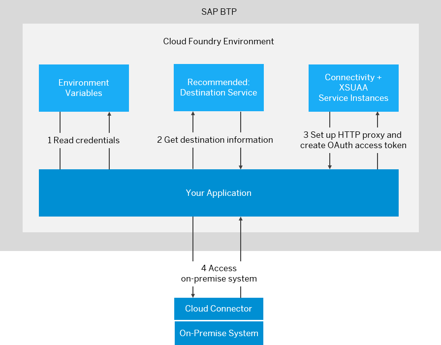

<!-- loio313b215066a8400db461b311e01bd99b -->

# Consuming the Connectivity Service

Connect your application to an on-premise system via HTTP.

> ### Note:  
> To use the Connectivity service with a protocol other than HTTP, see
> 
> -   [Invoking ABAP Function Modules via RFC](invoking-abap-function-modules-via-rfc-fa4adc9.md)
> -   [Using the TCP Protocol for Cloud Applications](using-the-tcp-protocol-for-cloud-applications-cd15837.md)


<a name="loio313b215066a8400db461b311e01bd99b__tasks_CS"/>

## Tasks


<table>
<tr>
<th valign="top">

Task Type

</th>
<th valign="top">

Task

</th>
</tr>
<tr>
<td valign="top" rowspan="2">


Operator and/or Developer

</td>
<td valign="top">

[Overview](consuming-the-connectivity-service-313b215.md#loio313b215066a8400db461b311e01bd99b__overview)

</td>
</tr>
<tr>
<td valign="top">

[Prerequisites](consuming-the-connectivity-service-313b215.md#loio313b215066a8400db461b311e01bd99b__prerequisites_CS)

</td>
</tr>
<tr>
<td valign="top">


Developer

</td>
<td valign="top">

[Basic Steps](consuming-the-connectivity-service-313b215.md#loio313b215066a8400db461b311e01bd99b__basic_steps)

1.  [Read Credentials from the Environment Variables](consuming-the-connectivity-service-313b215.md#loio313b215066a8400db461b311e01bd99b__section_EnvironmentVariables)
2.  [Provide the Destination Information](consuming-the-connectivity-service-313b215.md#loio313b215066a8400db461b311e01bd99b__section_RequiredInformation)
3.  [Set up the HTTP Proxy for On-Premise Connectivity](consuming-the-connectivity-service-313b215.md#loio313b215066a8400db461b311e01bd99b__section_HttpProxy)


</td>
</tr>
<tr>
<td valign="top">


Operator and/or Developer

</td>
<td valign="top">

[Additional Steps](consuming-the-connectivity-service-313b215.md#loio313b215066a8400db461b311e01bd99b__auth)

-   [Authentication against the On-Premise System](consuming-the-connectivity-service-313b215.md#loio313b215066a8400db461b311e01bd99b__auth)
-   [Specify a Cloud Connector Location ID](consuming-the-connectivity-service-313b215.md#loio313b215066a8400db461b311e01bd99b__location)
-   [Multitenancy in the Connectivity Service](consuming-the-connectivity-service-313b215.md#loio313b215066a8400db461b311e01bd99b__multi)


</td>
</tr>
</table>


<a name="loio313b215066a8400db461b311e01bd99b__overview"/>

## Overview


Using the Connectivity service, you can connect your Cloud Foundry application to an on-premise system through the Cloud Connector. To achieve this, you must provide the required information about the target system \(destination\), and set up an HTTP proxy that lets your application access the on-premise system.



Back to [Tasks](consuming-the-connectivity-service-313b215.md#loio313b215066a8400db461b311e01bd99b__tasks_CS)


<a name="loio313b215066a8400db461b311e01bd99b__prerequisites_CS"/>

## Prerequisites


-   You must be a *Global Account* member to connect through the Connectivity service with the Cloud Connector. See [Add Members to Your Global Account](https://help.sap.com/viewer/65de2977205c403bbc107264b8eccf4b/Cloud/en-US/4a0491330a164f5a873fa630c7f45f06.html "Add users as global account members using the SAP BTP cockpit.") :arrow_upper_right:.

    Also *Security Administrators* \(which must be either Global Account members or Cloud Foundry Organization/Space members\) can do it. See [Managing Security Administrators in Your Subaccount \[Feature Set A\]](https://help.sap.com/viewer/65de2977205c403bbc107264b8eccf4b/Cloud/en-US/6752c4b8435c456ebf67a97ddbbcb267.html "Running on the cloud management tools feature set A: When you create a subaccount, SAP BTP automatically grants your user the role for the administration of business users and their authorizations in the subaccount. Having this role, you can also add or remove other users who will then also be user and role administrators of this subaccount.") :arrow_upper_right:.

    > ### Note:  
    > To connect a Cloud Connector to your subaccount, you must currently be a **Security Administrator**.

-   You have installed and configured a Cloud Connector in your on-premise landscape for to the scenario you want to use. See [Installation](installation-57ae3d6.md) and [Configuration](configuration-ec68ee2.md).
-   You have deployed an application in a landscape of the Cloud Foundry environmentthat complies with the [Business Application Pattern](https://help.sap.com/viewer/65de2977205c403bbc107264b8eccf4b/Cloud/en-US/a1de162dffea417eb9cccd7855c607b7.html "In the Cloud Foundry environment, SAP is promoting a pattern for building applications. We use the term Business Application to distinguish from single applications in the context of the Cloud Foundry environment.") :arrow_upper_right:.
-   The Connectivity service is a regular service in the Cloud Foundry environment. Therefore, to consume the Connectivity service from an application, you must create a service instance and bind it to the application. See [Create and Bind a Connectivity Service Instance](create-and-bind-a-connectivity-service-instance-a2b88cf.md).
-   To get the required authorization for making on-premise calls through the connected Cloud Connector, the application must be bound to an instance of the *xsuaa* service using the service plan 'application'. The *xsuaa* service instance acts as an OAuth 2.0 client and grants user access to the bound application. Make sure you set the `xsappname` property to the name of the application when creating the instance. Find a detailed guide for this procedure in section *3. Creation of the Authorization & Trust Management Instance \(aka XSUAA\)* of the SCN blog [How to use SAP BTP Connectivity and Cloud Connector in the Cloud Foundry environment](https://blogs.sap.com/2017/07/13/part-2-how-to-use-the-sap-cloud-platform-connectivity-and-the-cloud-connector-in-the-cloud-foundry-environment/).

> ### Note:  
> Currently, the only supported protocol for connecting the Cloud Foundry environment to an on-premise system is HTTP. HTTPS is not needed, since the tunnel used by the Cloud Connector is TLS-encrypted.

> ### Caution:  
> There is a limit of **8192** bytes for the size of the HTTP lines \(for example, request line or header\) that you send via the Connectivity service. If this limit is exceeded, you receive an HTTP error of type 4xx. This issue is usually caused by the size of the *path* + *query* string of the request.

Back to [Tasks](consuming-the-connectivity-service-313b215.md#loio313b215066a8400db461b311e01bd99b__tasks_CS)


<a name="loio313b215066a8400db461b311e01bd99b__basic_steps"/>

## Basic Steps


To consume the Connectivity service from your Cloud Foundry application, perform the following basic steps:

1.  [Read Credentials from the Environment Variables](consuming-the-connectivity-service-313b215.md#loio313b215066a8400db461b311e01bd99b__section_EnvironmentVariables)
2.  [Provide the Destination Information](consuming-the-connectivity-service-313b215.md#loio313b215066a8400db461b311e01bd99b__section_RequiredInformation)
3.  [Set up the HTTP Proxy for On-Premise Connectivity](consuming-the-connectivity-service-313b215.md#loio313b215066a8400db461b311e01bd99b__section_HttpProxy)


Back to [Tasks](consuming-the-connectivity-service-313b215.md#loio313b215066a8400db461b311e01bd99b__tasks_CS)


<a name="loio313b215066a8400db461b311e01bd99b__section_EnvironmentVariables"/>

## Read Credentials from the Environment Variables


Consuming the Connectivity service requires credentials from the *xsuaa* and *Connectivity* service instances which are bound to the application. By binding the application to service instances of the xsuaa and Connectivity service as described in the prerequisites, these credentials become part of the environment variables of the application. You can access them as follows:

> ### Sample Code:  
> ```
> JSONObject jsonObj = new JSONObject(System.getenv("VCAP_SERVICES"));
> JSONArray jsonArr = jsonObj.getJSONArray("<service name, not the instance name>");
> JSONObject credentials = jsonArr.getJSONObject(0).getJSONObject("credentials");
> ```

> ### Note:  
> If you have multiple instances of the same service bound to the application, you must perform additional filtering to extract the correct credential from `jsonArr`. You must go through the elements of `jsonArr` and find the one matching the correct instance name.

This code stores a JSON object in the credentials variable. Additional parsing is required to extract the value for a specific key.

> ### Note:  
> We refer to the result of the above code block as `connectivityCredentials`, when called for *connectivity*, and `xsuaaCredentials` for *xsuaa*.

Back to [Tasks](consuming-the-connectivity-service-313b215.md#loio313b215066a8400db461b311e01bd99b__tasks_CS)


<a name="loio313b215066a8400db461b311e01bd99b__section_RequiredInformation"/>

## Provide the Destination Information


To consume the Connectivity service, you must provide some information about your on-premise system and the system mappings for it in the Cloud Connector. You require the following:

-   The endpoint in the Cloud Connector \(virtual host and virtual port\) and accessible URL paths on it \(destinations\). See [Configure Access Control \(HTTP\)](configure-access-control-http-e7d4927.md).
-   The required authentication type for the on-premise system. See [HTTP Destinations](http-destinations-42a0e6b.md).
-   Depending on the authentication type, you may need a username and password for accessing the on-premise system. For more details, see [Client Authentication Types for HTTP Destinations](client-authentication-types-for-http-destinations-4e13a04.md).
-   \(Optional\) You can use a *location Id*. For more details, see section [Specify a Cloud Connector Location ID](consuming-the-connectivity-service-313b215.md#loio313b215066a8400db461b311e01bd99b__location).

We recommend that you use the *Destination service* \(see [Consuming the Destination Service](consuming-the-destination-service-7e30625.md)\) to procure this information. However, using the Destination service is optional. You can also provide \(look up\) this information in another appropriate way.

Back to [Tasks](consuming-the-connectivity-service-313b215.md#loio313b215066a8400db461b311e01bd99b__tasks_CS)


<a name="loio313b215066a8400db461b311e01bd99b__section_HttpProxy"/>

## Set up the HTTP Proxy for On-Premise Connectivity


**Proxy Setup**

The Connectivity service provides a standard HTTP proxy for on-premise connectivity that is accessible by any application. Proxy host and port are available as the environment variables `<onpremise_proxy_host>` and `<onpremise_proxy_http_port>`. You can set up the on-premise HTTP proxy like this:

> ### Sample Code:  
> ```
> // get value of "onpremise_proxy_host" and "onpremise_proxy_http_port" from the environment variables
> // and create on-premise HTTP proxy
> String connProxyHost = connectivityCredentials.getString("onpremise_proxy_host");
> int connProxyPort = Integer.parseInt(credentials.getString("onpremise_proxy_http_port"));
> Proxy proxy = new Proxy(Proxy.Type.HTTP, new InetSocketAddress(connProxyHost, connProxyPort));
>  
>  
>  
> // create URL to the remote endpoint you like to call:
> // virtualhost:1234 is defined as an endpoint in the Cloud Connector, as described in the Required Information section
> URL url = new URL("http://virtualhost:1234");
>  
>  
> // create the connection object to the endpoint using the proxy
> // this does not open a connection but only creates a connection object, which can be modified later, before actually connecting
> urlConnection = (HttpURLConnection) url.openConnection(proxy);
> ```

> ### Note:  
> `"onpremise_proxy_http_port"` replaces the deprecated variable `"onpremise_proxy_port"`, which will be removed soon.

**Authorization**

To make calls to on-premise services configured in the Cloud Connector through the HTTP proxy, you must authorize at the HTTP proxy. For this, the *OAuth Client Credentials* flow is used: applications must create an OAuth access token using using the parameters `clientid` and `clientsecret` that are provided by the Connectivity service in the environment, as shown in the example code below. When the application has retrieved the access token, it must pass the token to the connectivity proxy using the `Proxy-Authorization` header.

The sample code below uses the following Maven artifacts:

-   `org.springframework.security:spring-security-oauth2-core`
-   `org.springframework.security:spring-security-oauth2-client`

> ### Sample Code:  
> ```
> import org.springframework.security.authentication.AbstractAuthenticationToken;
> import org.springframework.security.oauth2.client.ClientCredentialsOAuth2AuthorizedClientProvider;
> import org.springframework.security.oauth2.client.OAuth2AuthorizationContext;
> import org.springframework.security.oauth2.client.OAuth2AuthorizedClientProvider;
> import org.springframework.security.oauth2.client.registration.ClientRegistration;
> import org.springframework.security.oauth2.core.AuthorizationGrantType;
> import org.springframework.security.oauth2.core.OAuth2AccessToken;
>  
> ...
>  
> // get value of "clientid" and "clientsecret" from the environment variables
> String clientid = connectivityCredentials.getString("clientid");
> String clientsecret = connectivityCredentials.getString("clientsecret");
>  
> // get the URL to xsuaa from the environment variables
> String xsuaaUrl = xsuaaCredentials.getString("token_service_url");
>  
> // make request to UAA to retrieve access token
> ClientRegistration clientRegistration = ClientRegistration.withRegistrationId("some-id").
>     authorizationGrantType(AuthorizationGrantType.CLIENT_CREDENTIALS).
>     clientId(clientid).
>     clientSecret(clientsecret).
>     authorizationUri(xsuaaUrl + "/oauth/authorize").
>     tokenUri(xsuaaUrl + "/oauth/token").
>         build();
>  
> OAuth2AuthorizationContext xsuaaContext = OAuth2AuthorizationContext.withClientRegistration(clientRegistration).
>     principal(new AbstractAuthenticationToken(null) {
>         @Override
>         public Object getPrincipal() {
>             return null;
>         }
>  
>         @Override
>         public Object getCredentials() {
>             return null;
>         }
>  
>         @Override
>         public String getName() {
>             return "dummyPrincipalName";    // There is no principal in the client credentials authorization grant but a non-empty name is still required.
>         }
>     }).build();
>          
> OAuth2AuthorizedClientProvider clientCredentialsAccessTokenProvider = new ClientCredentialsOAuth2AuthorizedClientProvider();
> OAuth2AccessToken token = clientCredentialsAccessTokenProvider.authorize(xsuaaContext).getAccessToken();
>  
> // set access token as Proxy-Authorization header in the URL connection
> urlConnection.setRequestProperty("Proxy-Authorization",  token.getTokenType().getValue() + " " + token.getTokenValue());
> ```

> ### Note:  
> `xsuaaCredentials.getString("token_service_url")` replaces the deprecated property `xsuaaCredentials.getString("url")`, which will be removed soon.

Back to [Tasks](consuming-the-connectivity-service-313b215.md#loio313b215066a8400db461b311e01bd99b__tasks_CS)


<a name="loio313b215066a8400db461b311e01bd99b__auth"/>

## Authentication against the On-Premise System


Depending on the required authentication type for the desired on-premise resource, you may have to set an additional header in your request. This header provides the required information for the authentication process against the on-premise resource. See [Authentication to the On-Premise System](authentication-to-the-on-premise-system-67b0b94.md).

Back to [Tasks](consuming-the-connectivity-service-313b215.md#loio313b215066a8400db461b311e01bd99b__tasks_CS)


<a name="loio313b215066a8400db461b311e01bd99b__location"/>

## Specify a Cloud Connector Location ID


> ### Note:  
> This is an advanced option when using more than one Cloud Connector for a subaccount. For more information how to set the `location ID` in the Cloud Connector, see [Managing Subaccounts](managing-subaccounts-f16df12.md), step 4 in section *Subaccount Dashboard*.

You can connect multiple Cloud Connectors to a subaccount if their `location ID` is different. Using the header `SAP-Connectivity-SCC-Location_ID` you can specify the Cloud Connector over which the connection should be opened. If this header is not specified, the connection is opened to the Cloud Connector that is connected without any `location ID`. For example:

> ### Sample Code:  
> ```
> // Optionally, if configured, add the SCC location ID. 
> urlConnection.setRequestProperty("SAP-Connectivity-SCC-Location_ID", "orlando");
> ```

Back to [Tasks](consuming-the-connectivity-service-313b215.md#loio313b215066a8400db461b311e01bd99b__tasks_CS)


<a name="loio313b215066a8400db461b311e01bd99b__multi"/>

## Multitenancy in the Connectivity Service


To consume the Connectivity service from an SaaS application in a multitenant way, the only requirement is that the SaaS application returns the Connectivity service as a dependent service in its dependencies list.

For more information about the subscription flow, see [Develop the Multitenant Business Application](https://help.sap.com/viewer/65de2977205c403bbc107264b8eccf4b/Cloud/en-US/ff540477f5404e3da2a8ce23dcee602a.html).

Back to [Tasks](consuming-the-connectivity-service-313b215.md#loio313b215066a8400db461b311e01bd99b__tasks_CS)

**Related Information**  


[Cloud Connector](cloud-connector-e6c7616.md "Learn more about the Cloud Connector: features, scenarios and setup.")

[Set Up an Application as a Sample Backend System](https://help.sap.com/viewer/b865ed651e414196b39f8922db2122c7/Cloud/en-US/e59dc589bb57101480939e290c55e680.html "") :arrow_upper_right:

[Create and Bind a Connectivity Service Instance](create-and-bind-a-connectivity-service-instance-a2b88cf.md "To use the Connectivity service in your application, you need an instance of the service.")

[Authentication to the On-Premise System](authentication-to-the-on-premise-system-67b0b94.md "Provide authentication information for the authentication type you use.")

[Consuming the Destination Service](consuming-the-destination-service-7e30625.md "Retrieve and store externalized technical information about the destination to consume a target remote service from your application.")

[What Is the SAP Authorization and Trust Management Service?](https://help.sap.com/viewer/65de2977205c403bbc107264b8eccf4b/Cloud/en-US/649961f8d4ad463daca33b3a20deba4c.html "Get a high-level overview of the concepts that underpin the SAP Authorization and Trust Management service for SAP BTP in the Cloud Foundry environment.") :arrow_upper_right:

[Multitarget Applications in the Cloud Foundry Environment](https://help.sap.com/viewer/65de2977205c403bbc107264b8eccf4b/Cloud/en-US/d04fc0e2ad894545aebfd7126384307c.html "A Multitarget application (MTA) is essentially a single application that consists of multiple parts. These parts are created using various technologies and share the same lifecycle.") :arrow_upper_right:

[Invoking ABAP Function Modules via RFC](invoking-abap-function-modules-via-rfc-fa4adc9.md "Call a remote-enabled function module in an on-premise or cloud ABAP server from your application, using the RFC protocol.")

[Using the TCP Protocol for Cloud Applications](using-the-tcp-protocol-for-cloud-applications-cd15837.md "Access on-premise systems from an application via TCP-based protocols, using a SOCKS5 Proxy.")

