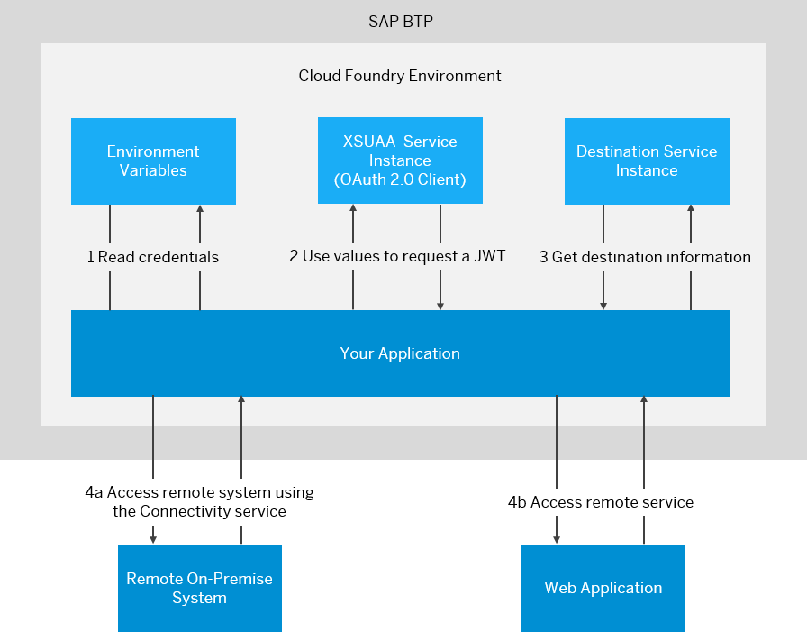
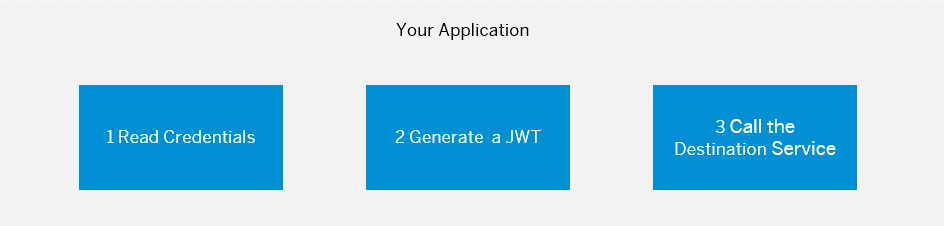

<!-- loio7e306250e08340f89d6c103e28840f30 -->

# Consuming the Destination Service

Retrieve and store externalized technical information about the destination to consume a target remote service from your Cloud Foundry application.


<a name="loio7e306250e08340f89d6c103e28840f30__tasks_DS"/>

## Tasks


<table>
<tr>
<th valign="top">

Task Type

</th>
<th valign="top">

Task

</th>
</tr>
<tr>
<td valign="top" rowspan="2">


Operator and/or Developer

</td>
<td valign="top">

[Overview](consuming-the-destination-service-7e30625.md#loio7e306250e08340f89d6c103e28840f30__overview_DS) 

</td>
</tr>
<tr>
<td valign="top">

[Prerequisites](consuming-the-destination-service-7e30625.md#loio7e306250e08340f89d6c103e28840f30__prereq_DS) 

</td>
</tr>
<tr>
<td valign="top">


Developer

</td>
<td valign="top">

[Steps](consuming-the-destination-service-7e30625.md#loio7e306250e08340f89d6c103e28840f30__steps_DS)

1.  [Read Credentials from the Environment Variables](consuming-the-destination-service-7e30625.md#loio7e306250e08340f89d6c103e28840f30__section_RequiredCredentials)
2.  [Generate a JSON Web Token \(JWT\)](consuming-the-destination-service-7e30625.md#loio7e306250e08340f89d6c103e28840f30__section_GenerateJWT)
3.  [Call the Destination Service](consuming-the-destination-service-7e30625.md#loio7e306250e08340f89d6c103e28840f30__section_CallDestinationService)


</td>
</tr>
<tr>
<td valign="top">


Operator and/or Developer

</td>
<td valign="top">

[Destination Configuration Attributes](consuming-the-destination-service-7e30625.md#loio7e306250e08340f89d6c103e28840f30__attributes) 

</td>
</tr>
</table>


<a name="loio7e306250e08340f89d6c103e28840f30__overview_DS"/>

## Overview


The Destination service lets you find the destination information that is required to access a remote service or system from your Cloud Foundry application.

-   For the connection to an *on-premise system*, you can optionally use this service, together with \(i.e. in addition to\) the Connectivity service, see [Consuming the Connectivity Service](consuming-the-connectivity-service-313b215.md).
-   For the connection to any other *Web application* \(remote service\), you can use the Destination service without the Connectivity service.

Consuming the Destination Service includes user authorization via a JSON Web Token \(JWT\) that is provided by the *xsuaa* service.




Back to [Tasks](consuming-the-destination-service-7e30625.md#loio7e306250e08340f89d6c103e28840f30__tasks_DS)


<a name="loio7e306250e08340f89d6c103e28840f30__prereq_DS"/>

## Prerequisites


-   To manage destinations and certificates on service instance level \(all CRUD operations\), you must be assigned to one of the following roles: `OrgManager`, `SpaceManager` or `SpaceDeveloper`.

    > ### Note:  
    > The role `SpaceAuditor` has only *Read* permission for destinations and certificates.

-   To consume the Destination service from an application, you must create a service instance and bind it to the application. See [Create and Bind a Destination Service Instance](create-and-bind-a-destination-service-instance-9fdad3c.md).
-   To generate the required JSON Web Token \(JWT\), you must bind the application to an instance of the *xsuaa* service using the service plan 'application'. The *xsuaa* service instance acts as an OAuth 2.0 client and grants user access to the bound application. Make sure that you set the `xsappname` property when creating the instance. Find a detailed guide for this procedure in section *3. Creation of the Authorization & Trust Management Instance \(aka XSUAA\)* of the SCN blog [How to use SAP BTP Connectivity and Cloud Connector in the Cloud Foundry environment](https://blogs.sap.com/2017/07/13/part-2-how-to-use-the-sap-cloud-platform-connectivity-and-the-cloud-connector-in-the-cloud-foundry-environment/).
-   You need at least one configured destination, otherwise there will be nothing to retrieve via the service.

    To access the *Destinations* editor in the cockpit, follow the steps in [Access the Destinations Editor](access-the-destinations-editor-82ca377.md).

    To manage destinations via REST API, see [Destination Service REST API](destination-service-rest-api-23ccafb.md).


Back to [Tasks](consuming-the-destination-service-7e30625.md#loio7e306250e08340f89d6c103e28840f30__tasks_DS)


<a name="loio7e306250e08340f89d6c103e28840f30__steps_DS"/>

## Steps


To consume the Destination service from your application, perform the following basic steps:

1.  [Read Credentials from the Environment Variables](consuming-the-destination-service-7e30625.md#loio7e306250e08340f89d6c103e28840f30__section_RequiredCredentials)
2.  [Generate a JSON Web Token \(JWT\)](consuming-the-destination-service-7e30625.md#loio7e306250e08340f89d6c103e28840f30__section_GenerateJWT)
3.  [Call the Destination Service](consuming-the-destination-service-7e30625.md#loio7e306250e08340f89d6c103e28840f30__section_CallDestinationService)



Back to [Tasks](consuming-the-destination-service-7e30625.md#loio7e306250e08340f89d6c103e28840f30__tasks_DS)


<a name="loio7e306250e08340f89d6c103e28840f30__section_RequiredCredentials"/>

## Read Credentials from the Environment Variables


The Destination service stores its credentials in the environment variables. To consume the service, you require the following information:

-   The value of `clientid`, `clientsecret` and `uri` from the Destination service credentials.
-   The values of `url` from the *xsuaa* credentials.

You can access this information as follows:

-   From the CLI, the following command lists the environment variables of `<app-name>`:

    ```
    cf env <app-name> 
    ```

-   From within the application, the service credential can be accessed as described in [Consuming the Connectivity Service](consuming-the-connectivity-service-313b215.md).

> ### Note:  
> Below, we refer to the *JSONObjects*, containing the instance credentials as `destinationCredentials` \(for the Destination service\) and `xsuaaCredentials` \(for xsuaa\).

Back to [Tasks](consuming-the-destination-service-7e30625.md#loio7e306250e08340f89d6c103e28840f30__tasks_DS)


<a name="loio7e306250e08340f89d6c103e28840f30__section_GenerateJWT"/>

## Generate a JSON Web Token \(JWT\)


Your application must create an OAuth client using the attributes `clientid` and `clientsecret`, which are provided by the Destination service instance. Then, you must retrieve a new JWT from UAA and pass it in the *Authorization* HTTP header.

Two examples how to achieve this \(Java and cURL\):

**Java:**

For a Java application, you can use a library that implements the client credentials OAuth flow. Here is an example of how the `clientCredentialsTokenFlow` can be obtained using the [XSUAA Token Client and Token Flow API](https://github.com/SAP/cloud-security-xsuaa-integration/tree/master/token-client):

> ### Caution:  
> Make sure you get the latest API version.

A sample Maven dependency declaration:

```
<dependency>
	<groupId>com.sap.cloud.security.xsuaa</groupId> 
	<artifactId>token-client</artifactId> 
	<version><latest version (e.g.: 2.7.7)></version> 
</dependency>
```

> ### Remember:  
> The XSUAA Token Client library works with multiple HTTP client libraries. Make sure you have one as Maven dependency.

The following sample uses the Apache REST client:

> ### Sample Code:  
> ```
> // get value of "clientid" and "clientsecret" from the environment variables
> String clientid = destinationCredentials.getString("clientid");
> String clientsecret = destinationCredentials.getString("clientsecret");
>  
> // get the URL to xsuaa from the environment variables
> URI xsuaaUri = new URI(xsuaaCredentials.getString("url"));
>  
> // use the XSUAA client library to ease the implementation of the user token exchange flow
> XsuaaTokenFlows tokenFlows = new XsuaaTokenFlows(new DefaultOAuth2TokenService(), new XsuaaDefaultEndpoints(xsUaaUri.toString()), new ClientCredentials(clientid, clientsecret));
>  
> String jwtToken = tokenFlows.clientCredentialsTokenFlow().execute().getAccessToken();
> ```

For more information about caching, see also [XSUAA Token Client and Token Flow API - Cache](https://github.com/SAP/cloud-security-xsuaa-integration/tree/master/token-client#cache).

**cURL:**

> ### Sample Code:  
> ```
> curl -X POST \
>   <xsuaa-url>/oauth/token \
>   -H 'authorization: Basic <<clientid>:<clientsecret> encoded with Base64>' \
>   -H 'content-type: application/x-www-form-urlencoded' \
>   -d 'client_id=<clientid>&grant_type=client_credentials'
> ```

Back to [Tasks](consuming-the-destination-service-7e30625.md#loio7e306250e08340f89d6c103e28840f30__tasks_DS)


<a name="loio7e306250e08340f89d6c103e28840f30__section_CallDestinationService"/>

## Call the Destination Service


When calling the Destination service, use the `uri` attribute, provided in `VCAP_SERVICES`, to build the request URLs.

[Read a Destination by only Specifying its Name \("Find Destination"\)](consuming-the-destination-service-7e30625.md#loio7e306250e08340f89d6c103e28840f30__find_ds)

[Read a Destination Associated with a Subaccount](consuming-the-destination-service-7e30625.md#loio7e306250e08340f89d6c103e28840f30__sub_ds)

[Get All Destinations Associated with a Subaccount](consuming-the-destination-service-7e30625.md#loio7e306250e08340f89d6c103e28840f30__sub_all_ds)

[Response Codes](consuming-the-destination-service-7e30625.md#loio7e306250e08340f89d6c103e28840f30__codes_ds)

**Read a Destination by only Specifying its Name \("Find Destination"\)**

This lets you provide simply a name of the destination while the service will search for it. First, the service searches the destinations that are associated with the service instance. If none of the destinations match the requested name, the service searches the destinations that are associated with the subaccount.

-   Path: `/destination-configuration/v1/destinations/<destination-name>`
-   Example of a call \(cURL\):

    > ### Sample Code:  
    > ```
    > curl "<uri>/destination-configuration/v1/destinations/<destination-name>" \
    > -X GET \
    > -H "Authorization: Bearer <jwtToken>"
    > ```

-   Example of a response \(this is a destination found when going through the subaccount destinations\):

    > ### Sample Code:  
    > ```
    > {
    > "owner":
    > {
    > "SubaccountId":<id>,
    > "InstanceId":null
    > },
    > "destinationConfiguration":
    > {
    > "Name": "demo-internet-destination",
    > "URL": "http://www.google.com",
    > "ProxyType": "Internet",
    > "Type": "HTTP",
    > "Authentication": "NoAuthentication"
    > }
    > }
    > ```


> ### Note:  
> The response from this type of call contains not only the configuration of the requested destination, but also some additional data. See ["Find Destination" Response Structure](find-destination-response-structure-83a3f3b.md).

Back to [Call the Destination Service](consuming-the-destination-service-7e30625.md#loio7e306250e08340f89d6c103e28840f30__section_CallDestinationService)

**Read a Destination Associated with a Subaccount**

This lets you retrieve the configurations of a destination that is defined within a subaccount, by providing the name of the destination.

-   Path: `/destination-configuration/v1/subaccountDestinations/<destination-name>`

-   Example of a call \(cURL\):

    > ### Sample Code:  
    > ```
    > curl "<uri>/destination-configuration/v1/subaccountDestinations/<destination name>" \
    > -X GET \
    > -H "Authorization: Bearer <jwtToken>"
    > ```

-   Example of a response:

    > ### Sample Code:  
    > ```
    > {
    > "Name": "demo-internet-destination",
    > "URL": "http://www.google.com",
    > "ProxyType": "Internet",
    > "Type": "HTTP",
    > "Authentication": "NoAuthentication"
    > }
    > ```


Back to [Call the Destination Service](consuming-the-destination-service-7e30625.md#loio7e306250e08340f89d6c103e28840f30__section_CallDestinationService)

**Get All Destinations Associated with a Subaccount**

This lets you retrieve the configurations of all destinations that are defined within a subaccount.

-   Path:`/destination-configuration/v1/subaccountDestinations`

-   Example of a call \(cURL\):

    > ### Sample Code:  
    > ```
    > curl "<uri>/destination-configuration/v1/subaccountDestinations" \
    > -X GET \
    > -H "Authorization: Bearer <jwtToken>"
    > ```

-   Example of a response:

    > ### Sample Code:  
    > ```
    > [
    > {
    > "Name": "demo-onpremise-destination1",
    > "URL": "http:/virtualhost:1234",
    > "ProxyType": "OnPremise",
    > "Type": "HTTP",
    > "Authentication": "NoAuthentication"
    > },
    > {
    > "Name": "demo-onpremise-destination2",
    > "URL": "http:/virtualhost:4321",
    > "ProxyType": "OnPremise",
    > "Type": "HTTP",
    > "Authentication": "BasicAuthentication",
    > "User": "myname123",
    > "Password": "123456"
    > }
    > ]
    > ```


Back to [Call the Destination Service](consuming-the-destination-service-7e30625.md#loio7e306250e08340f89d6c103e28840f30__section_CallDestinationService)

**Response Codes**

When calling the Destination service, you may get the following response codes:

-   **200**: OK \(Json of Destination\)
-   **401**: Unauthorized \(Authentication Failed\)
-   **403**: Forbidden \(Authorization Failed\)
-   **404**: The requested destination could not be found \(not applicable to 'get all destinations associated with a subaccount'\)
-   **500**: Internal Server Error

Back to [Call the Destination Service](consuming-the-destination-service-7e30625.md#loio7e306250e08340f89d6c103e28840f30__section_CallDestinationService)

Back to [Tasks](consuming-the-destination-service-7e30625.md#loio7e306250e08340f89d6c103e28840f30__tasks_DS)


<a name="loio7e306250e08340f89d6c103e28840f30__attributes"/>

## Destination Configuration Attributes


The JSON object that serves as the response of a successful request \(value of the `destinationConfiguration` property for "Find destination"\) can have different attributes, depending on the authentication type and proxy type of the corresponding destination. See [HTTP Destinations](http-destinations-42a0e6b.md).

Back to [Tasks](consuming-the-destination-service-7e30625.md#loio7e306250e08340f89d6c103e28840f30__tasks_DS)

**Related Information**  


[User Propagation via SAML 2.0 Bearer Assertion Flow](user-propagation-via-saml-2-0-bearer-assertion-flow-3cb7b81.md "Learn about the process for automatic token retrieval, using the OAuth2SAMLBearerAssertion authentication type for HTTP destinations.")

[Destination Service REST API](destination-service-rest-api-23ccafb.md "Destination service REST API specification for the SAP Cloud Foundry environment.")

[Exchanging User JWTs via OAuth2UserTokenExchange Destinations](exchanging-user-jwts-via-oauth2usertokenexchange-destinations-39d4265.md "Automatic token retrieval using the OAuth2UserTokenExchange authentication type for HTTP destinations.")

[Use Cases](use-cases-effd6be.md "Find instructions for typical RFC end-to-end scenarios that use the Connectivity service and/or the Destination service (Cloud Foundry environment).")

[Multitenancy in the Destination Service](multitenancy-in-the-destination-service-4e07f25.md "Establilsh multitenancy in the Destination service using subscription-level destinations.")

[Destination Java APIs](destination-java-apis-60f00ec.md "Use Destination service Java APIs to optimize application development in the Cloud Foundry environment.")

[Extending Destinations with Fragments](extending-destinations-with-fragments-f56600a.md "Use the “Find Destination” API to extend your destination with a destination fragment.")

