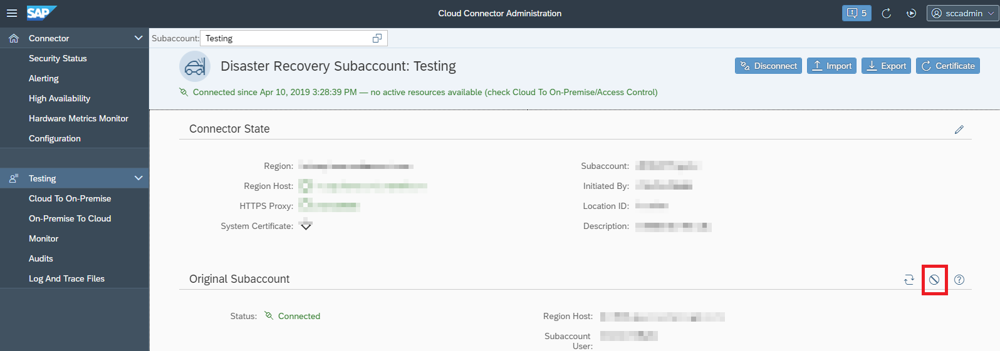

<!-- loio35736580b814412788e0b5b3915cbdc3 -->

# Convert a Disaster Recovery Subaccount into a Standard Subaccount

Convert a disaster recovery sucaccount into a standard subaccount if the former primary subaccount's region cannot be recovered.

> ### Caution:  
> This feature is deprecated.
> 
> Due to the discontinuation of the *Enhanced Disaster Recovery Service*, the related functionality in the Cloud Connector has been dropped as of version 2.16.
> 
> For more information, see [What's New for SAP Business Technology Platform](https://help.sap.com/whats-new/cf0cb2cb149647329b5d02aa96303f56?Component=Enhanced%2520Disaster%2520Recovery%2520Service&locale=en-US&version=Cloud).

Disaster recovery subaccounts that were switched to disaster recovery mode can be elevated to standard subaccounts if a disaster recovery region replaces an original region that is not expected to recover.

If a disaster recovery subaccount should be used as primary subaccount, you can convert it by choosing the button *Discard original subaccount and replace it with disaster recovery subaccount*.

