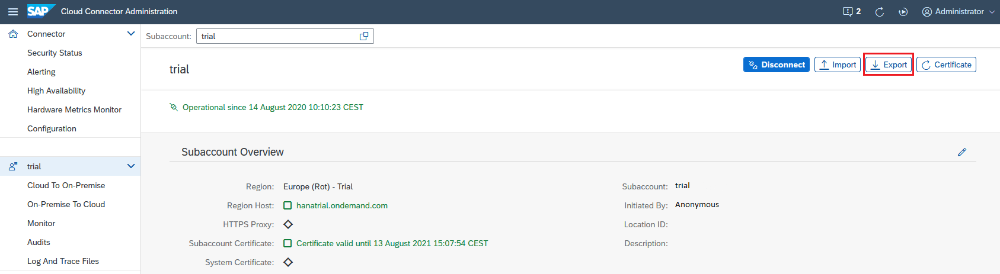
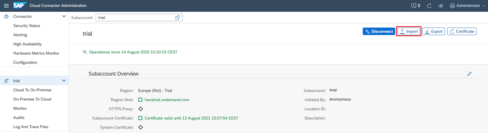
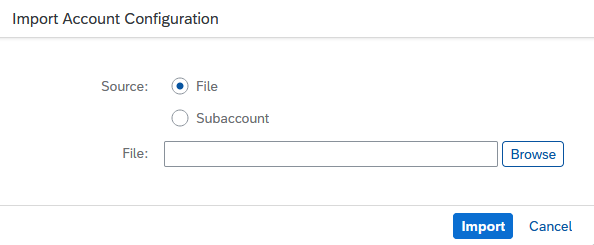

<!-- loio513d1296750548d9b8c1741cc8954a1d -->

# Copy a Subaccount Configuration

Copy an existing subcaccount configuration in the Cloud Connector to another subaccount.

You can copy the configuration of a subaccount's *Cloud To On-Premise* and *On-Premise To Coud* sections to a new subaccount, by using the export and import functions in the Cloud Connector administration UI.

> ### Note:  
> Principal propagation configuration \(section *Cloud To On-Premise*\) is not exported or imported, since it contains subaccount-specific data.

**Procedure: Export an Existing Configuration**

1.  In the Cloud Connector administration UI, choose your subaccount from the navigation menu.
2.  To export the existing configuration, choose the *Export* button in the upper right corner. The configuration is downloaded as a zip file to your local file system.

    

**Procedure: Import an Existing Configuration**

1.  From the navigation menu, choose the subaccount to which you want to copy an existing configuration.
2.  To import an existing configuration, choose the *Import* button in the upper right corner.

    

3.  Select one of the following sources:
    1.  *File*, if you want to copy the configuration from a previously downloaded zip file.
    2.  *Subaccount*, if you want to copy the configuration directly from another existing subaccount.

        

