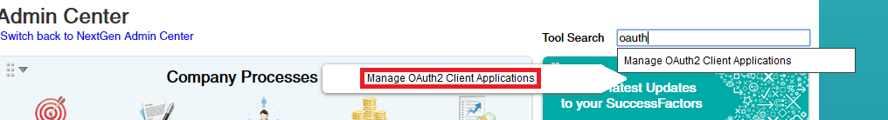
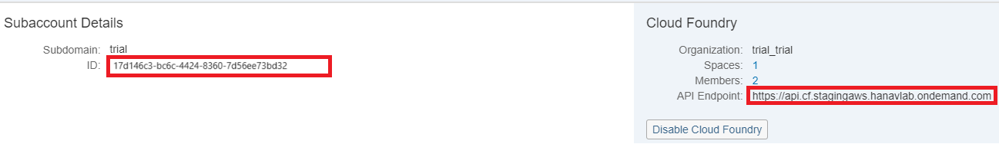
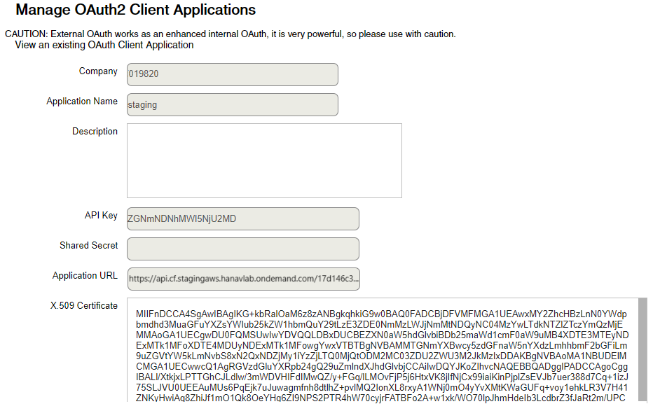

<!-- loio69130a77dd12431ca5e0c41c2d5fbecb -->

# Create an OAuth Client in SAP SuccessFactors

Create an OAuth client in SuccessFactors for user propagation from the SAP BTP Cloud Foundry environment.

1.  Download the X.509 certificate from your Cloud Foundry subaccount:

    In the cloud cockpit, navigate to your Cloud Foundry subaccount and from the left-side subaccount menu, choose *Connectivity* \> *Destinations*. Choose *Download Trust* to get the certificate for this subaccount.

    

2.  Create a SuccessFactors OAuth Client:

    In SuccessFactors, go to the *Admin Center* and search for `OAuth`. Choose `Manage OAuth2 Client Applications`.

    

    

3.  Press the *Register Client Application* button on the right. In the *<Application Name\>* field, provide some arbitrary descriptive name for the client. For *<Application URL\>*, enter the Cloud Foundry API endpoint of the client SAP BTP subaccount, followed by the subaccount GUID, for example `https://api.cf.stagingaws.hanavlab.ondemand.com/17d146c3-bc6c-4424-8360-7d56ee73bd32`. This information is available in the cloud cockpit under subaccount details:

    

4.  In the field *<X.509 Certificate\>*, paste the certificate that you downloaded in step 1.
5.  Choose *Register* to save the OAuth client.
6.  Now, locate your client in the list by its application name, choose *View* in the *Actions* column and take note of the *<API Key\>* that has been generated for it. You will use this key later in the OAuth2SAMLBearer destination in the Cloud Foundry environment.

    

<a name="loio69130a77dd12431ca5e0c41c2d5fbecb__section_xd1_x1y_cgb"/>

## Next Step

-   [Create and Consume a Destination for the Cloud Foundry Application](create-and-consume-a-destination-for-the-cloud-foundry-application-0781bb6.md)

