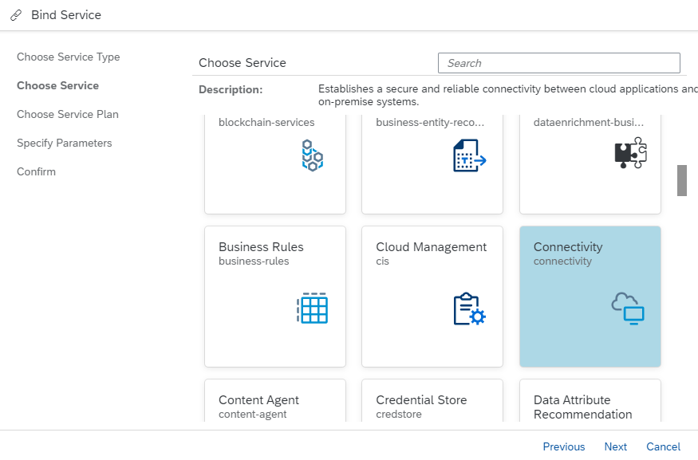

<!-- loioa2b88cf9d41e4061bfb06a23d9ba1c43 -->

# Create and Bind a Connectivity Service Instance

To use the Connectivity service in your application, you need an instance of the service.


<a name="loioa2b88cf9d41e4061bfb06a23d9ba1c43__section_bzt_wqq_2nb"/>

## Prerequisites

When using service plan “lite”, quota management is no longer required for this service. From any subaccount you can consume the service using service instances without restrictions on the instance count.

Previously, access to service plan “lite” has been granted via entitlement and quota management of the application runtime. It has now become an integral service offering of SAP BTP to simplify its usage. See also [Entitlements and Quotas](https://help.sap.com/viewer/3504ec5ef16548778610c7e89cc0eac3/Cloud/en-US/00aa2c23479d42568b18882b1ca90d79.html).


<a name="loioa2b88cf9d41e4061bfb06a23d9ba1c43__procedure_cs"/>

## Procedure

You have two options for creating a service instance – using the CLI or using the SAP BTP cockpit:

-   [Create and Bind a Service Instance from the CLI](create-and-bind-a-connectivity-service-instance-a2b88cf.md#loioa2b88cf9d41e4061bfb06a23d9ba1c43__cli_cs)
    -   [Example](create-and-bind-a-connectivity-service-instance-a2b88cf.md#loioa2b88cf9d41e4061bfb06a23d9ba1c43__example_cs)

    -   [Result](create-and-bind-a-connectivity-service-instance-a2b88cf.md#loioa2b88cf9d41e4061bfb06a23d9ba1c43__result_cs)

-   [Create and Bind a Service Instance from the Cockpit](create-and-bind-a-connectivity-service-instance-a2b88cf.md#loioa2b88cf9d41e4061bfb06a23d9ba1c43__cockpit_cs)
    -   [Result](create-and-bind-a-connectivity-service-instance-a2b88cf.md#loioa2b88cf9d41e4061bfb06a23d9ba1c43__result_cs)


For more information on using X.509 certificates, see:

[X.509 Bindings](create-and-bind-a-connectivity-service-instance-a2b88cf.md#loioa2b88cf9d41e4061bfb06a23d9ba1c43__bindings)


<a name="loioa2b88cf9d41e4061bfb06a23d9ba1c43__cli_cs"/>

## Create and Bind a Service Instance from the CLI

Use the following CLI commands to create a service instance and bind it to an application:

1.  *cf marketplace*
2.  *cf create-service connectivity <service-plan\> <service-name\>*
3.  *cf bind-service <app-name\> <service-name\> \[-c <config json\>\]* 

Back to [Procedure](create-and-bind-a-connectivity-service-instance-a2b88cf.md#loioa2b88cf9d41e4061bfb06a23d9ba1c43__procedure_cs)


## Example

To bind an instance of the Connectivity service "lite" plan to application "myapp", use following commands on the Cloud Foundry command line:

*cf create-service connectivity lite myinstance*

*cf bind-service myapp myinstance*

Back to [Procedure](create-and-bind-a-connectivity-service-instance-a2b88cf.md#loioa2b88cf9d41e4061bfb06a23d9ba1c43__procedure_cs)


<a name="loioa2b88cf9d41e4061bfb06a23d9ba1c43__cockpit_cs"/>

## Create and Bind a Service Instance from the Cockpit

Assuming that you have already deployed your application to the platform, follow these steps to create a service instance and bind it to an application:

1.  In the SAP BTP Cockpit, navigate to your application.
2.  From the left navigation menu, choose *Service Bindings*.
3.  Choose the *Bind Service* button.
4.  The *Bind Service* wizard appears.
5.  Select the *Service from the catalog* radio button, then choose *Next*.
6.  From the list of available services, select *Connectivity*, then choose *Next*.

    

7.  On the next page of the wizard, select the *Create new instance* radio button.
8.  Leave *<Plan\>* `lite` selected and choose *Next*.
9.  The next page is used for specifying user-provided parameters in JSON format. If you do not want to do that, skip this step by choosing *Next*.
10. In the *<Instance Name\>* textbox, enter an unique name for your service instance.
11. Choose *Finish*.

Back to [Procedure](create-and-bind-a-connectivity-service-instance-a2b88cf.md#loioa2b88cf9d41e4061bfb06a23d9ba1c43__procedure_cs)


<a name="loioa2b88cf9d41e4061bfb06a23d9ba1c43__result_cs"/>

## Result

When the binding is created, the application gets the corresponding connectivity credentials in its environment variables:

> ### Sample Code:  
> ```
> "VCAP_SERVICES": {
>  "connectivity": [
>  {
>  "credentials": {
>  "onpremise_proxy_host": "10.0.85.1",
>  "onpremise_proxy_port": "20003",
>  "onpremise_proxy_http_port": "20003",
>  "clientid": "sb-connectivity-app",
>  "clientsecret": "KXqObiN6d9gLA4cS2rOVAahPCX0=",
>  "token_service_url": "<token_service_url>",
>  },
>  "label": "connectivity",
>  "name": "conn-lite",
>  "plan": "default",
>  "provider": null,
>  "syslog_drain_url": null,
>  "tags": [
>  "connectivity",
>  "conn",
>  "connsvc"
>  ],
>  "volume_mounts": []
>  }
>  ],
> ```

> ### Note:  
> `"onpremise_proxy_http_port"` replaces the deprecated variable `"onpremise_proxy_port"`, which will be removed soon. Same goes for `"token_service_url"`, which replaces `"url"`.

Back to [Procedure](create-and-bind-a-connectivity-service-instance-a2b88cf.md#loioa2b88cf9d41e4061bfb06a23d9ba1c43__procedure_cs)


<a name="loioa2b88cf9d41e4061bfb06a23d9ba1c43__bindings"/>

## X.509 Bindings

> ### Note:  
> Older instances of the service do not support the X.509 credentials binding type and an attempt to create one will result in an error. To overcome this, you just need to update the service instance, so it picks up the X.509 support.

The service supports X.509 bindings as described in [Retrieving Access Tokens with Mutual Transport Layer Security (mTLS)](https://help.sap.com/viewer/65de2977205c403bbc107264b8eccf4b/Cloud/en-US/f60c8e724bb8496eae10ed29e896766a.html "Mutual Transport Layer Security (mTLS) is considered more secure than the combination of client ID and client secret. Unlike retrieving the access token with client ID and client secret, no secret is shared between calling application and the service instance of SAP Authorization and Trust Management service (XSUAA).") :arrow_upper_right:. This lets you choose if your binding / service key will be with a client secret X.509 certificate generated by SAP or an X.509 certificate provided by you. To do so, add a config JSON when creating your binding:

```
cf bind-service <app-name> <service-name> [-c <config json>]

```

The structure of the config JSON should be like this:

```
{
    "xsuaa":
    {
        <X.509 properties>
    },
    <other config parameters>
}
```

For a list of the supported X.509 properties, see:

-   [Parameters for X.509 Certificates Managed by SAP Authorization and Trust Management Service](https://help.sap.com/viewer/65de2977205c403bbc107264b8eccf4b/Cloud/en-US/436ed684eadc4045881e59bd1048d98d.html "Use the parameters to have the service generate X.509 certificates for you.") :arrow_upper_right:
-   [Parameters for Self-Managed X.509 Certificates](https://help.sap.com/viewer/65de2977205c403bbc107264b8eccf4b/Cloud/en-US/5168df615064457eafe3e48e10a95665.html "Use these parameters to provide your own certificates for a binding or service key to service instances of the SAP Authorization and Trust Management service (XSUAA).") :arrow_upper_right: 

> ### Note:  
> By default, without providing a config JSON, a binding with client secret will be created.

Back to [Procedure](create-and-bind-a-connectivity-service-instance-a2b88cf.md#loioa2b88cf9d41e4061bfb06a23d9ba1c43__procedure_cs)

