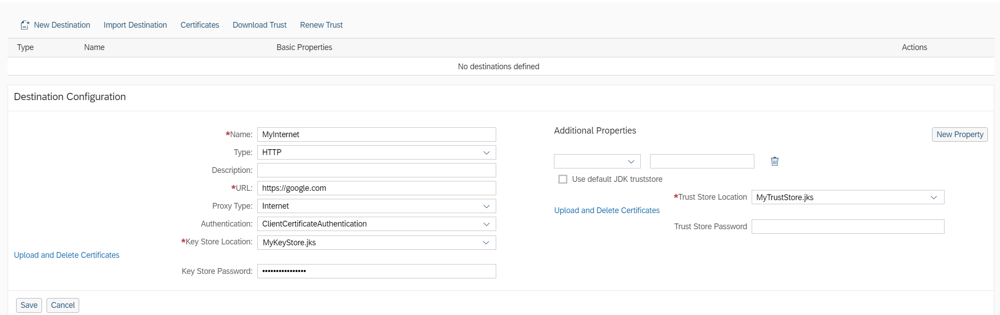
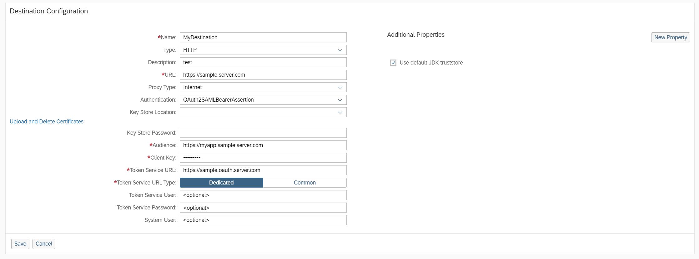
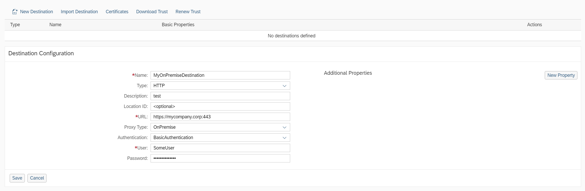
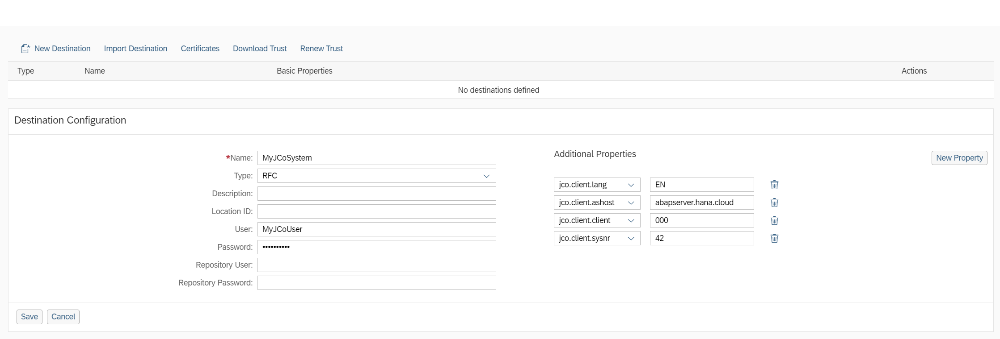
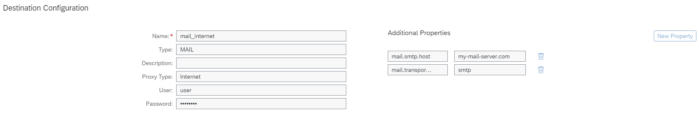
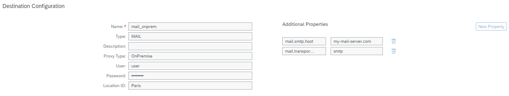

<!-- loio3a2d57580d474da6960a644462a92861 -->

# Destination Examples

Find configuration examples for HTTP and RFC destinations in the Cloud Foundry environment, using different authentication types.

<a name="loio3a2d57580d474da6960a644462a92861__content"/>

## Content

[HTTP Destination \(Internet, Client Certificate Authentication\)](destination-examples-3a2d575.md#loio3a2d57580d474da6960a644462a92861__http_client)

[HTTP Destination \(Internet, OAuth2SAMLBearerAssertion\)](destination-examples-3a2d575.md#loio3a2d57580d474da6960a644462a92861__http_oauth)

[HTTP Destination \(On-Premise\)](destination-examples-3a2d575.md#loio3a2d57580d474da6960a644462a92861__http_op)

[RFC Destination](destination-examples-3a2d575.md#loio3a2d57580d474da6960a644462a92861__rfc)

[Mail Destination \(Internet\)](destination-examples-3a2d575.md#loio3a2d57580d474da6960a644462a92861__mail_internet)

[Mail Destination \(On-Premise\)](destination-examples-3a2d575.md#loio3a2d57580d474da6960a644462a92861__mail_onpremise)

<a name="loio3a2d57580d474da6960a644462a92861__http_client"/>

## Example: HTTP Destination \(Internet, Client Certificate Authentication\)

Back to [Content](destination-examples-3a2d575.md#loio3a2d57580d474da6960a644462a92861__content)

<a name="loio3a2d57580d474da6960a644462a92861__http_oauth"/>

## Example: HTTP Destination \(Internet, OAuth2SAMLBearerAssertion\)

Back to [Content](destination-examples-3a2d575.md#loio3a2d57580d474da6960a644462a92861__content)

<a name="loio3a2d57580d474da6960a644462a92861__http_op"/>

## Example: HTTP Destination \(On-Premise\)

Back to [Content](destination-examples-3a2d575.md#loio3a2d57580d474da6960a644462a92861__content)

<a name="loio3a2d57580d474da6960a644462a92861__rfc"/>

## Example: RFC Destination

The following main properties correspond to the relevant additional properties:

*User* → `jco.client.user` 

*Password* → `jco.client.passwd` 

*Repository password* → `jco.destination.repository.passwd`

> ### Note:  
> For security reasons, do not use these additional properties but use the corresponding main properties' fields.

Back to [Content](destination-examples-3a2d575.md#loio3a2d57580d474da6960a644462a92861__content)

<a name="loio3a2d57580d474da6960a644462a92861__mail_internet"/>

## Example: Mail Destination \(Internet\)

Back to [Content](destination-examples-3a2d575.md#loio3a2d57580d474da6960a644462a92861__content)

<a name="loio3a2d57580d474da6960a644462a92861__mail_onpremise"/>

## Example: Mail Destination \(On-Premise\)

Back to [Content](destination-examples-3a2d575.md#loio3a2d57580d474da6960a644462a92861__content)

**Related Information**  

[HTTP Destinations](http-destinations-42a0e6b.md "Find information about HTTP destinations for Internet and on-premise connections (Cloud Foundry environment).")

[RFC Destinations](rfc-destinations-238d027.md "")

