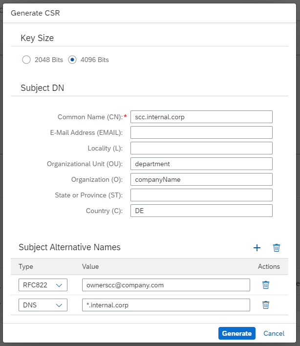
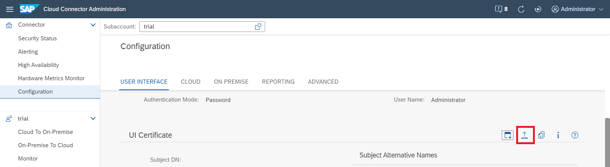
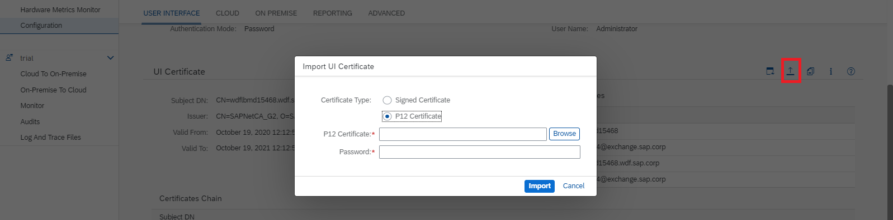

<!-- loiob70bf164a6e6498b8bf1f459554609f5 -->

# Exchange UI Certificates in the Administration UI

By default, the Cloud Connector includes a self-signed UI certificate. It is used to encrypt the communication between the browser-based user interface and the Cloud Connector itself. For security reasons, however, you should replace this certificate with your own one to let the browser accept the certificate without security warnings.

<a name="concept_jhp_ydl_cs"/>

<!-- concept\_jhp\_ydl\_cs -->

## Procedure

## Master Instance

1.  From the main menu, choose *Configuration* and go to the *User Interface* tab.
2.  In the *UI Certificate* section, start a certificate signing request procedure by choosing the icon *Generate a Certificate Signing Request*.
3.  In the pop-up *Generate CSR*, specify a key size and a subject fitting to your host name.

    For host matching, you should use the available names within the `subjectAlternativeName` \(SAN\) extension, see [RFC 2818](https://tools.ietf.org/html/rfc2818) and *https://www.chromestatus.com/feature/4981025180483584*. A check verifies whether the host matches one of the entries in the SAN extension.

    In section **Subject Alternative Names**, you can add additional values by pressing the *Add* button. Choose one or more of the following SAN types and provide the matching values:

    -   DNS: a specific host name \(for example, `www.sap.com`\) or a wildcard hostname \(for example, `*.sap.com`\).
    -   IP: an IPv4 or IPv6 address.
    -   [RFC822](https://tools.ietf.org/html/rfc822): an example for this type of value is a simple email address: for example, `donotreply@sap.com`.
    -   URI: a URI for which the certificate should be valid.

    

4.  Press *Generate*.
5.  You are prompted to save the signing request in a file. The content of the file is the signing request in PEM format.

    The signing request must be provided to a Certificate Authority \(CA\) - either one within your company or another one you trust. The CA signs the request and the returned response should be stored in a file.

    > ### Note:  
    > The response should be either an X.509 certificate or a PKCS\#7 in PEM format.

6.  To import the signing response, choose the *Upload* icon.

    

    As of Cloud Connector version 2.13, you can also upload an existing PKCS\#12 certificate directly \(instead of generating a CSR\).

    

7.  Select *Browse* to locate the file and then choose the *Import* button.
8.  Review the certificate details that are displayed.
9.  Restart the Cloud Connector to activate the new certificate.

## Shadow Instance

In a High Availability setup, perform the same operation on the shadow instance.

> ### Caution:  
> UI certificates are used for the secure communication between master and shadow instances. Replacing the UI certificate breaks the trust relationship and communication between master and shadow is not possible anymore.
> 
> Please disconnect the shadow instance when you are going to replace UI certificate\(s\). Once the certificate update is done, connect the shadow instance again. You will be forced to enter user and password again to establish the trust relationship between master and shadow instances.

