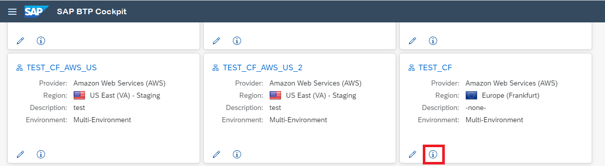

<!-- loiob43eff2df3f84124995f6acbc9e5c55b -->

# Find Your Subaccount ID \(Cloud Foundry Environment\)

Get your subaccount ID to configure the Cloud Connector in the Cloud Foundry environment.

> ### Note:  
> For the Beta version, the cloud cockpit is not yet available.

In order to set up your subaccount in the Cloud Connector, you must know the subaccount ID. Follow these steps to acquire it:

1.  Open the SAP BTP cockpit.
2.  Navigate to the subaccount list of the global account containing your subaccount: choose *Home* \> *<Your Global Account\>* \> *Account Explorer*.
3.  Find your subaccount in the list.
4.  Choose the *Info* icon in the subaccount tile to display the subaccount ID:

    

