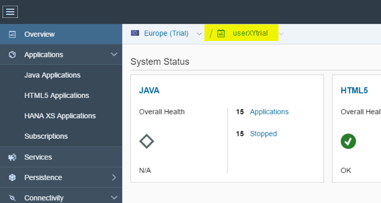
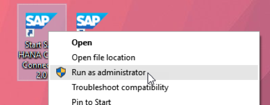

<!-- loiof8d6f9ab43c14e52a9e8036515a472e9 -->

# Frequently Asked Questions

Answers to the most common questions about the Cloud Connector.

## Technical Issues

### **Does the Cloud Connector send data from on-premise systems to SAP BTP or the other way around?**

The connection is opened from the on-premise system to the cloud, but is then used in the other direction.

An on-premise system is, in contrast to a cloud system, normally located behind a restrictive firewall and its services aren’t accessible thru the Internet. This concept follows a widely used pattern often referred to as *reverse invoke proxy*.

### **Is the connection between the SAP BTP and the Cloud Connector encrypted?**

Yes, by default, TLS encryption is used for the tunnel between SAP BTP and the Cloud Connector.

If used properly, TLS is a highly secure protocol. It is the industry standard for encrypted communication and also, for example, as a secure channel in HTTPS.

Keep your Cloud Connector installation and JDK updated to avoid the use of weak and deprecated ciphers for TLS communication. Which cipher and TLS versions are actually used, is defined by both the cloud region setup and the JDK that is used for Cloud Connector. The TLS implementation used for the communication is the one of the JDK.

### **Can I use a TLS-terminating firewall between Cloud Connector and SAP BTP?**

This is not possible. Basically, this is a desired man-in-the-middle attack, which does not allow the Cloud Connector to establish a mutual trust to the SAP BTP side.

### **Can I copy/clone a Cloud Connector installation and use it in parallel on a different machine?**

This is not supported. You would face issues regularly, as those two instances will be considered as one, which is not expected by the cloud side.

If you just want to move the installation to a new machine, create a backup via the [Configuration Backup](configuration-backup-abd1ba7.md) feature, create a new installation, import the backup, and discard the previous installation.

### **What is the oldest version of SAP Business Suite that's compatible with the Cloud Connector?**

The Cloud Connector can connect an SAP Business Suite system version 4.6C and newer.

### **Which Java versions are supported to run the Cloud Connector?**

<table>
<tr>
<td valign="top">

</td>
<td valign="top">

</td>
<td valign="top" colspan="5">

Supported Java Version

</td>
</tr>
<tr>
<td valign="top">

</td>
<td valign="top">

</td>
<td valign="top">

6

</td>
<td valign="top">

7

</td>
<td valign="top">

8

</td>
<td valign="top">

11

</td>
<td valign="top">

17

</td>
</tr>
<tr>
<td valign="top" rowspan="6">

Cloud Connector Version

</td>
<td valign="top">

< 2.7.2

</td>
<td valign="top">

Yes

</td>
<td valign="top">

Yes

</td>
<td valign="top">

No

</td>
<td valign="top">

No

</td>
<td valign="top">

No

</td>
</tr>
<tr>
<td valign="top">

= 2.7.2

</td>
<td valign="top">

Yes

</td>
<td valign="top">

Yes

</td>
<td valign="top">

Yes

</td>
<td valign="top">

No

</td>
<td valign="top">

No

</td>
</tr>
<tr>
<td valign="top">

\>= 2.8

</td>
<td valign="top">

No

</td>
<td valign="top">

Yes

</td>
<td valign="top">

Yes

</td>
<td valign="top">

No

</td>
<td valign="top">

No

</td>
</tr>
<tr>
<td valign="top">

\>=2.12.3

</td>
<td valign="top">

No

</td>
<td valign="top">

No

</td>
<td valign="top">

Yes

</td>
<td valign="top">

No

</td>
<td valign="top">

No

</td>
</tr>
<tr>
<td valign="top">

\>= 2.14.0

</td>
<td valign="top">

No

</td>
<td valign="top">

No

</td>
<td valign="top">

Yes

</td>
<td valign="top">

Yes

</td>
<td valign="top">

No

</td>
</tr>
<tr>
<td valign="top">

\>= 2.15.0

</td>
<td valign="top">

No

</td>
<td valign="top">

No

</td>
<td valign="top">

Yes

</td>
<td valign="top">

Yes

</td>
<td valign="top">

Yes

</td>
</tr>
</table>

> ### Restriction:  
> Support for Java 7 has been discontinued. For more information, see [Prerequisites](prerequisites-e23f776.md#loioe23f776e4d594fdbaeeb1196d47bbcc0__jdk).

> ### Tip:  
> We recommend that you always use the latest patch level of the respective Java version.

> ### Caution:  
> Version 2.8 and later of theCloud Connector may have problems with ciphers in Google Chrome, if you use the JVM 7. For more information read [this SCN Article](https://blogs.sap.com/2015/09/09/cloud-connector-and-errsslweakserverephemeraldhkey-with-chrome/).

### **Which configuration in the SAP BTP destinations do I need to handle the user management access to the Cloud User Store of the Cloud Connector?**

See [Configure an On-Premise User Store](https://help.sap.com/viewer/b865ed651e414196b39f8922db2122c7/Cloud/en-US/933034aeb00d489eaf21d50bbb12fed5.html "Configure SAP BTP Java applications to use your corporate LDAP server or on-premise SAP system as a user store.") :arrow_upper_right:.

### **Is the Cloud Connector sufficient to connect the SAP BTP to an SAP ABAP back end or is SAP BTP Integration needed?**

It depends on the scenario: For pure point-to-point connectivity to call on-premise functionality like BAPIs, RFCs, OData services, and so on, that are exposed via on-premise systems, the Cloud Connector might suffice.

However, if you require advanced functionality, for example, n-to-n connectivity as an integration hub, SAP BTP Integration – Process Integration is a more suitable solution. SAP BTP Integration can use the Cloud Connector as a communication channel.

### **How much bandwidth does the Cloud Connector consume?**

The amount of bandwidth depends greatly on the application that is using the Cloud Connector tunnel. If the tunnel isn’t currently used, but still connected, a few bytes per minute is used simply to keep the connection alive.

### **What happens to a response if there's a connection failure while a request is being processed?**

The response is lost. The Cloud Connector only provides tunneling, it does not store and forward data when there are network issues.

### **Where should I install the Cloud Connector?**

For productive instances, we recommend installing the Cloud Connector on a single purpose machine. This is relevant for [Security](security-cb50b61.md). For more details on which network zones to choose for the Cloud Connector setup, see [Network Zones](network-zones-7b9d90c.md).

### **How does a disaster recovery setup look like for the Cloud Connector?**

There is no explicit implementation of a disaster recovery setup for the Cloud Connector. However, it is actually not needed.

Instead, make sure you have machines available in some other data center than the one in which your productive setup is running. Also, make sure you regularly generate a [Configuration Backup](configuration-backup-abd1ba7.md).

If a disaster situation occurs, install the Cloud Connector again and restore the latest backup. Immediately after the restart that is required after restoring the backup, you are back to a running setup, as long as all the backend systems are reachable from the new location.

### **How many servers do I need to deploy the Cloud Connector?**

We recommend that you use at least three servers, with the following purposes:

-   Development
-   Production master
-   Production shadow

> ### Note:  
> Do not run the production master and the production shadow as VMs inside the same physical machine. Doing so removes the redundancy, which is needed to guarantee high availability. A QA \(Quality Assurance\) instance is a useful extension. For disaster recovery, you will need two additional instances: another master instance, and another shadow instance as a reserve for the disaster case.

### **What are the hardware requirements to deploy the Cloud Connector?**

See: [Prerequisites](prerequisites-e23f776.md).

### **Can I send push messages from an on-premise system to the SAP BTP through the Cloud Connector?**

No, this is not supported by the Cloud Connector.

### **Is NTLM supported for authorization against the proxy server?**

No, the Cloud Connector currently supports only basic authentication.

### **Which operating systems are supported by the Cloud Connector?**

See [Prerequisites](prerequisites-e23f776.md).

### **Which processor architectures are supported by the Cloud Connector?**

We currently support 64-bit operating systems running only on an x86-64 processor \(also known as x64, x86\_64 or AMD64\), and for Linux also on the *PowerPC Little Endian* variant \(also known as *ppc64le*\).

See: [Prerequisites](prerequisites-e23f776.md).

### **Can I use the Cloud Connector without an ABAP back end?**

Yes, you should be able to connect almost any system that supports the HTTP Protocol, to the SAP BTP, for example, Apache HTTP Server, Apache Tomcat, Microsoft IIS, or Nginx.

### **Can I authenticate with client certificates configured in SAP BTP destinations at HTTP services that are exposed via the Cloud Connector?**

No, this is not possible. For client certificate authentication, an end-2-end TLS communication is required. This is not the case, because the Cloud Connector needs to inspect incoming requests in order to perform access control checks.

### **How can I do connection pooling for HTTP services that are exposed via the Cloud Connector?**

The Cloud Connector itself does not perform connection pooling, but provides a 1-to-1 mapping for each logical connection received trough the tunnel.

By this mapping, a new connection to the backend system is opened, and kept open until closed either by the backend or by the client on cloud side.

The actual connection pooling is defined by the application client on cloud side:

-   If a connection is re-used in the client library, it is re-used on the Cloud Connector side as well.
-   If it is closed immediately, also the mapped one on Cloud Connector side will be closed immediately.

### **Can I open two windows or tabs in a single browser instance to administrate the Cloud Connector?**

No, this is not supported and may cause odd behavior on the different screens, in particular when trying to navigate through multiple subaccounts. If you like to open the administration UI twice, use two separate browser instances.

### **Does the Cloud Connector delete or modify HTTP headers?**

Modifications of HTTP response headers are done if needed. In particular, Set-Cookie domains are adjusted according to the configured domain and host mappings. Also, in case of redirects, the location header will be adjusted according to the host mappings. Modifications of HTTP request headers are also done if needed, which is currently only the case for the *Host* header content. It will be replaced by the internal host, if the host mapping configuration is set up accordingly. The Cloud Connector will not delete any header that is sent by the cloud application. However, the Connectivity service will drop Connectivity service-specific headers, such as `SAP-Connectivity-Authentication` or `SAP-Connectivity-ConsumerAccount` so that those headers will neither reach the Cloud Connector nor the eventual backend.

## Administration

### **Are there Audit Logs for changes in the Cloud Connector?**

Yes, find more details here: [Manage Audit Logs](manage-audit-logs-2264c70.md).

### **Is it possible to split authorization?**

No, currently there is only one role that allows complete administration of the Cloud Connector.

### **Can I configure multiple administrative subaccounts?**

Yes, to enable this, you must configure an LDAP server. See: [Use LDAP for User Administration](use-ldap-for-user-administration-120ceec.md).

### **How can I reset the Cloud Connector's administrator password when not using LDAP for authentication?**

Visit [https://tools.hana.ondemand.com/\#cloud](https://tools.hana.ondemand.com/#cloud) to download the portable version of the Cloud Connector. Extract the *users.xml* file in the *config* directory to the *config* directory of your Cloud Connector installation, then restart the Cloud Connector.

This resets the password and user name to their default values.

You can manually edit the file; however, we strongly recommend that you use the*users.xml* file.

### **How do I create a backup of the Cloud Connector configuration?**

Starting with Cloud Connector version 2.11, you can use a dedicated backup feature, either from the administration UI \(see [Configuration Backup](configuration-backup-abd1ba7.md)\) or via REST API \(see [Backup](backup-d94b9db.md)\).

### **Can I create a backup of the complete installation?**

Yes, you can create an archive file of the installation directory to create a full backup. Before you restore from a backup, note the following:

-   If you restore the backup on a different host, the UI certificate will be invalidated.
-   Before you restore the backup, you should perform a “normal” installation and then replace the files. This registers the Cloud Connector at your operating systems package manager.

### **Why do I need a user ID during configuration?**

This user opens the tunnel and generates the certificates that are used for mutual trust later on.

The user is not part of the certificate that identifies the Cloud Connector.

In both the Cloud Connector UI and in the SAP BTP cockpit, this user ID appears as the one who performed the initial configuration \(even though the user may have left the company\).

### **What happens to a Cloud Connector connection if the user who created the tunnel leaves the company?**

This does not affect the tunnel, even if you restart the Cloud Connector.

### **What do changes in major or minor version numbers mean?**

The semantics of Cloud Connector versions are explained in detail [here](https://blogs.sap.com/2015/10/07/sap-hana-cloud-connector-support-information/).

### **Does SAP provide support for older Cloud Connector versions?**

SAP supports the latest 2 feature releases in parallel. For the latest feature release, the last 2 patch levels are supported. For the previous feature release, only its latest patch level is supported.

For more information on the Cloud Connector support strategy, see SAP Note [3302250](https://me.sap.com/notes/3302250).

### **What is the difference between “subaccount name” and “subaccount user”?**

SAP BTP customers can purchase subaccounts and deploy applications into these subaccounts.

Additionally, there are users, who have a password and can log in to the cockpit and manage all subaccounts they have permission for.

-   A single subaccount can be managed by multiple users, for example, your company may have several administrators.
-   A single user can manage multiple subaccounts, for example, if you have multiple applications and want them \(for isolation reasons\) to be split over multiple subaccounts.

Find your account name by taking the following steps:

1.  Open the SAP BTP cockpit.
2.  Log in with your subaccount user.
3.  You’ll see the subaccount name in the top left section of the screen.

For trial users, the account name is typically your user name, followed by the suffix “trial”:

## Features

### **Does the Cloud Connector work with the SAP BTP Cloud Foundry environment?**

As of version 2.10, the Cloud Connector can establish a connection to regions based on the SAP BTP Cloud Foundry environment. Newer regions, however, require a Cloud Connector version 2.11 or higher.

### **Does the Cloud Connector work with SAP S/4HANA Cloud?**

As of version 2.10, the Cloud Connector offers a Service Channel to S/4HANA Cloud instances, given that they are associated with the respective SAP BTP subaccount. For more information, see [Using Service Channels](using-service-channels-16f6342.md).

Also supported as of version 2.10: S/4HANA Cloud communication scenarios invoking HTTP services or remote-enabled function modules \(RFMs\) in on-premise ABAP systems.

### **Does the Cloud Connector work with the SAP BTP ABAP environment?**

As of version 2.11, the Cloud Connector supports communication from and to the SAP BTP ABAP environment, when using the **Neo** Connectivity service. Using the **Cloud Foundry** Connectivity service requires a Cloud Connector version 2.12.3 or higher.

### **How do I bind multiple Cloud Connectors to one SAP BTP subaccount?**

As of version 2.9, you can connect multiple Cloud Connectors to a single subaccount. This lets you assign multiple separate corporate network segments.

Those Cloud Connectors are distinguishable based on the location ID, which you must provide to the destination configuration on the cloud side.

> ### Note:  
> During an upgrade, location IDs provided in earlier versions of the Cloud Connector are dropped to ensure that running scenarios are not disturbed.

### **Is WebSocket communication through the Cloud Connector supported?**

Yes, this is possible as of version 2.12.

### **Is there any plan to add traffic management functionality in Cloud Connector?**

No, this functionality is not currently planned.

### **Can I use the Cloud Connector from cloud to on-premise for any protocol?**

As of version 2.10, you can use the TCP channel of the Cloud Connector, if the client supports a SOCKS5 proxy to establish the connection. However, only the HTTP and RFC protocols currently provide an additional level of access control by checking invoked resources.

### **Can I use the Cloud Connector from on-premise to cloud for any protocol?**

This is possible only for a limited set of protocols. You can use the Cloud Connector as a JDBC or ODBC proxy to access the HANA DB instance within your SAP BTP Neo subaccount \(service channel\). This is sometimes referred to as “HANA protocol”. Also, there are service channels for SSH access to SAP BTP Neo virtual machines, and for RFC access to ABAP cloud systems. All of these service channels provide access to endpoints that are not visible in the Internet.

For HTTP, the endpoints that could be addressed are visible in the Internet. Therefore, you can simply use your normal network infrastructure that is prepared for accessing HTTPS endpoints in the Internet anyway.

### **Can I check the communication of the service channel?**

No, the audit log monitors access only from SAP BTP to on-premise systems.

<a name="loiof8d6f9ab43c14e52a9e8036515a472e9__troubleshooting"/>

## Troubleshooting

### **How do I fix the “Could not open Service Manager” error message?**

You are probably seeing this error message due to missing administrator privileges. Right-click the cloud connector shortcut and select Run as administrator.

If you don’t have administrator privileges on your machine you can use the portable variant of the Cloud Connector.

> ### Note:  
> The portable variants of the Cloud Connector are meant for nonproductive scenarios only.

### **How do I set `JAVA_HOME` and `PATH` correctly?**

`JAVA_HOME` must point to the installation directory of your SAP JVM or JDK while `PATH` must contain the *bin* folder inside the installation directory of your SAP JVM or JDK. This is relevant in particular for the portable versions. The installers will also detect JDKs in other places.

### **How do I use the various `.bat-Batch` or `.sh-Shell` script tools in the Cloud Connector directory?**

Open a command line prompt with administrator privileges or with sufficient user privileges to read and write files in the Cloud Connector directory. Then, make sure the environment variable `JAVA_HOME` is set to the installation directory of the JDK used by the Cloud Connector.

Afterwards, switch to the Cloud Connector directory and call the appropriate batch or shell script tools via `<toolname>.bat` or `./<toolname>.sh`. If the respective tool script requires further input parameters, its usage syntax will be written to the console.

### **When I try to open the Cloud Connector UI, Google Chrome opens a *Save as* dialog, Firefox displays some cryptic signs, and Internet Explorer shows a blank page, how do I fix this?**

This happens when you try to access the Cloud Connector over HTTP instead of HTTPS. HTTP is the default protocol for most browsers.

Adding “https://” to the beginning of your URL should fix the problem. For localhost, you can use `https://localhost:8443/`.

