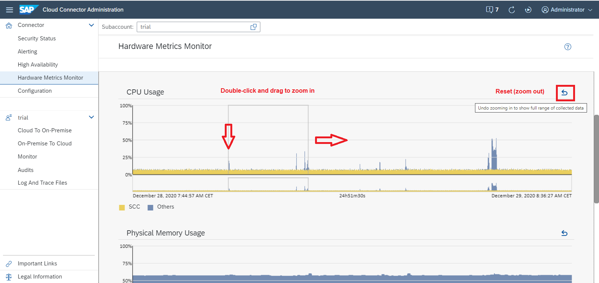

<!-- loio6684f08c2bba4d5db9ca9af6e16660ee -->

# Hardware Metrics

Check the current state of critical system resources in the Cloud Connector.

You can check the current state of critical system resources \(disc space, Java heap, physical memory, virtual memory\) using pie charts.

To access the monitor, choose *Hardware Metrics Monitor* from the main menu.

In addition, the history of CPU and memory usage \(physical memory, Java heap\) is shown in history graphs below the pie charts \(recorded in intervals of 15 seconds\), as well as the history of disk usage, recorded in intervals of 60 seconds. History data is retained for at most 24 hours.

You can view the usage data for a selected time period in each history graph:

-   Double-click inside the main graph area to set the start \(or end\) point, and drag to the left or to the right to zoom in.
    -   The entire timeline is always visible in the smaller bottom area right below the main graph.
    -   A frame in the bottom area shows the position of the selected section in the overall timeline.

-   Choose *Undo zooming in...* to reset the main graph area to the full range of available data.

> ### Note:  
> Zooming, dragging, and undoing zooming is synchronized across all history graphs. All graphs always show the situation during the same time period.

History data is written to a file to avoid data loss when stopping the Cloud Connector. Upon restart, the history data is read from file. Downtime is represented by a gray rectangle indicating that no data is available during the respective period of time.

