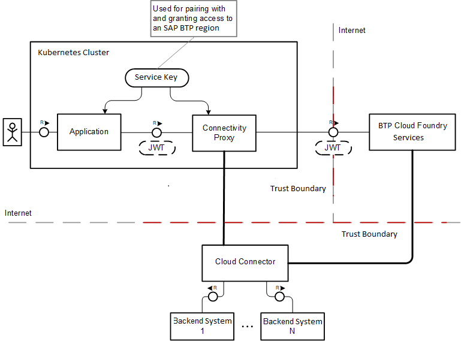

<!-- loio14ad61db386949d8abaf45c641aa7dc9 -->

# How the Connectivity Proxy Works

Learn about the connectivity proxy for Kubernetes: Scenario and required configuration.

[Glossary](how-the-connectivity-proxy-works-14ad61d.md#loio14ad61db386949d8abaf45c641aa7dc9__glossary)

[Scenario](how-the-connectivity-proxy-works-14ad61d.md#loio14ad61db386949d8abaf45c641aa7dc9__scenario)

-   [Prerequisites](how-the-connectivity-proxy-works-14ad61d.md#loio14ad61db386949d8abaf45c641aa7dc9__prereq)
-   [Runtime Flow in Steps](how-the-connectivity-proxy-works-14ad61d.md#loio14ad61db386949d8abaf45c641aa7dc9__flow)
-   [Involved Parties](how-the-connectivity-proxy-works-14ad61d.md#loio14ad61db386949d8abaf45c641aa7dc9__parties)

[Configuration](how-the-connectivity-proxy-works-14ad61d.md#loio14ad61db386949d8abaf45c641aa7dc9__k8s)

<a name="loio14ad61db386949d8abaf45c641aa7dc9__glossary"/>

## Glossary

-   **SAP Business Technology Platform** \(SAP BTP\): SAP platform for cloud services \(replaces *SAP Cloud Platform*\).
-   **SAP Connectivity service**: Core platform service, offering a secure tunnelling solution between your on-premise network and the cloud.
-   **Cloud Connector**: On-premise client of the Connectivity service, deployed and lifecycle-managed in your local network. The initiator of the secure tunnel to the platform, that is, to the Connectivity service.
-   **Connectivity proxy**: Software component \(logically part of the Connectivity service\), deployed locally to the consuming part \(usually a cloud application or a service component\). It can work in multiple operational modes, depending on the exact requirement of the consuming party.
-   **SAP UAA** \(aka XSUAA\): SAP Authorization service, issues client credentials and access tokens, associated with the platform tenancy model.

[Back to Top](how-the-connectivity-proxy-works-14ad61d.md#loio14ad61db386949d8abaf45c641aa7dc9__top)

<a name="loio14ad61db386949d8abaf45c641aa7dc9__scenario"/>

## Scenario

An end user works with a cloud application or solution. To complete the task, the application or solution needs to connect to an on-premise system \(hosted either by the consumer tenant or the cloud application provider tenant\). The system is not accessible directly via Internet, but securely exposed by the Cloud Connector. Only selected parts of the system functionality may be exposed to the cloud application. For more information, see [Cloud Connector](cloud-connector-e6c7616.md).

**Prerequisites**

-   The connectivity proxy is deployed and configured in the Kubernetes cluster \(see [Lifecycle Management](lifecycle-management-60c0a45.md)\).
-   A cloud application is deployed on Kubernetes, next to the connectivity proxy, and it is configured to connect to the proxy \(see [Using the Connectivity Proxy](using-the-connectivity-proxy-f3c1ef4.md)\). The cloud application is up and running and accessible by end users.
-   The Cloud Connector is installed and configured in your local network and connected to the cloud \(that is, to the Connectivity service\), and stays in a ready-to-be-used mode \(see [Cloud Connector](cloud-connector-e6c7616.md)\).
-   The on-premise systems that the cloud application needs to connect to are properly exposed via / configured in the Cloud Connector \(see [Configure Access Control](configure-access-control-f42fe44.md)\).

[Back to Scenario](how-the-connectivity-proxy-works-14ad61d.md#loio14ad61db386949d8abaf45c641aa7dc9__scenario)

[Back to Top](how-the-connectivity-proxy-works-14ad61d.md#loio14ad61db386949d8abaf45c641aa7dc9__top)

**Runtime Flow in Steps**

When all prerequisites are met, the cloud application can be properly used by end users:

-   An end user works with a *client tool*, for example, a browser or a REST client.
-   The *client tool* connects to a *cloud application*, in this case hosted in a Kubernetes cluster.
-   The *cloud application* knows it needs to connect to the on-premise system, therefore it connects to the connectivity proxy. Depending on the specific requirements of the cloud application environment, the *cloud application* might need to obtain an access token which is used to authenticate the application as a client, as well as to authorize it to connect to the respective tenant-specific Cloud Connector exposing the target system \(see [Operational Modes](operational-modes-148bbad.md)\).
-   The *connectivity proxy* accepts the client proxy request \(by the *cloud application*\) and routes the traffic via a TLS secure tunnel, which has been already initiated by the Cloud Connector and successfully established.
-   The Cloud Connector receives the *request data* from the *cloud application* and performs the related access control checks. A connection is established to the target on-premise system, and the request data is forwarded to the on-remise system.
-   The *response data* from the on-premise system is routed back to the *cloud application*.
-   The *cloud application* processes the response data retrieved by the on-premise system and shows the result to the end user.

[Back to Scenario](how-the-connectivity-proxy-works-14ad61d.md#loio14ad61db386949d8abaf45c641aa7dc9__scenario)

[Back to Top](how-the-connectivity-proxy-works-14ad61d.md#loio14ad61db386949d8abaf45c641aa7dc9__top)

**Involved Parties**

-   **Cloud application**: Business workload initiated by end users \(or a background job\) of the business solution.

-   **SAP BTP** **Services**: The connectivity proxy cannot operate on its own. It needs to connect to other services for key operations, namely:
    -   *authorization - XSUAA*: Ensure any operation is properly secured.
    -   *pairing/integration with SAP Connectivity service*: Secure access control to Cloud Connectors.

-   **On-Premise systems or services**: The target system, securely hosted in your local network, usually behind a firewall, and exposed via the Cloud Connector.

.

[Back to Scenario](how-the-connectivity-proxy-works-14ad61d.md#loio14ad61db386949d8abaf45c641aa7dc9__scenario)

[Back to Top](how-the-connectivity-proxy-works-14ad61d.md#loio14ad61db386949d8abaf45c641aa7dc9__top)

<a name="loio14ad61db386949d8abaf45c641aa7dc9__k8s"/>

## Configuration

The connectivity proxy for Kubernetes is meant to

-   Be deployed as a Kubernetes [StatefulSet](https://kubernetes.io/docs/concepts/workloads/). As it is accessed both by other Kubernetes deployments and the Cloud Connector, you need to configure access accordingly.
-   Connect to other \(remote\) services.
-   Enforce authorization on its proxy endpoints.

For all these points, proper configuration is required. For more information, see [Lifecycle Management](lifecycle-management-60c0a45.md).

[Back to Top](how-the-connectivity-proxy-works-14ad61d.md#loio14ad61db386949d8abaf45c641aa7dc9__top)

