<!-- loiodb9170a7d97610148537d5a84bf79ba2 -->

# Initial Configuration

After installing and starting the Cloud Connector, log on to the administration UI and perform the required configuration to make your Cloud Connector operational.

<a name="loiodb9170a7d97610148537d5a84bf79ba2__context"/>

## Tasks

[Prerequisites](initial-configuration-db9170a.md#loiodb9170a7d97610148537d5a84bf79ba2__prereq)

[Log on to the Cloud Connector](initial-configuration-db9170a.md#loiodb9170a7d97610148537d5a84bf79ba2__log_in)

[Initial Setup](initial-configuration-db9170a.md#loiodb9170a7d97610148537d5a84bf79ba2__change_password)

[Set up Connection Parameters and HTTPS Proxy](initial-configuration-db9170a.md#loiodb9170a7d97610148537d5a84bf79ba2__configure_proxy)

[Establish Connections to SAP BTP](initial-configuration-db9170a.md#loiodb9170a7d97610148537d5a84bf79ba2__establish_cloud_conection)

<a name="loiodb9170a7d97610148537d5a84bf79ba2__prereq"/>

## Prerequisites

-   You have downloaded and installed the Cloud Connector, see [Installation](installation-57ae3d6.md).
-   You have assigned one of these roles/role collections to the subaccount user that you use for initial Cloud Connector setup, depending on the SAP BTP environment in which your subaccount is running:

    > ### Note:  
    > For the **Cloud Foundry** environment, you must know on which cloud management tools feature set \(A or B\) your account is running. For more information on feature sets, see [Cloud Management Tools — Feature Set Overview](https://help.sap.com/viewer/65de2977205c403bbc107264b8eccf4b/Cloud/en-US/caf4e4e23aef4666ad8f125af393dfb2.html "Cloud management tools represent the group of technologies designed for managing SAP BTP.") :arrow_upper_right:.

    <table>
    <tr>
    <th valign="top">

    Environment
    
    </th>
    <th valign="top">

    Required Roles/Role Collections
    
    </th>
    <th valign="top">

    More Information
    
    </th>
    </tr>
    <tr>
    <td valign="top">
    
    **Cloud Foundry** \[feature set **A**\]
    
    </td>
    <td valign="top">
    
    The user must be a *member of the global account* that the subaccount belongs to.

    Alternatively, you can assign the user as *Security Administrator*.
    
    </td>
    <td valign="top">
    
    [Add Members to Your Global Account](https://help.sap.com/viewer/65de2977205c403bbc107264b8eccf4b/Cloud/en-US/4a0491330a164f5a873fa630c7f45f06.html "Add users as global account members using the SAP BTP cockpit.") :arrow_upper_right: 

    [Managing Security Administrators in Your Subaccount \[Feature Set A\]](https://help.sap.com/viewer/65de2977205c403bbc107264b8eccf4b/Cloud/en-US/6752c4b8435c456ebf67a97ddbbcb267.html "Running on the cloud management tools feature set A: When you create a subaccount, SAP BTP automatically grants your user the role for the administration of business users and their authorizations in the subaccount. Having this role, you can also add or remove other users who will then also be user and role administrators of this subaccount.") :arrow_upper_right:
    
    </td>
    </tr>
    <tr>
    <td valign="top">
    
    **Cloud Foundry** \[feature set **B**\]
    
    </td>
    <td valign="top">
    
    Assign at least one of these *default role collections* \(all of them including the role `Cloud Connector Administrator`\):

    -   `Subaccount Administrator`
    -   `Cloud Connector Administrator`
    -   `Connectivity and Destination Administrator`

    Alternatively, you can assign a *custom role collection* to the user that includes the role `Cloud Connector Administrator`.
    
    </td>
    <td valign="top">
    
    [Default Role Collections \[Feature Set B\]](what-is-sap-btp-connectivity-daca64d.md#loiodaca64dacc6148fcb5c70ed86082ef91__table_default_role_collections_setB) 

    [Role Collections and Roles in Global Accounts, Directories, and Subaccounts \[Feature Set B\]](https://help.sap.com/viewer/65de2977205c403bbc107264b8eccf4b/Cloud/en-US/0039cf082d3d43eba9200fe15647922a.html "In the cloud management tools feature set B, SAP BTP provides a set of role collections to set up administrator access to your global account and subaccounts.") :arrow_upper_right:
    
    </td>
    </tr>
    <tr>
    <td valign="top">
    
    **Neo**
    
    </td>
    <td valign="top">
    
    Assign at least one of these *default roles*:

    -   `Cloud Connector Admin` 
    -   `Administrator`

    Alternatively, you can assign a *custom role* to the user that includes the permission `manageSCCTunnels`.
    
    </td>
    <td valign="top">
    
    [Managing Member Authorizations in the Neo Environment](https://help.sap.com/viewer/ea72206b834e4ace9cd834feed6c0e09/Cloud/en-US/a1ab5c4cc117455392cd0a512c7f890d.html "SAP BTP includes predefined platform roles that support the typical tasks performed by users when interacting with the platform. In addition, subaccount administrators can combine various scopes into a custom platform role that addresses their individual requirements.") :arrow_upper_right:
    
    </td>
    </tr>
    </table>
    
    After establishing the Cloud Connector connection, this user is not needed any more, since it serves only for initial connection setup. You may revoke the corresponding role assignment then and remove the user from the *Members* list \( **Neo** environment\), or from the *Users* list \(**Cloud Foundry** environment\).

    > ### Note:  
    > If the Cloud Connector is installed in an environment that is operated by SAP, SAP provides a user that you can add as member in your SAP BTP subaccount and assign the required role.

-   We strongly recommend that you read and follow the steps described in [Recommendations for Secure Setup](recommendations-for-secure-setup-e7ea82a.md). For operating the Cloud Connector securely, see also [Security Guidelines](security-guidelines-8db6945.md).

Back to[Tasks](initial-configuration-db9170a.md#loiodb9170a7d97610148537d5a84bf79ba2__context) 

<a name="loiodb9170a7d97610148537d5a84bf79ba2__log_in"/>

## Log on to the Cloud Connector

To administer the Cloud Connector, you need a Web browser. To check the list of supported browsers, see [Prerequisites and Restrictions](https://help.sap.com/viewer/65de2977205c403bbc107264b8eccf4b/Cloud/en-US/e6ddaefcbb571014b70fa01fc6a3f818.html "Find a list of the product prerequisites and restrictions for SAP BTP.") :arrow_upper_right: → section *Browser Support*.

1.  In a Web browser, enter: `https://<hostname>:<port>` 
    -   *<hostname\>* refers to the machine on which the Cloud Connector is installed. If installed on your machine, you can simply enter `localhost`.
    -   *<port\>* is the Cloud Connector port specified during installation \(the default port is `8443`\).

2.  On the logon screen, enter `Administrator` / `manage` \(case sensitive\) for *<User Name\>* / *<Password\>*.

    > ### Note:  
    > By default, the Cloud Connector includes a self-signed UI certificate. Browsers may show a security warning because they don't trust the issuer of this certificate. In this case, you can skip the warning message.

Back to[Tasks](initial-configuration-db9170a.md#loiodb9170a7d97610148537d5a84bf79ba2__context) 

<a name="loiodb9170a7d97610148537d5a84bf79ba2__change_password"/>

## Initial Setup

1.  When you first log in, you must change the password before you continue.

    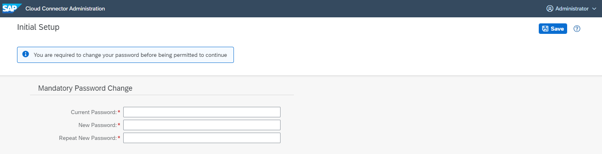

2.  Afterwards, you can choose between master and shadow installation. Select *Master* if you are installing a single Cloud Connector instance or the main instance of a *high availability* setup. For more information, see [High Availability Setup](high-availability-setup-2f9250b.md).

    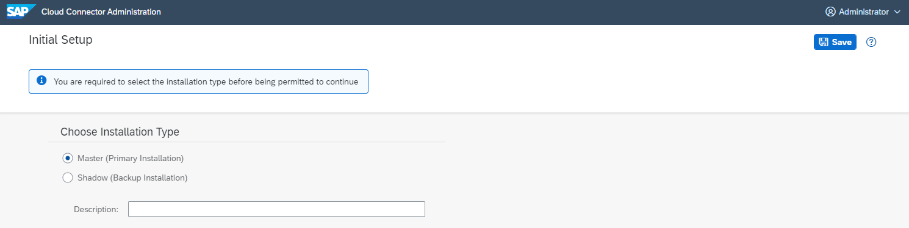

3.  \(Optional\): When configuring a master, you can provide a \(free-text\) *Description* for this Cloud Connector instance that helps you distinguish different Cloud Connectors. This information will also be shown in the *Cloud Connectors* view in the SAP BTP cockpit.

4.  Afterwards, you are forwarded to the main page. In the top right corner you can always see how long your current session is still valid until you need to login again before proceeding.

    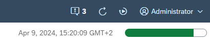

**User Administration**

To edit the password for the `Administrator` user, choose *Configuration* from the main menu, tab *User Interface*, section *User Administration*:

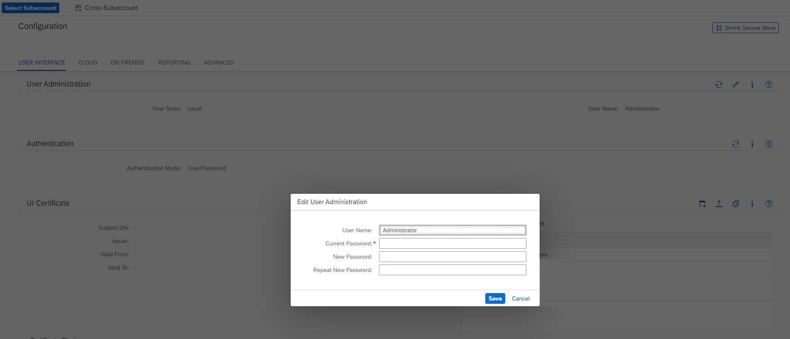

> ### Note:  
> User name and password cannot be changed at the same time. If you want to change the user name, you must enter only the current password in a first step. Do not enter values for *<New Password\>* or *<Repeat New Password\>* when changing the user name. To change the password in second step, enter the old password, the new one, and the repeated \(new\) password, but leave the user name unchanged.

Back to[Tasks](initial-configuration-db9170a.md#loiodb9170a7d97610148537d5a84bf79ba2__context) 

<a name="loiodb9170a7d97610148537d5a84bf79ba2__configure_proxy"/>

## Set up Connection Parameters and HTTPS Proxy

When logging in for the first time, the following screen is displayed every time you choose an option from the main menu that requires a configured subaccount:

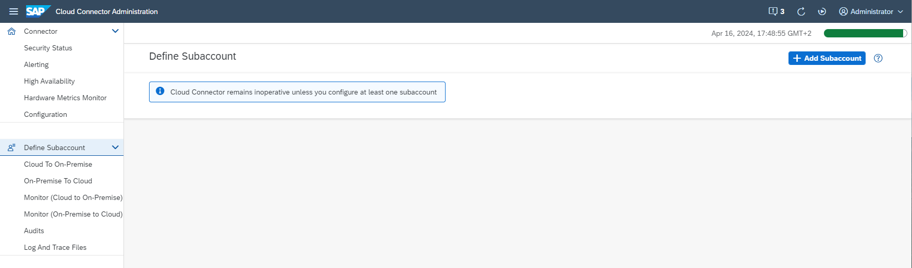

Press *Add Subaccount* to define a subaccount. This will open a dialog or wizard through which the Cloud Connector collects the following optional and required information:

1.  \(Optional\) Enter an HTTPS proxy. When in doubt, consult your network administrator to check if a proxy is required.

    > ### Note:  
    > During the configuration process, the Cloud Connector sends HEAD requests to track the status of the proxy in the Cloud Connector UI. As a prerequisite, the proxy must be confgured to allow those HEAD requests. Otherwise, it closes the connection and you get the message *Proxy is not operational \(status code 503\)*.

    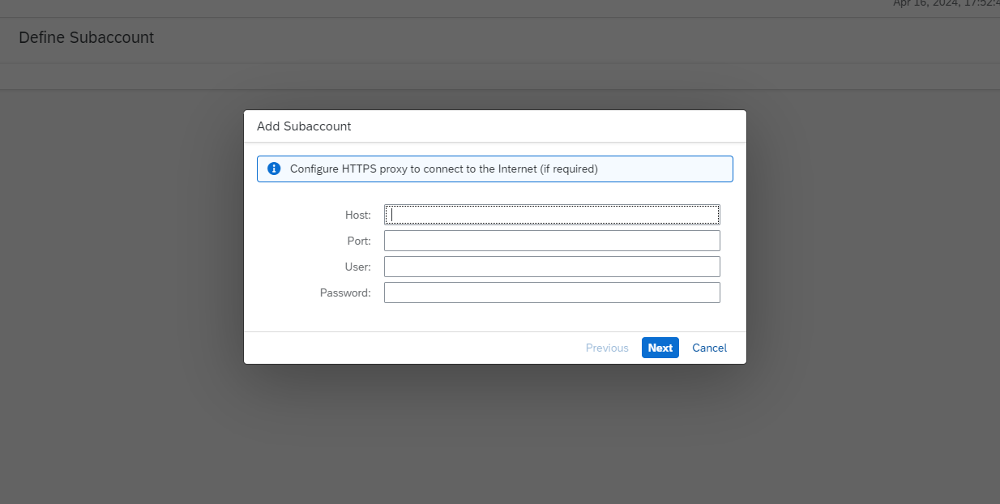

2.  In the next step, you can choose between a *manual* configuration and a *file-based* configuration.

    *File-based* configuration lets you use an authentication data file downloaded from your subaccount on SAP BTP to simplify and accelerate subaccount configuration in the Cloud Connector.

    > ### Restriction:  
    > Authentication data download from SAP BTP is available for subaccuonts in multi-cloud foundation, feature set B only.

    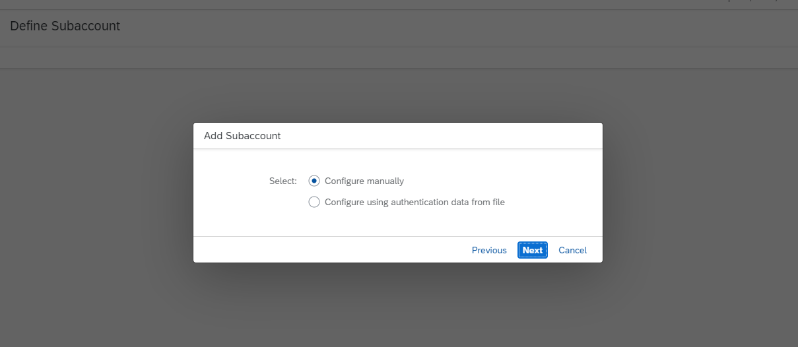

3.  \(Skip if you have selected *file-based* configuration\) For *manual* configuration, the following dialog is shown:

    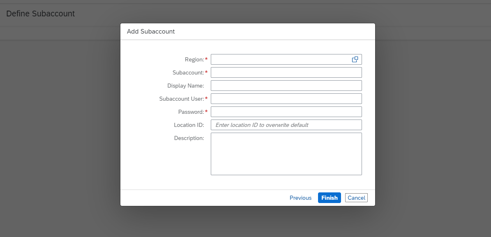

    1.  The *<Region\>* field specifies the SAP BTP region that should be used such as *Europe \(Rot\)*, for example. Both a value help and a drop-down box with suggestions while typing are available.

        > ### Remember:  
        > The available regions and region domains depend on the SAP BTP environment you are using. For more information, see [Regions](https://help.sap.com/docs/btp/sap-business-technology-platform/regions?version=Cloud) \(Cloud Foundry and ABAP environment\) or [Regions and Hosts Available for the Neo Environment](https://help.sap.com/docs/btp/sap-btp-neo-environment/regions-and-hosts-available-for-neo-environment?version=Cloud).

        > ### Note:  
        > You can also configure a region yourself, if it is not part of the standard list. Either insert the region host manually, or create a custom region, as described in [Configure Custom Regions](configure-custom-regions-a994a75.md).

    2.  For *<Subaccount\>*, enter the value you obtained when you registered your subaccount on SAP BTP.

        > ### Note:  
        > For a subaccount in the **Cloud Foundry** environment, you must enter the subaccount **ID** as *<Subaccount\>*, rather than its actual \(technical\) name. For information on getting the subaccount ID, see [Find Your Subaccount ID \(Cloud Foundry Environment\)](find-your-subaccount-id-cloud-foundry-environment-b43eff2.md).
        > 
        > For the **c** environment, enter the subaccount's **technical name** in the field *<Subaccount\>*, not the subaccount ID.

    3.  *<Subaccount User\>* and *<Password\>* require dedicated values, depending on the type of identity provider \(IDP\) you are using:

        > ### Note:  
        > To understand which is the IDP configured in your subaccount \(**Neo** environment\), see[Configuring Platform Identity Provider](https://help.sap.com/docs/btp/sap-btp-neo-environment/configuring-platform-identity-provider-feature-set-b?version=Cloud).
        > 
        > For more information on IDPs in the **Cloud Foundry** environment, see [Trust and Federation with Identity Providers](https://help.sap.com/docs/btp/sap-business-technology-platform/trust-and-federation-with-identity-providers?version=Cloud).

        -   *SAP ID Service* \(Default\):

            -   User/password from SAP ID Service must be used.

                > ### Note:  
                > For a subaccount in the **Cloud Foundry** environment, you must provide your `Login E-mail` as *<Subaccount User\>* instead of a user ID. The user must be a member of the global account the subaccount belongs to.

            -   The user must be a member of the subaccount, and the subaccount must have the correct \(SAP ID Service\) user base.

            > ### Note:  
            > Alternatively, you can add a new subaccount user in the SAP BTP cockpit, assign the required authorization \(see section [Prerequisites](initial-configuration-db9170a.md#loiodb9170a7d97610148537d5a84bf79ba2__prereq)\), and use the new user and password.
            > 
            > For a **Neo** subaccount, you can also add a new subaccount user with the role `Cloud Connector Admin` from the *Members* tab in the SAP BTP cockpit and use the new user and password.

        -   *Custom IDP* \(IAS tenant\):
            -   **Neo** subaccount:
                -   User/password from the configured IAS tenant must be provided.
                -   The user must be a member of the subaccount, and the subaccount must have the correct \(IAS tenant\) user base.

            -   **Cloud Foundry** subaccount:
                -   For a subaccount in the **Cloud Foundry** environment, the Cloud Connector supports the use of a custom IDP via single sign-on \(SSO\) passcode.

                    For more information, see [Use a Custom IDP for Subaccount Configuration](use-a-custom-idp-for-subaccount-configuration-2022612.md).

        > ### Note:  
        > The Cloud Connector does not yet support *SAP Universal ID*. Please use your S-user or P-user credentials for the *<subaccount user\>* and *<password\>* fields instead.
        > 
        > For more information, see SAP note [3085908](https://me.sap.com/notes/3085908).

        For the **Neo** environment, see also [Add Members to Your Neo Subaccount](https://help.sap.com/viewer/ea72206b834e4ace9cd834feed6c0e09/Cloud/en-US/a253570f081e448d9f78fc2bfeedfdc3.html "Add users as members to a subaccount in the Neo environment and assign roles to them using the SAP BTP cockpit.") :arrow_upper_right:.

        For the **Cloud Foundry** environment, see also [Add Org Members](https://help.sap.com/viewer/65de2977205c403bbc107264b8eccf4b/Cloud/en-US/a4eeaf179ee646b99558f27c0bae7b3e.html "In the cockpit, add users as org members and assign roles to grant the users access to information, such as user and quota information in a Cloud Foundry org.") :arrow_upper_right:.

        > ### Tip:  
        > When using SAP Cloud Identity Services - Identity Authentication \(IAS\) as platform identity provider with two-factor authentication \(2FA / MFA\) for your subaccount, you can simply append the required token to the regular password. For example, if your password is "eX7?6rUm" and the one-time passcode is "123456", you must enter "eX7?6rUm123456" into the *<Password\>* field.

    4.  \(Optional\) You can define a *<Display Name\>* that lets you easily recognize a specific subaccount in the UI compared to the technical subaccount name.
    5.  \(Optional\) You can define a *<Location ID\>* identifying the location of this Cloud Connector for a specific subaccount. The location ID is used as routing information.It lets you connect multiple Cloud Connectors to a single subaccount. If you don't specify any value for *<Location ID\>*, the default is used. The location ID must be unique per subaccount and should be an identifier that can be used in a URI. To route requests to a Cloud Connector with a location ID, the location ID must be configured in the respective destinations.
    6.  \(Optional\) You can provide a *<Description\>* of the subaccount that becomes a part of the subaccount's detail information.

        > ### Note:  
        > Location ID and description can be changed later on at any time. See [Managing Subaccounts](managing-subaccounts-f16df12.md).

    7.  Choose *Finish*.

4.  \(Skip if you have selected *manual* configuration\) For the *file-based* approach using authentication data, the following dialog is shown:

    > ### Restriction:  
    > Authentication data download from SAP BTP is available for subaccuonts in multi-cloud foundation, feature set B only.

    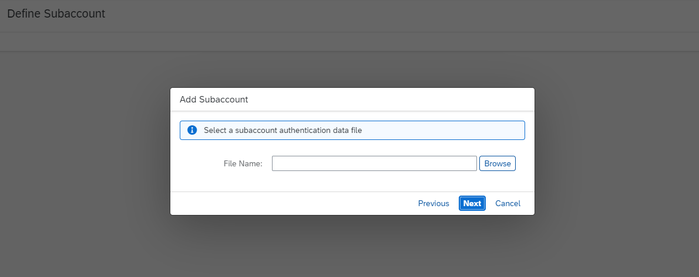

    You can download the authentication data file from your subaccount in the SAP BTP cockpit. To do so,

    1.  Log on to the SAP BTP cockpit and choose the subaccount you'd like connect to.
    2.  Go to section *Connectivity* \> *Cloud Connectors* and press *Download Authentication Data*.
    3.  Choose the file containing the authentication data and press *Next*.

        You can then review the data extracted from the file, as well as optionally enter a location ID and a description \(see step 3d and 3e for details on the latter two properties\).

    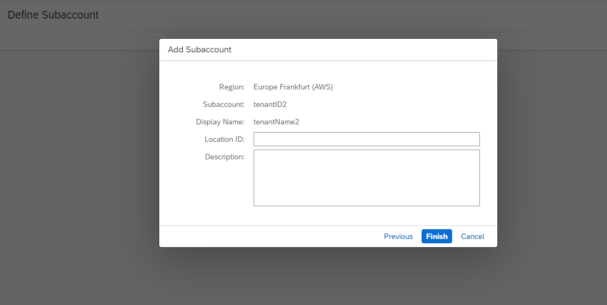

    When done, press *Finish*.

The Cloud Connector now starts a handshake with SAP BTP and attempts to establish a secure TLS tunnel to the server that hosts the subaccount in which your cloud applications are running. However, no requests are yet allowed to pass from the cloud side to any of your internal backend systems. To allow your cloud applications to access specific internal backend systems, proceed with [Configure Access Control](configure-access-control-f42fe44.md).

> ### Note:  
> The internal network must allow access to the port. Specific configuration for opening the respective port\(s\) depends on the firewall software used. The default ports are `80` for HTTP and `443` for HTTPS. For RFC communication, you must open a gateway port \(default: `33+<instance number>` and an arbitrary message server port. For a connection to a HANA Database \(on SAP BTP\) via JDBC, you must open an arbitrary *outbound* port in your network. Mail \(SMTP\) communication is not supported.

-   If you later want to change your proxy settings \(for example, because the company firewall rules have changed\), choose *Configuration* from the main menu and go to the *Cloud* tab, section*HTTPS Proxy*. Some proxy servers require credentials for authentication. In this case, you must provide the relevant user/password information.

    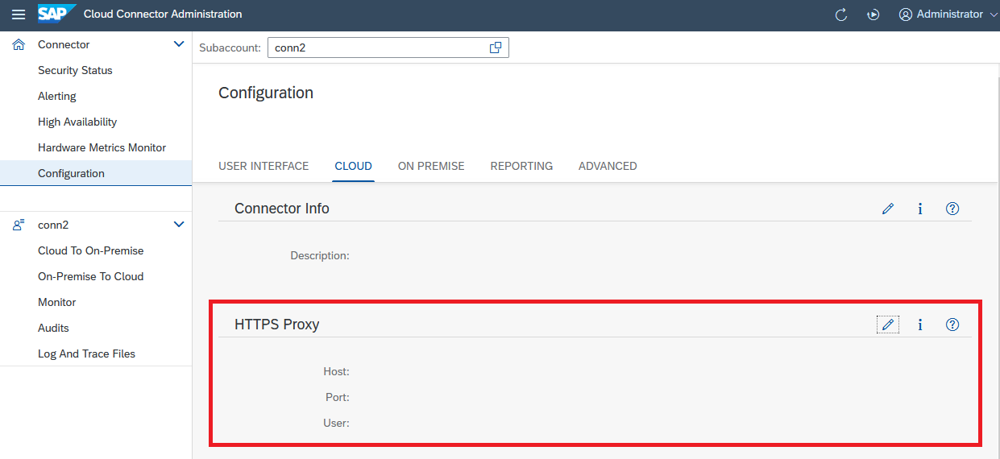

-   If you want to change the description for your Cloud Connector \(don't confuse with the description of subaccounts\), choose *Configuration* from the main menu, go to the *Cloud* tab, section *Connector Info* and edit the description:

    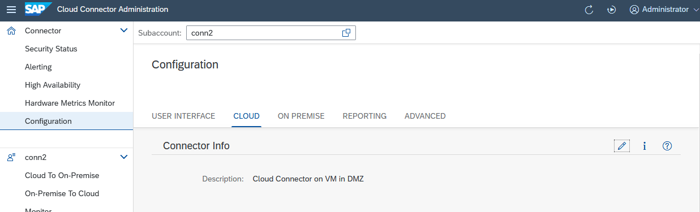

Back to[Tasks](initial-configuration-db9170a.md#loiodb9170a7d97610148537d5a84bf79ba2__context) 

<a name="loiodb9170a7d97610148537d5a84bf79ba2__establish_cloud_conection"/>

## Establish Connections to SAP BTP

As soon as the initial setup is complete, the tunnel to the cloud endpoint is open, but no requests are allowed to pass until you have performed the *Access Control* setup, see [Configure Access Control](configure-access-control-f42fe44.md).

To manually close \(and reopen\) the connection to SAP BTP, choose your subaccount from the main menu and select the *Disconnect* button \(or the *Connect* button to reconnect to SAP BTP\).

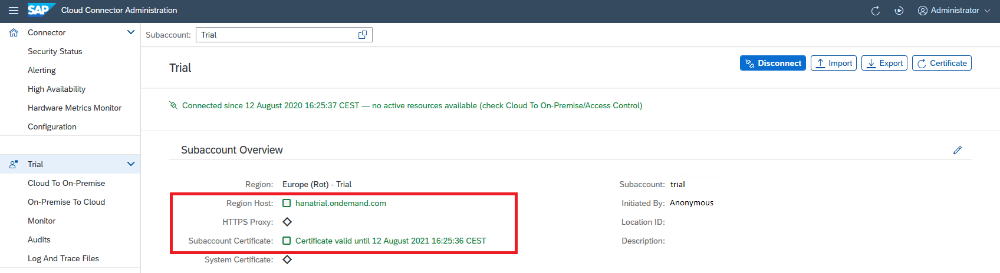

-   The green icon next to *Region Host* indicates that it is valid and can be reached.
-   If an *HTTPS Proxy* is configured, its availability is shown the same way. In the screenshot, the grey diamond icon next to *HTTPS Proxy* indicates that connectivity is possible without proxy configuration.

In case of a timeout or a connectivity issue, these icons are yellow \(warning\) or red \(error\), and a tooltip shows the cause of the problem. *Initiated By* refers to the user that has originally established the tunnel. During normal operations, this user is no longer needed. Instead, a certificate is used to open the connection to a subaccount.

-   The status of the certificate is shown next to *Subaccount Certificate*. It is shown as valid \(green icon\), if the expiration date is still far in the future, and turns to yellow if expiration approaches according to your alert settings. It turns red as soon as it has expired. This is the latest point in time, when you should [Update the Certificate for Your Subaccount](update-the-certificate-for-a-subaccount-071708a.md).

> ### Note:  
> When connected, you can monitor the Cloud Connector also in the *Connectivity* section of the SAP BTP cockpit. There, you can track attributes like version, description and high availability set up. Every Cloud Connector configured for your subaccount automatically appears in the *Connectivity* section of the cockpit.

Back to[Tasks](initial-configuration-db9170a.md#loiodb9170a7d97610148537d5a84bf79ba2__context) 

**Related Information**  

[Managing Subaccounts](managing-subaccounts-f16df12.md "Add and connect your SAP BTP subaccounts to the Cloud Connector.")

[Initial Configuration \(HTTP\)](initial-configuration-http-3f974ea.md "Configure the Cloud Connector for HTTP communication.")

[Initial Configuration \(RFC\)](initial-configuration-rfc-f09eefe.md "Configure a Secure Network Connection (SNC) to set up the Cloud Connector for RFC communication to an ABAP backend system.")

[Configuring the Cloud Connector for LDAP](configuring-the-cloud-connector-for-ldap-f94810a.md "Configure the Cloud Connector to support LDAP in different scenarios (cloud applications using LDAP or Cloud Connector authentication).")

[Managing Member Authorizations in the Neo Environment](https://help.sap.com/viewer/ea72206b834e4ace9cd834feed6c0e09/Cloud/en-US/a1ab5c4cc117455392cd0a512c7f890d.html "SAP BTP includes predefined platform roles that support the typical tasks performed by users when interacting with the platform. In addition, subaccount administrators can combine various scopes into a custom platform role that addresses their individual requirements.") :arrow_upper_right:

[Use a Custom IDP for Subaccount Configuration](use-a-custom-idp-for-subaccount-configuration-2022612.md "Enable custom identity provider (IDP) authentication to configure a Cloud Foundry subaccount in the Cloud Connector by using a one-time passcode.")

