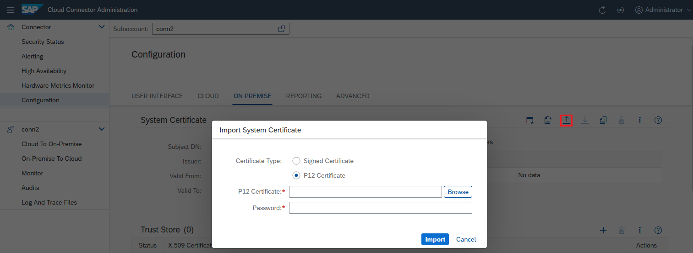
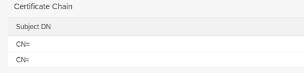
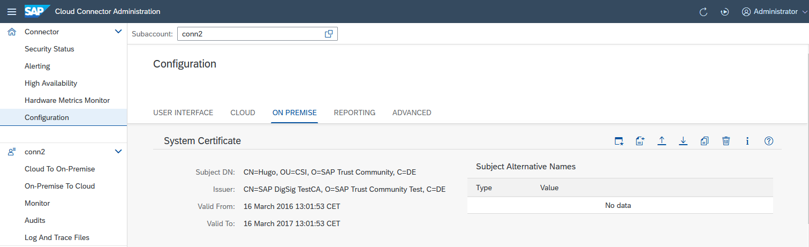

<!-- loio3f974eae3cba4dafa274ec59f69daba6 -->

# Initial Configuration \(HTTP\)

Configure the Cloud Connector for HTTP communication.

<a name="loio3f974eae3cba4dafa274ec59f69daba6__section_N1001A_N10011_N10001"/>

## Install a System Certificate for Mutual Authentication

To set up a mutual authentication between the Cloud Connector and any backend system it connects to, you can import an X.509 client certificate into the Cloud Connector. The Cloud Connector then uses the so-called *system certificate* for all HTTPS requests to backends that request or require a client certificate. The certificate authority \(CA\) that signed the Cloud Connector's system certificate must be trusted by all backend systems to which the Cloud Connector is supposed to connect.

You must provide the system certificate as PKCS\#12 file containing the client certificate, the corresponding private key and the CA root certificate that signed the client certificate \(plus potentially the certificates of any intermediate CAs, if the certificate chain is longer than 2\).

<a name="loio3f974eae3cba4dafa274ec59f69daba6__section_rdy_tpb_vfb"/>

## Procedure

From the left panel, choose *Configuration*. On the tab *On Premise*, choose *System Certificate* \> *Import a certificate* to upload a certificate and provide its password:

A second option is to start a *certificate signing request* procedure as described for the UI certificate in [Exchange UI Certificates in the Administration UI](exchange-ui-certificates-in-the-administration-ui-b70bf16.md) and upload the resulting signed certificate.

> ### Note:  
> If having intermediate certificates in place, make sure you import the complete chain \(for example, as PKCS\#7 file\) so that mTLS connections always work properly.
> 
> You can verify this in the **Certificate Chain** area of the **System Certificate** section:
> 
> 

A third option is to generate a self-signed certificate. It might be useful if no CA is needed, for example, in a demo setup or if you want to use a dedicated CA. For this option, choose *Create and import a self-signed certificate*:

If a system certificate has been imported successfully, its distinguished name, the name of the issuer, and the validity dates are displayed:

<a name="loio3f974eae3cba4dafa274ec59f69daba6__section_vnt_vm3_m1c"/>

## Delete, Export, or Renew a System Certificate

You can delete a system certificate that is no longer required. To do this, use the respective button and confirm deletion.

If you need the public key for establishing trust with a server, you can export the full chain via the *Export* button.

To renew a certificate that is close to expiration, install the new certificate as described above. This will replace the expiring certificate.

**Related Information**  

[Configure Access Control \(HTTP\)](configure-access-control-http-e7d4927.md "Specify the backend systems that can be accessed by your cloud applications using HTTP.")

