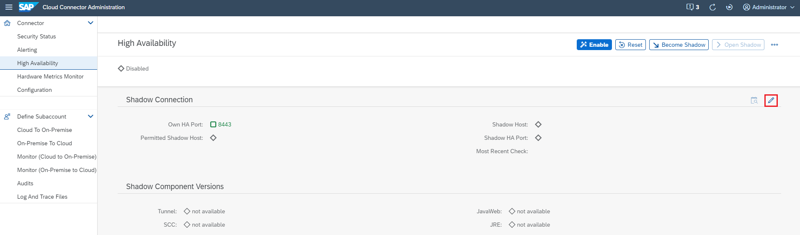

<!-- loioc697705179a24d2b8b6be038fae59c33 -->

# Install a Failover Instance for High Availability

Install a redundant Cloud Connector instance \(shadow instance\) that monitors the main instance.

<a name="concept_p4y_fhj_q4"/>

<!-- concept\_p4y\_fhj\_q4 -->

## Procedure

<a name="concept_p4y_fhj_q4__preparing"/>

## Prepare the Master Instance for High Availability

1.  Open the Cloud Connector UI and go to the master instance.
2.  From the main menu, choose *High Availability*.
3.  Choose *Enable*.

    

    If this flag is not activated, no shadow instance can connect to this Cloud Connector. Additionally, by providing a concrete *Shadow Host* you can ensure that only from this host a shadow instance can be connected.

**Optional Configuration**

1.  Choose *Edit*.

    

2.  You can now change the high availability \(HA\) port to a different one from where the Cloud Connector administration UI is accessible. This port is then used for the master/shadow communication only, that is, to check for failovers or push configuration. This is especially needed in case of a [Logon to the Cloud Connector via Client Certificate](logon-to-the-cloud-connector-via-client-certificate-daa547f.md), so that master/shadow communication is still possible without having a client certificate for logon.
3.  Additionally, by providing a concrete shadow host you can ensure that a shadow instance can be connected from this host only. The host name will be shown as *Permitted Shadow Host* on the HA screen if you have configured one.

> ### Caution:  
> Pressing the *Reset* button resets all high availability settings \(besides the own port configuration\) to their initial state. As a result, high availability is disabled and the shadow host is cleared. Reset only works if no shadow is connected. Also, editing the settings for HA will only work if no shadow is connected.

<a name="concept_p4y_fhj_q4__install"/>

## Install and Set Up a Shadow Instance

Install the shadow instance in the same network segment as the master instance. Communication between master and shadow via proxy is not supported. The same distribution package is used for master and shadow instance.

> ### Note:  
> If you plan to use LDAP for the user authentication on both master and shadow, make sure you configure it **before** you establish the connection from shadow to master.

1.  On first start-up of a Cloud Connector instance, a UI wizard asks you whether the current instance should be master or shadow. Choose *Shadow* and *Save*:

    

2.  From the main menu, choose *Shadow Connector* and provide connection data for the master instance, that is, the master host and port. Optionally, you can change the high availability \(HA\) port to a different one from where the Cloud Connector administration UI is accessible. This port is then used for the master/shadow communication only, that is, to check for failovers or push configuration. This is especially needed in case of a [Logon to the Cloud Connector via Client Certificate](logon-to-the-cloud-connector-via-client-certificate-daa547f.md) so that master/shadow communication is still possible without having a client certificate for logon.

    Additionally, you can choose from the list of known host names, to use the host name under which the shadow host is visible to the master. You can specify a host name manually, if the one you want is not on the list. For the first connection, you must log on to the master instance, using the user name and password for the master instance. The master and shadow instances exchange X.509 certificates, which will be used for mutual authentication.

    

    > ### Note:  
    > If you want to attach the shadow instance to a different master, press the *Reset* button. All your high availability settings \(besides the own port configuration\) will be removed, that is, reset to their initial state. This works only if the shadow is not connected.

3.  Upon a successful connection, the master instance pushes the entire configuration plus some information about itself to the shadow instance. You can see this information in the UI of the shadow instance, but you can't modify it.
4.  The UI on the master instance shows information about the connected shadow instance. To display this information, choose *High Availability* from the main menu.
5.  If configuration changes have not been pushed successfully, alert messages are generated in the general **Alerting** section. This might happen, for example, if a temporary network failure occurs at the same time a configuration change is made. As an administrator, you can check if there is an inconsistency in the configuration data between master and shadow that could cause trouble if the shadow needs to take over. Typically, the master recognizes this situation and tries to push the configuration change at a later time automatically. If this is successful, all failure alerts are removed and replaced by a warning alert showing that there had been trouble before.

    If the master doesn't recover automatically, disconnect, then reconnect the shadow, which triggers a complete configuration transfer.

**Related Information**  

[Initial Configuration](initial-configuration-db9170a.md "After installing and starting the Cloud Connector, log on to the administration UI and perform the required configuration to make your Cloud Connector operational.")

[Master and Shadow Administration](master-and-shadow-administration-7f57de1.md "Manage the Cloud Connector master and shadow instances in a high availability setup.")

