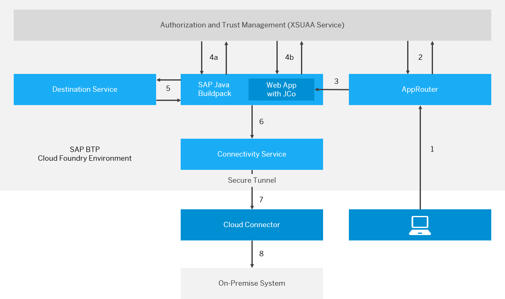

<!-- loiobfcb54ca058f4b1dafd26e438ff1e2f4 -->

# Invoke ABAP Function Modules in On-Premise ABAP Systems

Call a function module in an on-premise ABAP system via RFC, using a sample Web application \(Cloud Foundry environment\).

This scenario performs a remote function call to invoke an ABAP function module, by using the Connectivity service and the Destination service in the Cloud Foundry environment, as well as a Cloud Foundry application router.

<a name="loiobfcb54ca058f4b1dafd26e438ff1e2f4__tasks_tutorial_rfc"/>

## Tasks

<table>
<tr>
<th valign="top">

Task Type

</th>
<th valign="top">

Task

</th>
</tr>
<tr>
<td valign="top" rowspan="4">

Operator and/or Developer

</td>
<td valign="top">

[Scenario Overview](invoke-abap-function-modules-in-on-premise-abap-systems-bfcb54c.md#loiobfcb54ca058f4b1dafd26e438ff1e2f4__Scenario) 

</td>
</tr>
<tr>
<td valign="top">

[Connectivity User Roles](invoke-abap-function-modules-in-on-premise-abap-systems-bfcb54c.md#loiobfcb54ca058f4b1dafd26e438ff1e2f4__Roles) 

</td>
</tr>
<tr>
<td valign="top">

[Installation Prerequisites](invoke-abap-function-modules-in-on-premise-abap-systems-bfcb54c.md#loiobfcb54ca058f4b1dafd26e438ff1e2f4__Install) 

</td>
</tr>
<tr>
<td valign="top">

[Used Values](invoke-abap-function-modules-in-on-premise-abap-systems-bfcb54c.md#loiobfcb54ca058f4b1dafd26e438ff1e2f4__values) 

</td>
</tr>
<tr>
<td valign="top">

Developer

</td>
<td valign="top">

[Develop a Sample Web Application](develop-a-sample-web-application-7808d1d.md) 

</td>
</tr>
<tr>
<td valign="top">

Operator and/or Developer

</td>
<td valign="top">

[Create and Bind Service Instances](create-and-bind-service-instances-6dd5e26.md) 

</td>
</tr>
<tr>
<td valign="top">

Developer

</td>
<td valign="top">

[Deploy the Application](deploy-the-application-9d19a9d.md) 

</td>
</tr>
<tr>
<td valign="top">

Operator

</td>
<td valign="top">

[Configure Roles and Trust](configure-roles-and-trust-e862ab7.md) 

</td>
</tr>
<tr>
<td valign="top">

Operator and/or Developer

</td>
<td valign="top">

[Set Up an Application Router](set-up-an-application-router-b14eeb9.md) 

</td>
</tr>
<tr>
<td valign="top" rowspan="2">

Operator

</td>
<td valign="top">

[Configure the RFC Destination](configure-the-rfc-destination-296f457.md) 

</td>
</tr>
<tr>
<td valign="top">

[Configure the Cloud Connector](configure-the-cloud-connector-783a96e.md) 

</td>
</tr>
<tr>
<td valign="top">

Operator and/or Developer

</td>
<td valign="top">

[Monitoring Your Web Application](monitoring-your-web-application-e2ce724.md) \(Optional\)

</td>
</tr>
</table>

<a name="loiobfcb54ca058f4b1dafd26e438ff1e2f4__Scenario"/>

## Scenario Overview

**Control Flow for Using the Java Connector \(JCo\) with Basic Authentication**

**Process Steps:**

1.  Call through AppRouter \(entry point for business applications\).

    > ### Note:  
    > AppRouter is only required you want to use multitenancy or perform user-specific service calls. In all other cases, JCo uses [cloud-security-xsuaa-integration](https://github.com/SAP/cloud-security-xsuaa-integration/tree/master/token-client) with `ClientCredentialFlow`.

2.  Redirect to XSUAA for login. JSON Web Token \(JWT1\) is sent to AppRouter and cached there.
3.  AppRouter calls Web app and sends JWT1 with credentials.
4.  Buildpack/XSUAA interaction:
    1.  Buildpack requests JWT2 to access the Destination service instance \(JCo call\).
    2.  Buildpack requests JWT3 to access the Connectivity service instance.

5.  Buildpack requests destination configuration \(JWT2\).
6.  Buildpack sends request to the Connectivity service instance \(with JWT3 and Authorization Header\).
7.  Connectivity service forwards request to the Cloud Connector.
8.  Cloud Connector sends request to on-premise system.

Since token exchanges are handled by the buildpack, you must only create and bind the service instances, see [Create and Bind Service Instances](create-and-bind-service-instances-6dd5e26.md).

Back to [Tasks](invoke-abap-function-modules-in-on-premise-abap-systems-bfcb54c.md#loiobfcb54ca058f4b1dafd26e438ff1e2f4__tasks_tutorial_rfc)

<a name="loiobfcb54ca058f4b1dafd26e438ff1e2f4__values"/>

## Used Values

This scenario uses:

-   A subaccount in region `Europe (Frankfurt)`, for which the API endpoint is `api.cf.eu10.hana.ondemand.com`.
-   The application name `jco-demo-<subaccount name>`, where *<subaccount name\>* is the subdomain name of the subaccount. For this example, we use `p1234`.

Back to [Tasks](invoke-abap-function-modules-in-on-premise-abap-systems-bfcb54c.md#loiobfcb54ca058f4b1dafd26e438ff1e2f4__tasks_tutorial_rfc)

<a name="loiobfcb54ca058f4b1dafd26e438ff1e2f4__Roles"/>

## Connectivity User Roles

Different user roles are involved in the cloud to on-premise connectivity end-to-end scenario. The particular steps for the relevant roles are described below:

**IT Administrator**

Sets up and configures the Cloud Connector. Scenario steps:

1.  Downloads the Cloud Connector from [https://tools.hana.ondemand.com/\#cloud](https://tools.hana.ondemand.com/#cloud)
2.  Installs the Cloud Connector.
3.  Establishes an SSL tunnel from the connector to an SAP BTP subaccount.
4.  Configures the exposed back-end systems and resources.

**Application Developer**

Develops Web applications using destinations. Scenario steps:

1.  Installs Eclipse IDE, the Cloud Foundry Plugin for Eclipse and the Cloud Foundry CLI.
2.  Develops a Java EE application using the JCo APIs.
3.  Configures connectivity destinations via the SAP BTP cockpit.
4.  Deploys and tests the Java EE application on SAP BTP.

**Account Operator**

Deploys Web applications, creates application routers, creates and binds service instances, conducts tests. Scenario steps:

1.  Obtains a ready Java EE application WAR file.
2.  Deploys an application router with respective routes to the application.
3.  Creates an XSUAA service instance and binds it to the router.
4.  Deploys the Java EE application to an SAP BTP subaccount.
5.  Creates a Connectivity service and Destination service instance, and binds them to the application.
6.  Creates and manages roles and role collections.

Back to [Tasks](invoke-abap-function-modules-in-on-premise-abap-systems-bfcb54c.md#loiobfcb54ca058f4b1dafd26e438ff1e2f4__tasks_tutorial_rfc)

<a name="loiobfcb54ca058f4b1dafd26e438ff1e2f4__Install"/>

## Installation Prerequisites

-   You have downloaded the Cloud Connector installation archive from [SAP Development Tools for Eclipse](https://tools.hana.ondemand.com/#cloud) and connected the Cloud Connector to your subaccount.
-   You have downloaded and set up your Eclipse IDE and the [Eclipse Tools for Cloud Foundry](https://projects.eclipse.org/projects/ecd.cft).
-   You have downloaded the Cloud Foundry CLI, see [Tools](https://help.sap.com/viewer/65de2977205c403bbc107264b8eccf4b/Cloud/en-US/abcae5b568c94e5391a74d15f5db9213.html "SAP BTP includes many tools to help you develop and manage applications, and connect them to your on-premise systems.") :arrow_upper_right:.

Back to [Tasks](invoke-abap-function-modules-in-on-premise-abap-systems-bfcb54c.md#loiobfcb54ca058f4b1dafd26e438ff1e2f4__tasks_tutorial_rfc)

<a name="loiobfcb54ca058f4b1dafd26e438ff1e2f4__section_xsy_nkc_cgb"/>

## Next Steps

-   [Develop a Sample Web Application](develop-a-sample-web-application-7808d1d.md)
-   [Create and Bind Service Instances](create-and-bind-service-instances-6dd5e26.md)
-   [Deploy the Application](deploy-the-application-9d19a9d.md)
-   [Configure Roles and Trust](configure-roles-and-trust-e862ab7.md)
-   [Set Up an Application Router](set-up-an-application-router-b14eeb9.md)
-   [Configure the RFC Destination](configure-the-rfc-destination-296f457.md)
-   [Configure the Cloud Connector](configure-the-cloud-connector-783a96e.md)
-   [Monitoring Your Web Application](monitoring-your-web-application-e2ce724.md) \(Optional\)

**Related Information**  

[Multitenancy for JCo Applications \(Advanced\)](multitenancy-for-jco-applications-advanced-93c1e03.md "Learn about the required steps to make your Cloud Foundry JCo application tenant-aware.")

