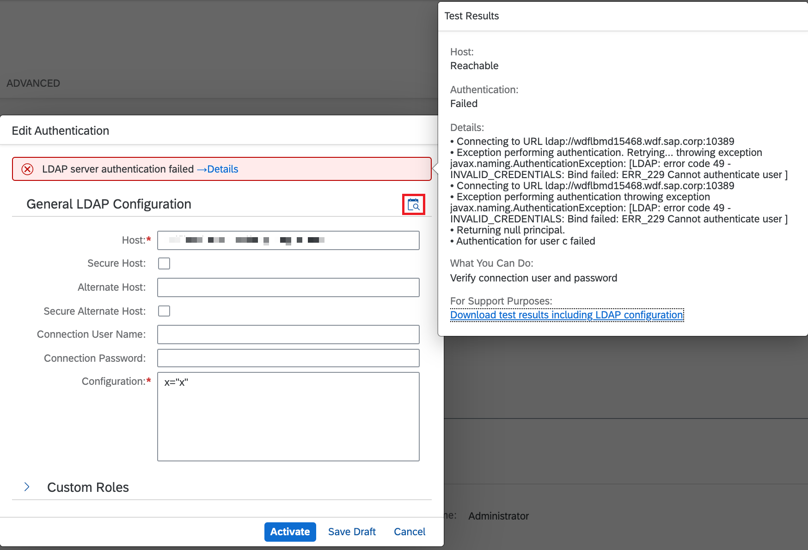
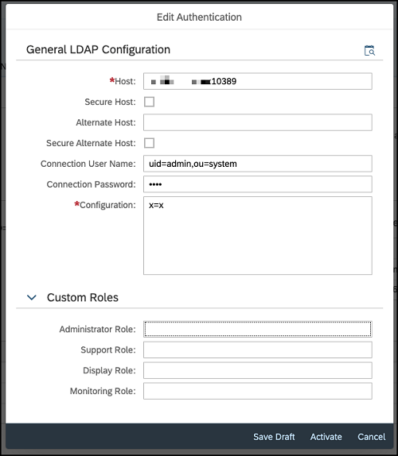
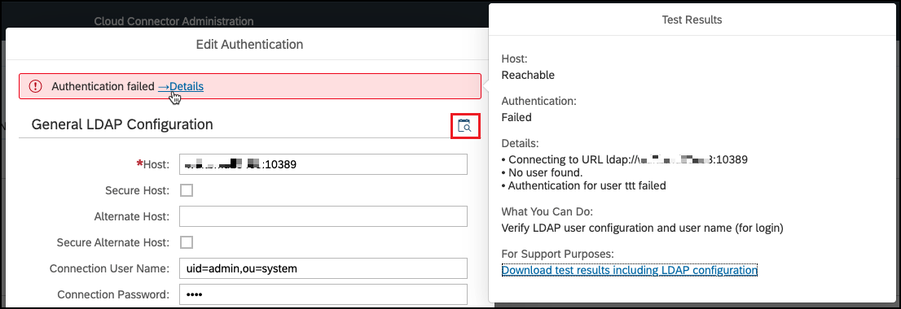
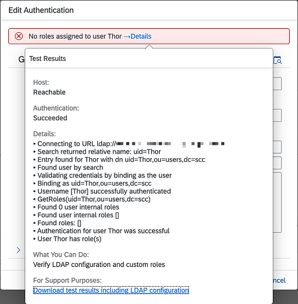
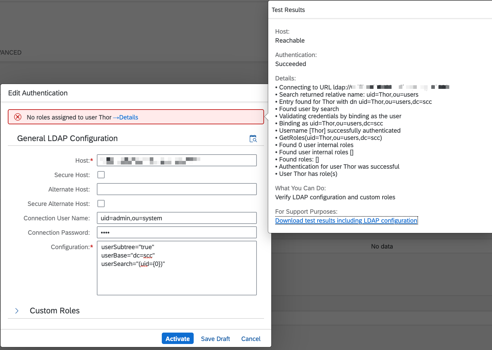
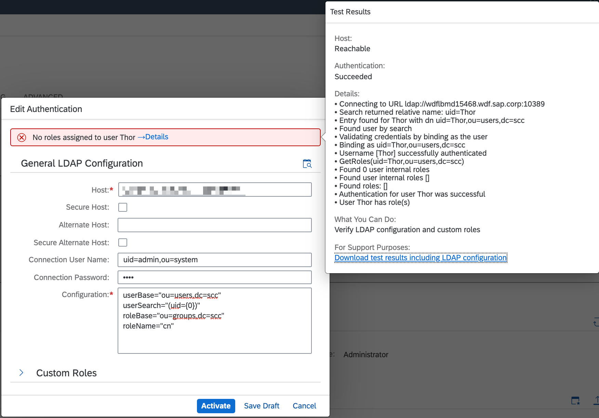
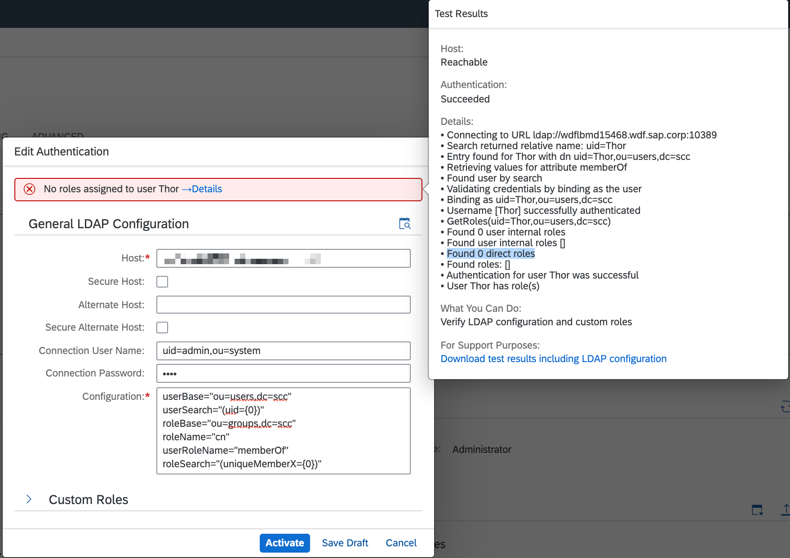
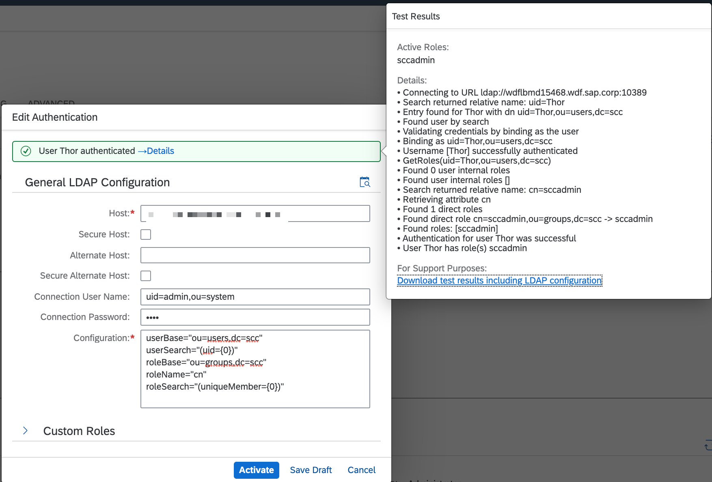

<!-- loio703a99d1b00d495298d6fd2cf7492e10 -->

# LDAP Configuration: Best Practices

Get background information on LDAP configuration for the Cloud Connector.

[Introduction](ldap-configuration-best-practices-703a99d.md#loio703a99d1b00d495298d6fd2cf7492e10__intro)

[Connect to the LDAP Server](ldap-configuration-best-practices-703a99d.md#loio703a99d1b00d495298d6fd2cf7492e10__connect)

[SSL Issues](ldap-configuration-best-practices-703a99d.md#loio703a99d1b00d495298d6fd2cf7492e10__ssl)

[Authentication](ldap-configuration-best-practices-703a99d.md#loio703a99d1b00d495298d6fd2cf7492e10__auth)

[User Selection](ldap-configuration-best-practices-703a99d.md#loio703a99d1b00d495298d6fd2cf7492e10__selection)

[User Roles](ldap-configuration-best-practices-703a99d.md#loio703a99d1b00d495298d6fd2cf7492e10__roles)

[Relationship between User and Group](ldap-configuration-best-practices-703a99d.md#loio703a99d1b00d495298d6fd2cf7492e10__relationship)

[Custom User Roles](ldap-configuration-best-practices-703a99d.md#loio703a99d1b00d495298d6fd2cf7492e10__custom)

[Additional Notes](ldap-configuration-best-practices-703a99d.md#loio703a99d1b00d495298d6fd2cf7492e10__notes)


<a name="loio703a99d1b00d495298d6fd2cf7492e10__intro"/>

## Introduction

Using an LDAP server for user management allows seamless integration of the Cloud Connector into the on-premise environment. It requires some configuration that must match the setup on your LDAP server, and therefore can't be generated automatically.

The configuration parameters are common for various products and mostly well known.

The apache tomcat project, which is used as underlying technology by the Cloud Connector, provides an excellent tutorial: [tomcat.apache.org/tomcat-8.5-doc/realm-howto.html](http://tomcat.apache.org/tomcat-8.5-doc/realm-howto.html). It explains the LDAP configuration parameters and considers various LDAP directory setups, including their specific configuration.

However, some aspects may raise questions. For this reason, we show you how to configure LDAP and verify LDAP configuration, providing useful background information in this topic.

A basic understanding of LDAP and tomcat's how-to guide is a prerequisite. As help tool, we are using the *ldapsearch* utility. You can use any LDAP client for this procedure.

Back to [Top](ldap-configuration-best-practices-703a99d.md#loio703a99d1b00d495298d6fd2cf7492e10__top)


<a name="loio703a99d1b00d495298d6fd2cf7492e10__connect"/>

## Connect to the LDAP Server

In a first step, you must establish a connection to the LDAP server. Like an HTTP connection, the connection to LDAP can be secure \(via SSL/TLS\) or plain. It points to a host and port. The address looks like this:

-   SSL/TLS connection: `ldaps://<ldap.server.in.your.company>:<numeric port>`
-   Plain connection: `ldap://<ldap.server.in.your.company>:<numeric port>` 

> ### Sample Code:  
> ```
> ldapsearch -H ldap://<ldaphost>:<port>
> ```

The return value is ***\-1*** if the address is not reachable. Before you go ahead, you need to know the address of your LDAP server. As soon as the *ldapsearch* utility returns a value other than ***\-1***, the address of the LDAP server is correct. More precisely, it indicates only that there is a server listening on this port, which is supposed to be the LDAP server.

Once the address is known, you can test the connection in the Cloud Connector. Enter the address and add a dummy configuration, for example, `x="x"`, to outwit the check. Then choose the test icon in the upper right corner. For a valid address, the LDAP configuration test in the Cloud Connector reports the following:



The message: *Connecting to URL ldap://<ldaphost\>:<port\>; Exception performing authentication* indicates that your LDAP server requires user and password for queries.

Back to [Top](ldap-configuration-best-practices-703a99d.md#loio703a99d1b00d495298d6fd2cf7492e10__top)


<a name="loio703a99d1b00d495298d6fd2cf7492e10__ssl"/>

## SSL Issues

LDAP connection over SSL/TLS will run into SSL errors if the LDAP server uses an "untrusted" certificate. This could be a self-signed certificate or a certificate signed by a generally untrusted authority.

If you cannot use a trusted certificate on your LDAP server, you must import the public part of the issuer certificate to the JDK's trust storage. See the JDK documentation how to do that.

Usually, the trust storage location is *cacerts* inside the java directory \(`jre/lib/security/cacerts`\). You can use the *keytool* utility for import.

> ### Sample Code:  
> ```
> keytool -import -storepass changeit -file <certificate used by LDAP server> -keystore cacerts -alias <e.g. LDAP_xyz> 
> ```

See also: [Working with Certificates and SSL](https://docs.oracle.com/cd/E19830-01/819-4712/ablqw/index.html) \(Java documentation\).

Back to [Top](ldap-configuration-best-practices-703a99d.md#loio703a99d1b00d495298d6fd2cf7492e10__top)


<a name="loio703a99d1b00d495298d6fd2cf7492e10__auth"/>

## Authentication

If the address of the LDAP server is correct and the Cloud Connector can establish a connection, you can proceed with the next step: the authentication by the LDAP directory.

The LDAP server may require authentication or not \(anonymous connection\), before a query can be executed. Authentication is done by user and password, specified by the `connectionName` and `connectionPassword` properties.

Anonymous access is sufficient in most cases and provides the same level of security. However, you have to deal with the existing setup on the LDAP server.

> ### Note:  
> The LDAP user is not the same user that is later used to logon on to the Cloud Connector. It is a specific user, which has permissions to query the LDAP directory. It can be stored in an LDAP directory separated from other users. We recommend that you specify the fully-qualified user name like `"uid=admin,ou=system"`.

Additionally, *MS Active Directory* allows authentication for *user@domain*, for example, *ldapUser@company.local*.

To verify the values, let's first check the authentication with *ldapsearch*:

> ### Sample Code:  
> ```
> ldapsearch -D "uid=admin,ou=system" -w <password> -H ldap://<ldaphost>:<port> -b "x=x"
> ```

> ### Note:  
> We added a non-existing user base `-b "x=x"` to prevent long output.

The only thing to check here is, if authentication is ok. If it is not, LDAP returns *INVALID\_CREDENTIALS: Bind failed*:

> ### Sample Code:  
> ```
> ldapsearch -D "uid=admin,ou=system" -w <wrong password> -H ldap://<ldaphost>:<port> -b "x=x"
> ldap_bind: Invalid credentials (49)
> additional info: INVALID_CREDENTIALS: Bind failed: ERR_229 Cannot authenticate user uid=admin,ou=system
> ```

You can perform the same test in the Cloud Connector UI:



Choose the test icon in the upper right corner, and enter something as name and password:



Authentication failed in this check, but the connection to the LDAP server was successful.

If you get an *Exception performing authentication* message here, check the reply from the LDAP server and align your parameters until you can connect.

Back to [Top](ldap-configuration-best-practices-703a99d.md#loio703a99d1b00d495298d6fd2cf7492e10__top)


<a name="loio703a99d1b00d495298d6fd2cf7492e10__selection"/>

## User Selection

Once authentication is checked, set the root node for users. User nodes are nodes containing user details. They are located somewhere in the LDAP tree. Sometimes they are all listed under one branch \(parent node\), but they may also be distributed across several branches. In any case, start with one branch that contains at least one user node.

List the user nodes with *ldapsearch*:

> ### Sample Code:  
> ```
> ldapsearch -D "uid=admin,ou=system" -w <password> -H ldap://<ldaphost>:<port> -b "ou=users,dc=scc"
> ```

The output contains the nodes located under the specified base. Each node looks like this:

> ### Sample Code:  
> ```
> # Thor, users, scc
> dn: uid=Thor,ou=users,dc=scc
> sn: SCC Administrator
> cn: sccadmin
> objectClass: top
> objectClass: inetOrgPerson
> objectClass: person
> objectClass: organizationalPerson
> userPassword:: ...
> uid: Thor
> ```

Basically, every unique parameter can be used as user ID. The user *Thor* in this example could also enter its DN \(distinguished name\) as user name. However, this is not very user-friendly. To not upset Thor, you can define the attribute containing the user ID that is used for logon.

`userSearch` selects the attribute containing the user ID. Together with the `userBase`, the configuration looks like this now:

> ### Sample Code:  
> ```
> userBase="ou=users,dc=scc"
> userSearch="(uid={0})"
> ```

The corresponding LDAP selection is:

> ### Sample Code:  
> ```
> ldapsearch -D "uid=admin,ou=system" -w <password> -H ldap://<ldaphost>:<port> -b "ou=users,dc=scc" "(&(uid=Thor))"
> ```

Now, we take a closer look now at the response. The user *Thor* was found, its password was successfully validated by LDAP server, but there are no specific roles selected:



Let's assume that the users are not located under the same branch in the LDAP tree. For this case, you cannot define more than one *userBase*. Instead, you can set *userBase* for the corresponding parent node, which then includes all the user branches. To achieve this, add `userSubtree="true"` to the configuration.



Taking a look at the relative name returned by search, it is *uid=Thor,ou=users* now.

Besides `uid`, you are free to use every other attribute of the user node. For example, for *Active Directory*, the preferred attribute is often `sAMAccountName`, the corresponding configuration is`userSearch="(sAMAccountName={0})"`.

> ### Note:  
> For *Active Directory*, it might be necessary to add `adCompat="true"` to the configuration.

As mentioned above, you can use every attribute as user ID as long as it is *unique*. To verify this, check the query result for the respective attribute with *ldapsearch*. If it contains more than one node, the test in the Cloud Connector would report *User name \[<userid\>\] has multiple entries, No user found, Authentication for user <userid\> failed*. In our test, the CN \(common name\) attribute is not unique and the following search returns more than one entry.

> ### Sample Code:  
> ```
> ldapsearch -D "uid=admin,ou=system" -w <password> -H ldap://<ldaphost>:<port> -b "ou=users,dc=scc" "(&(cn=<userid>))"
> ```

> ### Note:  
> If `connectionUser` is located under `userBase` and its ID can be selected by the same `userSearch`, you can use just the user ID in the `connectionUser` field instead of a fully-qualified DN.

Back to [Top](ldap-configuration-best-practices-703a99d.md#loio703a99d1b00d495298d6fd2cf7492e10__top)


<a name="loio703a99d1b00d495298d6fd2cf7492e10__roles"/>

## User Roles

At this point, the configuration let's you establish a connection to the LDAP server and authenticate a user.

In the next step, we configure authorization, that is, the roles assigned to a user.

A role is a *group* in LDAP terms. The Cloud Connector provides the following roles: `sccadmin`, `sccsubadmin`, `sccsupport`, `sccmonitoring` and `sccdisplay`.

Most likely, your LDAP server does not define such groups. Here, the best practice is to create new groups for role assignment. Using these special groups for managing Cloud Connector users lets administrators easily grant permissions to the relevant users. For example, only users with administrator permissions would be added to the `sccadmin` group. Like this, you avoid side effects, and you can increase the security and stability levels of the Cloud Connector.

Reuse of already existing groups is also possible. Set these group names as custom roles in the Cloud Connector's LDAP configuration. However, keep in mind that every user in the existing group will automatically get permissions for the Cloud Connector. Even if at present all users in the available group should have permissions for Cloud Connector, this could cause issues at some point in the future. To avoid this, custom roles should not be used for reuse of existing groups on your LDAP server. The main purpose of reused groups is to create group names that match your company's naming conventions.

Like users, also groups are represented as nodes in an LDAP tree branch. The branch where the groups are located must be configured as `roleBase`.

The `roleName` defines, which of its attributes is taken as role name. Usually, you wouldn't use the fully-qualified distinguished name as role name.

Check if *ldapsearch* can find entries for the role:

> ### Sample Code:  
> ```
> ldapsearch -D "uid=admin,ou=system" -w <password> -H ldap://<ldaphost>:<port> -b "<roleBase>" "(&(cn=<roleName>))"
> ```



When trying to define only `roleBase` and `roleName`, the test reports no roles for the specified user: *Found roles: \[\]*. The empty brackets indicate an 'empty collection'. The reason is that the configuration does not define how users are related to the found groups. Find some background information on this in the next section.

Back to [Top](ldap-configuration-best-practices-703a99d.md#loio703a99d1b00d495298d6fd2cf7492e10__top)


<a name="loio703a99d1b00d495298d6fd2cf7492e10__relationship"/>

## Relationship between User and Group

LDAP provides two ways to define the relationship between a user and its groups:

1.  The group node contains one or more attributes `uniqueMember`, or
2.  Uses one or more attributes `memberOf` in a user node.

-   **Case 1**: Extend the current configuration by *roleSearch="\(uniqueMember=\{0\}\)"*.

    The Cloud Connector's test reports direct roles in this case. Roles selected by *roleSearch* are LDAP entries. Using configuration parameter *roleName*, you specify the LDAP entry attribute which will be the role name.

    In our example, we are using *roleName="cn"* with the following result in the test: *"Found direct role cn=sccadmin,ou=groups,dc=scc -\> sccadmin"*. The selected value *sccadmin* is the value of the attribute *cn* located in the original LDAP entry.


-   **Case 2**: Extend the current configuration by *userRoleName="memberOf"*.

    This is reported by the Cloud Connector's test as internal role. If no groups are defined by *memberOf*, the internal group list is empty.

    > ### Remember:  
    > The roles specified by an attribute of a user entry are used as is, that is, the configuration parameter *roleName* is irrelevant in this case, and the role name is just set to the attribute value.


Below, the test report selected neither internal nor direct roles:



To demonstrate an empty result, the parameter `roleSearch` was set to a non-existing attribute here.

Below, the test reflecting LDAP configuration eventually reports a non-empty list of found roles, containing the role `sccadmin`:



> ### Note:  
> Like user nodes, also group nodes on the LDAP server may be located under several branches inside the "base" branch. In this case, add the boolean attribute `roleSubtree="true"`.

Back to [Top](ldap-configuration-best-practices-703a99d.md#loio703a99d1b00d495298d6fd2cf7492e10__top)


<a name="loio703a99d1b00d495298d6fd2cf7492e10__custom"/>

## Custom User Roles

If you want to use non-default groups, you can set a group of your choice in the **Custom Roles** section. You can replace one or more roles.

> ### Note:  
> Keep in mind that the custom role definition replaces the standard role. So, once a custom role for *Administrator* is set, the standard one \(`sccadmin`\) is not effective anymore.

Back to [Top](ldap-configuration-best-practices-703a99d.md#loio703a99d1b00d495298d6fd2cf7492e10__top)


<a name="loio703a99d1b00d495298d6fd2cf7492e10__notes"/>

## Additional Notes

There are some more configuration parameters available that are out of scope here. Most LDAP configurations are covered by the parameters discussed above.

For special purposes, you may have to add to your configuration:

-   `adCompat="true"`, if your LDAP server uses *MS Active Directory* and you encounter strange errors in the test report.
-   `forceDnHexEscape="true"`, if your LDAP server uses *MS Active Directory* and there are non-standard characters in the DN.
-   `connectionTimeout="x"`, if you want to change the default of 5s.

**General Recommendations**

-   Don't use the `userPattern` parameter. It invalidates SSL/TLS-based authentication and high availability setup would fail.
-   If the user ID has **non-standard characters**, escape them with `\nn`.
-   For **back-slash**, always use `\\`.

Back to [Top](ldap-configuration-best-practices-703a99d.md#loio703a99d1b00d495298d6fd2cf7492e10__top)

