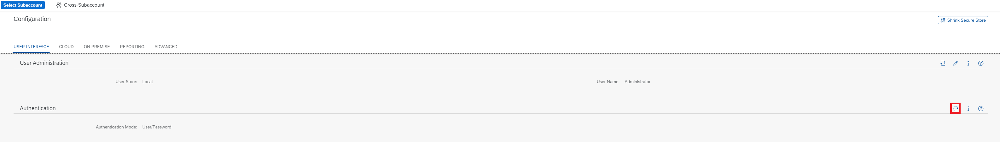
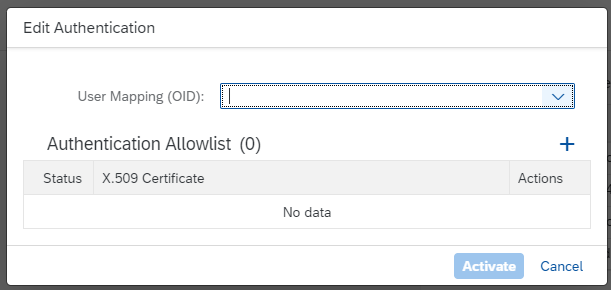

<!-- loiodaa547fae1f4402e9a0b6d82da9f007a -->

# Logon to the Cloud Connector via Client Certificate

Switch from default logon to client certificate logon to access the Cloud Connector.

> ### Restriction:  
> For Cloud Connector version 2.16.0: This feature does not work if *high availability* setup is active. A Cloud Connector shadow instance cannot connect due to missing trust with error: *There is no trust with Cloud Connector on https://<host\>:<port\>. Reset shadow configuration and try to connect shadow again*.

> ### Restriction:  
> Configuring the logon with a certificate is not allowed for SAP-operated Cloud Connectors, for example in the context of *Enterprise Cloud Services* or *S/4HANA Private Cloud Edition*.

Instead of authenticating with user and password as configured by default \(see [Initial Configuration](initial-configuration-db9170a.md)\), you can switch to client certificate authentication and logon. To do so, choose *Configuration* \(or *Shadow Configuration*\) from the main menu, and tab *User Interface*, section *Authentication*.

In the next prompt, select an object identifier \(OID\) from the dropdown list to extract the user name from the provided client certificate.

You must add at least one CA certificate, used by Cloud Connector to validate against the incoming client certificate. After activation, a restart is required.

The login works as follows:

1.  \(Prerequisite\): You must have a fitting client certificate provided in your browser \(or in your REST client\).
2.  When accessing the Cloud Connector, an mTLS handshake is performed, that is, the Cloud Connector checks your selected client certificate against the CAs from the authentication allowlist.

    > ### Caution:  
    > If your client certificate is not self-signed, you must provide \(one of\) the issuer certificates in the *authentication allowlist*, not the client certificate from your browser.

3.  If trust is correct, the Cloud Connector extracts the user from the configured user mapping OID. This user will be logged on. If LDAP is used, the respective roles are checked and assigned.

If you select, for example, *CN*, and have a client certificate with *CN=Administrator*, the user *Administrator* is used after mutual trust was established.

