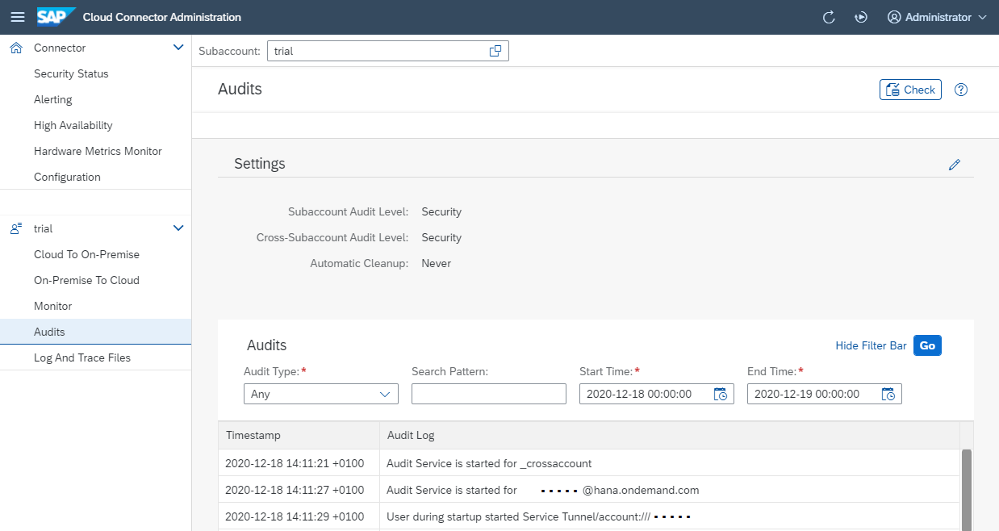

<!-- loio2264c7002f844fe4833186a1d168de66 -->

# Manage Audit Logs

Configure audit log settings and verify the integrity of audit logs.

<a name="loio2264c7002f844fe4833186a1d168de66__section_50B0B8B863F545F7984E1F76FFCE2B51"/>

## Configure Audit Logs in the Cloud Connector

Choose *Audit* from your subaccount menu and go to *Settings* to specify the type of audit events the Cloud Connector should log at runtime. You can currently select between the following *Audit Levels* \(for either *<subaccount\>* and *<cross-subaccount\>* scope\):

-   **Security**: Default value. The Cloud Connector writes an audit entry \(`Access Denied`\) for each request that was blocked. It also writes audit entries, whenever an administrator changes one of the critical configuration settings, such as exposed back-end systems, allowed resources, and so on.
-   **All**: The Cloud Connector writes one audit entry for each received request, regardless of whether it was allowed to pass or not \(`Access Allowed` and `Access Denied`\). It also writes audit entries that are relevant to the **Security** mode.
-   **Off**: No audit entries are written.

> ### Caution:  
> To prevent a single person from being able to both change the audit log level, and delete audit logs, we recommend that the operating system administrator and the SAP BTP administrator are different persons. We also suggest that you turn on the audit log at the operating system level for file operations.

> ### Tip:  
> We recommend that you don't log all events unless you are required to do so by legal requirements or company policies. Generally, logging security events only is sufficient.

To enable automatic cleanup of audit log files, choose a period \(14 to 365 days\) from the list in the field *<Automatic Cleanup\>*.

Audit entries for configuration changes are written for the following categories:

-   `Account`: A subaccount configuration was changed.
-   `Configuration`: A new subaccount was added or a disaster recovery switch happened.
-   `BackendMapping`: Changes to the virtual to internal system mappings.
-   `AllowedResource`: In a virtual system, changes in the accessible resources.
-   `DomainMapping`: Changes to the domain mappings.
-   `ServiceChannelConfiguration`: The configuration of a service channel was changed.
-   `SCCPassword`: The Cloud Connector administration password was changed.
-   `SCCUser`: The Cloud Connector administration user was changed.
-   `LDAPConfiguration`: Changes to the LDAP settings.
-   `EMailConfiguration`: The Email settings for alerts were changed.
-   `AlertConfiguration`: The observation settings for alerts were changed.
-   `ScimConfiguration`: Something changed in the settings for the cloud user store.
-   `KerberosConfiguration`: The Kerberos configuration was changed.
-   `SNCSettings`: SNC settings of Cloud Connector were changed.
-   `ProxySettings`: The proxy settings were changed.
-   `SystemCertificate`: The system certificate was changed.
-   `PpcaCertificate`: The CA certificate was changed.
-   `PrincipalPropagationConfiguration`: The principal propagation settings were changed.
-   `TrustSynchronization`: The trust configuration for principal propagation was synchronized.
-   `IdentityProviderTrust`: The trust configuration for a specific identity provider was changed.
-   `ApplicationTrust`: The trust configuration to applications was changed.
-   `TrustedBackendCertificate`: The trust store certificate was added or removed.
-   `SccCustomRoles`: Custom role name settings were changed.
-   `BackendAuthority`: RFC-specific user and client settings were adjusted.
-   `AdvancedConnectivity`: Advanced connectivity configuration was changed.
-   `AdvancedJVM`: Advanced JVM configuration was changed.
-   `ApplicationConfiguration`: Application-specific connection configuration was changed.
-   `PayloadTrace`: Payload trace \(traffic data\) was activated/deactivated.
-   `CPICTrace`: The CPIC trace level was changed.
-   `AuditLogLevel`: The subaccount-specific audit log level was changed.
-   `CrossAuditLogLevel`: The cross-subaccount audit log level was changed.
-   `AuditLogCleanup`: The audit log cleanup setting was changed.

In the *Audit Viewer* section, you can first define filter criteria, then display or download the selected audit entries.

-   In the *Audit Type* field, you can select the types of auditing events you are interested in.
-   In the *Pattern* field, you can specify a certain string that the detail text of each selected audit entry must contain. The detail text may contain, for example, information about the user name, requested resource/URL, or the virtual *<host\>:<port\>*. Basic wildcards \(glob patterns\) are supported, that is, asterisk for any number of characters \(including none\) and question mark for a single character. Use this feature to do the following:
    -   Filter the audit log for all requests that a particular HTTP user has made during a certain time frame.
    -   Identify all users who attempted to request a particular URL.
    -   Identify all requests to a particular back-end system.
    -   Determine whether a user has changed a certain Cloud Connector configuration. For example, a search for string `BackendMapping` returns all `add-`, `delete-` or `modify-` operations on the *Mapping Virtual To Internal System* page.

-   The *Time Range* settings specify the time frame to which you want to limit the eligible audit entries.

These filter criteria are combined with a logical `AND` so that all audit entries that match these criteria are shown. If you have modified the criteria, choose the *Search* button again to display the updated selection of audit events that match the new criteria.

Use the *Download* button to download the selected audit entries as a compressed \(GZIP\) CSV file that can be imported, for example, by Excel. The ZIP file also contains a second text file, a manifest or information, that provides the selection parameters as well as the date and time when the selection was extracted.

<a name="loio2264c7002f844fe4833186a1d168de66__section_uw2_tzn_vyb"/>

## Example

In the following example, the *Audit Viewer* displays `Any` audit entries, at `Security` level, for the time frame between **December 18 2020, 00:00:00** and **December 19, 00:00:00**:

## Verify the Integrity of Audit Logs

To check the integrity of all or a part of the audit logs, go to `<scc_installation>/auditor`. This directory contains an executable `go` script file \(respectively, `go.cmd` on Microsoft Windows and `go.sh` on other operating systems\).

If you start the `go` file without specifying parameters from `<scc_installation>/auditor`, all available audit logs for the current Cloud Connector installation are verified.

The auditor tool is a Java application, and therefore requires a Java runtime, specified in JAVA\_HOME, to execute:

-   For Microsoft Windows OS, set *JAVA\_HOME=<path-to-java-installation\>*
-   For Linux OS and Mac OS X, export: *JAVA\_HOME=<path-to-java-installation\>*

Alternatively, to execute Java, you can include the Java `bin` directory in the `PATH` variable.

You can check audit logs also in the UI, using the rightmost button of the **Audits** section.

> ### Note:  
> The selected date range determines the audit logs that are going to be checked \(entire days only, ignoring the time of day\).

<a name="loio2264c7002f844fe4833186a1d168de66__section_pl4_4cx_nrb"/>

## Change the Location of Audit Logs

As of Cloud Connector 2.14 you can move audit logs to a different location. Standard location remains `log/audit`.

> ### Note:  
> Make sure there is enough space left on the device for the desired location and the Cloud Connector OS user has permission to write files to that location.

If you want to do this, proceed as follows:

1.  Shut down the Cloud Connector.
2.  Execute the respective script for the location change.
    1.  For Microsoft Windows OS: `changeAuditLogPath.bat <desiredLocation>`.
    2.  For Linux OS and Mac OS X: `./changeAuditLogPath.sh <desiredLocation>`.

3.  The script checks if the target might be a network location. If this is assumed, the script asks for confirmation. Afterwards, it tries to move all existing audit logs to the new location. Only after successful move, the location change takes effect, otherwise it remains in the old place.
4.  Start the Cloud Connector again.

> ### Caution:  
> If you choose a network location while access to the file system is slow, overall processing performance of the Cloud Connector may decrease significantly.

