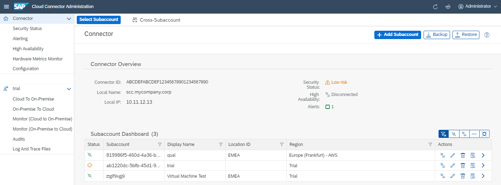
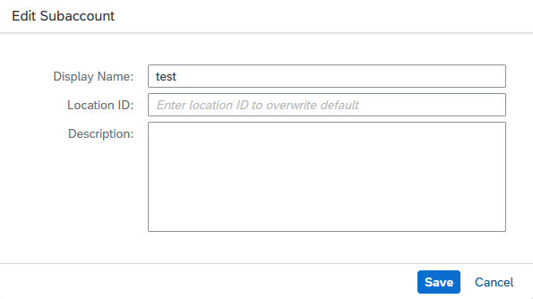

<!-- loiof16df12fab9f4fe1b8a4122f0fd54b6e -->

# Managing Subaccounts

Add and connect your SAP BTP subaccounts to the Cloud Connector.

> ### Note:  
> This topic refers to subaccount management in the Cloud Connector. If you are looking for information about managing subaccounts on SAP BTP \(Cloud Foundry or Neo environment\), see
> 
> -   [Account Administration](https://help.sap.com/viewer/65de2977205c403bbc107264b8eccf4b/Cloud/en-US/5d62ec89de39442f8f31d527855cbced.html "Learn how to manage global accounts, directories, and subaccounts on SAP BTP using different tools.") :arrow_upper_right: \(**Cloud Foundry** environment\)
> -   [Administration and Operations, Neo Environment](https://help.sap.com/viewer/ea72206b834e4ace9cd834feed6c0e09/Cloud/en-US/44bfcfbca3684f0eb716ae661c36eef6.html "Learn about the different account administration and application operation tasks which you can perform in the Neo environment.") :arrow_upper_right:

## Context

You can connect to several subaccounts within a single Cloud Connector installation. Those subaccounts can use the Cloud Connector concurrently with different configurations. By selecting a subaccount from the drop-down box, all tab entries show the configuration, audit, and state, specific to this subaccount. In case of audit and traces, cross-subaccount info is merged with the subaccount-specific parts of the UI.

> ### Note:  
> We recommend that you group only subaccounts with the same qualities in a single installation:
> 
> -   Productive subaccounts should reside on a Cloud Connector that is used for productive subaccounts only.
> -   Test and development subaccounts can be merged, depending on the group of users that are supposed to deal with those subaccounts. However, the preferred logical setup is to have separate development and test installations.

<a name="loiof16df12fab9f4fe1b8a4122f0fd54b6e__section_l3v_kv1_vfb"/>

## Prerequisites

You have assigned one of these roles/role collections to the subaccount user that you use for initial Cloud Connector setup, depending on the SAP BTP environment in which your subaccount is running:

> ### Note:  
> For the **Cloud Foundry** environment, you must know on which cloud management tools feature set \(A or B\) your account is running. For more information on feature sets, see [Cloud Management Tools — Feature Set Overview](https://help.sap.com/viewer/65de2977205c403bbc107264b8eccf4b/Cloud/en-US/caf4e4e23aef4666ad8f125af393dfb2.html "Cloud management tools represent the group of technologies designed for managing SAP BTP.") :arrow_upper_right:.

<table>
<tr>
<th valign="top">

Environment

</th>
<th valign="top">

Required Roles/Role Collections

</th>
<th valign="top">

More Information

</th>
</tr>
<tr>
<td valign="top">

**Cloud Foundry** \[feature set **A**\]

</td>
<td valign="top">

The user must be a *member of the global account* that the subaccount belongs to.

Alternatively, you can assign the user as *Security Administrator*.

</td>
<td valign="top">

[Add Members to Your Global Account](https://help.sap.com/viewer/65de2977205c403bbc107264b8eccf4b/Cloud/en-US/4a0491330a164f5a873fa630c7f45f06.html "Add users as global account members using the SAP BTP cockpit.") :arrow_upper_right: 

[Managing Security Administrators in Your Subaccount \[Feature Set A\]](https://help.sap.com/viewer/65de2977205c403bbc107264b8eccf4b/Cloud/en-US/6752c4b8435c456ebf67a97ddbbcb267.html "Running on the cloud management tools feature set A: When you create a subaccount, SAP BTP automatically grants your user the role for the administration of business users and their authorizations in the subaccount. Having this role, you can also add or remove other users who will then also be user and role administrators of this subaccount.") :arrow_upper_right:

</td>
</tr>
<tr>
<td valign="top">

**Cloud Foundry** \[feature set **B**\]

</td>
<td valign="top">

Assign at least one of these *default role collections* \(all of them including the role `Cloud Connector Administrator`\):

-   `Subaccount Administrator`
-   `Cloud Connector Administrator`
-   `Connectivity and Destination Administrator`

Alternatively, you can assign a *custom role collection* to the user that includes the role `Cloud Connector Administrator`.

</td>
<td valign="top">

[Default Role Collections \[Feature Set B\]](what-is-sap-btp-connectivity-daca64d.md#loiodaca64dacc6148fcb5c70ed86082ef91__table_default_role_collections_setB) 

[Role Collections and Roles in Global Accounts, Directories, and Subaccounts \[Feature Set B\]](https://help.sap.com/viewer/65de2977205c403bbc107264b8eccf4b/Cloud/en-US/0039cf082d3d43eba9200fe15647922a.html "In the cloud management tools feature set B, SAP BTP provides a set of role collections to set up administrator access to your global account and subaccounts.") :arrow_upper_right:

</td>
</tr>
<tr>
<td valign="top">

**Neo**

</td>
<td valign="top">

Assign at least one of these *default roles*:

-   `Cloud Connector Admin` 
-   `Administrator`

Alternatively, you can assign a *custom role* to the user that includes the permission `manageSCCTunnels`.

</td>
<td valign="top">

[Managing Member Authorizations in the Neo Environment](https://help.sap.com/viewer/ea72206b834e4ace9cd834feed6c0e09/Cloud/en-US/a1ab5c4cc117455392cd0a512c7f890d.html "SAP BTP includes predefined platform roles that support the typical tasks performed by users when interacting with the platform. In addition, subaccount administrators can combine various scopes into a custom platform role that addresses their individual requirements.") :arrow_upper_right:

</td>
</tr>
</table>

After establishing the Cloud Connector connection, this user is not needed any more, since it serves only for initial connection setup. You may revoke the corresponding role assignment then and remove the user from the *Members* list.

> ### Note:  
> If the Cloud Connector is installed in an environment that is operated by SAP, SAP provides a user that you can add as member in your SAP BTP subaccount and assign the required role.

## Subaccount Dashboard

In the subaccount dashboard \(choose your *Subaccount* from the main menu\), you can check the state of all subaccount connections managed by this Cloud Connector at a glance.

In the screenshot above, the subaccount with display name *trial* \(actual subaccount ID starts with *ab1220dc-5bfb-45d1-9...*\) is already connected, but has no active resources exposed. All other subaccounts are connected with exposed resources and are fully operational. In addition, depending on the connection state, the dashboard allows you to do disconnect and connect subaccounts by pressing the respective button in the *Actions* column. You may also view details of, delete, or navigate to a subaccount using buttons from the *Actions* column.

The *Sort* buttons for the columns **Subaccount** and **Display Name** let you sort the entries by the column either ascending or descending, and the *Filter* buttons in the columns let you filter the listed entries.

You can use the *Filter* buttons above the dashboard to filter the shown subaccounts based on the connection status. You can select *all subaccounts*, *all connected ones*, *all disconnected ones*, *all subaccounts currently in connecting or reconnecting status*, or *all subaccounts for which establishing the connection has failed*.

If you want to connect an additional subaccount to your on-premise landscape, press the *Add Subaccount* button. For more information on the configuration procedure, see [Set up Connection Parameters and HTTPS Proxy](initial-configuration-db9170a.md#loiodb9170a7d97610148537d5a84bf79ba2__configure_proxy) in the context of initial configuration.

> ### Remember:  
> Keep in mind that the specification of an HTTPS proxy is only offered when establishing the first connection.

## Next Steps

-   To modify an existing subaccount, choose the *Edit* icon and change the *<Display Name\>*, *<Location ID\>* and/or *<Description\>*.

    

-   You can also delete a subaccount from the list of connections.The subaccount will be disconnected and all configurations will be removed from the installation.

**Related Information**  

[Managing Member Authorizations in the Neo Environment](https://help.sap.com/viewer/ea72206b834e4ace9cd834feed6c0e09/Cloud/en-US/a1ab5c4cc117455392cd0a512c7f890d.html "SAP BTP includes predefined platform roles that support the typical tasks performed by users when interacting with the platform. In addition, subaccount administrators can combine various scopes into a custom platform role that addresses their individual requirements.") :arrow_upper_right:

[Copy a Subaccount Configuration](copy-a-subaccount-configuration-513d129.md "Copy an existing subcaccount configuration in the Cloud Connector to another subaccount.")

[Update the Certificate for a Subaccount](update-the-certificate-for-a-subaccount-071708a.md "Certificates used by the Cloud Connector are issued with a limited validity period. To prevent a downtime while refreshing the certificate, you can update it for your subaccount directly from the administration UI.")

[Configure a Disaster Recovery Subaccount](configure-a-disaster-recovery-subaccount-39447fa.md "Configure a subaccount as backup for disaster recovery.")

[Find Your Subaccount ID \(Cloud Foundry Environment\)](find-your-subaccount-id-cloud-foundry-environment-b43eff2.md "Get your subaccount ID to configure the Cloud Connector in the Cloud Foundry environment.")

[Configure Custom Regions](configure-custom-regions-a994a75.md "Configure regions that are not available in the standard selection.")

[Use a Custom IDP for Subaccount Configuration](use-a-custom-idp-for-subaccount-configuration-2022612.md "Enable custom identity provider (IDP) authentication to configure a Cloud Foundry subaccount in the Cloud Connector by using a one-time passcode.")

