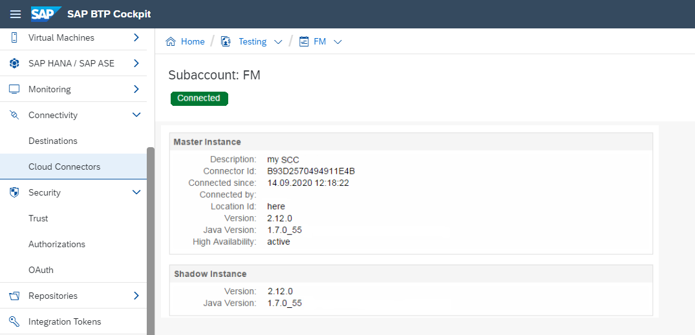

<!-- loio6d9c937dd35344bca3eb61ebf34a5c1d -->

# Monitoring

Learn how to monitor the Cloud Connector from the SAP BTP cockpit and from the Cloud Connector administration UI.


<a name="loio6d9c937dd35344bca3eb61ebf34a5c1d__section_zrt_csj_rfb"/>

## Checking the Operational State

The simplest way to verify whether a Cloud Connector is running is to try to access its administration UI. If you can open the UI in a Web browser, the `cloud connector` process is running.

-   On Microsoft Windows operating systems, the `cloud connector` process is registered as a Windows service, which is configured to start automatically after a new Cloud Connector installation. If the Cloud Connector server is rebooted, the `cloud connector` process should also auto-restart immediately. You can check the state with the following command:

    ```
    sc query "SAP Cloud Connector"
    ```

    The line state shows the state of the service.

-   On Linux operating systems, the Cloud Connector is registered as a daemon process and restarts automatically each time the `cloud connector` process is down, for example, following a system restart. You can check the daemon state with the following command:

    ```
    service scc_daemon status
    ```


To verify if a Cloud Connector is connected to a certain cloud subaccount, log on to the Cloud Connector administration UI and go to the *Subaccount Dashboard*, where the connection state of the connected subaccounts is visible, as described in section [Connect and Disconnect a Cloud Subaccount](connect-and-disconnect-a-cloud-subaccount-e8f055e.md).


## Monitoring from the Cockpit

The cockpit includes a *Connectivity* section, where users can check the status of the Cloud Connector\(s\) attached in the current subaccount, if any, as well as information about the Cloud Connector ID, version, used Java runtime, high availability setup \(master and shadow instance\), and so on \(choose *Connectivity* \> *Cloud Connectors*\).

Access to this view is granted to:

-   Neo envirnoment: Users with a role containing the permission `readSCCTunnels`, for example, the predefined role `Cloud Connector Admin`.
-   Cloud Foundry environment, feature set A: Users with a Cloud Foundry org role containing the permission `readSCCTunnels`, for example, the role `Org Manager`.

    > ### Note:  
    > As a prerequisite, a Cloud Foundry org must be available.

-   Cloud Foundry environment, feature set B: Users with a role containing the permission `readSCCTunnels`, for example, the predefined role `Cloud Connector Administrator`.

> ### Note:  
> For more information on feature sets in the Cloud Foundry environment, see [Cloud Management Tools — Feature Set Overview](https://help.sap.com/viewer/65de2977205c403bbc107264b8eccf4b/Cloud/en-US/caf4e4e23aef4666ad8f125af393dfb2.html "Cloud management tools represent the group of technologies designed for managing SAP BTP.") :arrow_upper_right:.




## Monitoring from the Cloud Connector Administration UI

The Cloud Connector offers various views for monitoring its activities and state.

You can check the overall state of the Cloud Connector through its [Hardware Metrics](hardware-metrics-6684f08.md), whereas subaccount-specific performance and usage data is available via [Subaccount-Specific Monitoring](subaccount-specific-monitoring-4c8e47e.md). To provide external monitoring tools, you can use the [Monitoring APIs](monitoring-apis-f6e7a7b.md).

**Related Information**  


[Configure Solution Management Integration](configure-solution-management-integration-3a058a2.md "Activate Solution Management reporting in the Cloud Connector.")

[High Availability Setup](high-availability-setup-2f9250b.md "You can operate the Cloud Connector in a high availability mode, in which a master and a shadow instance are installed.")

